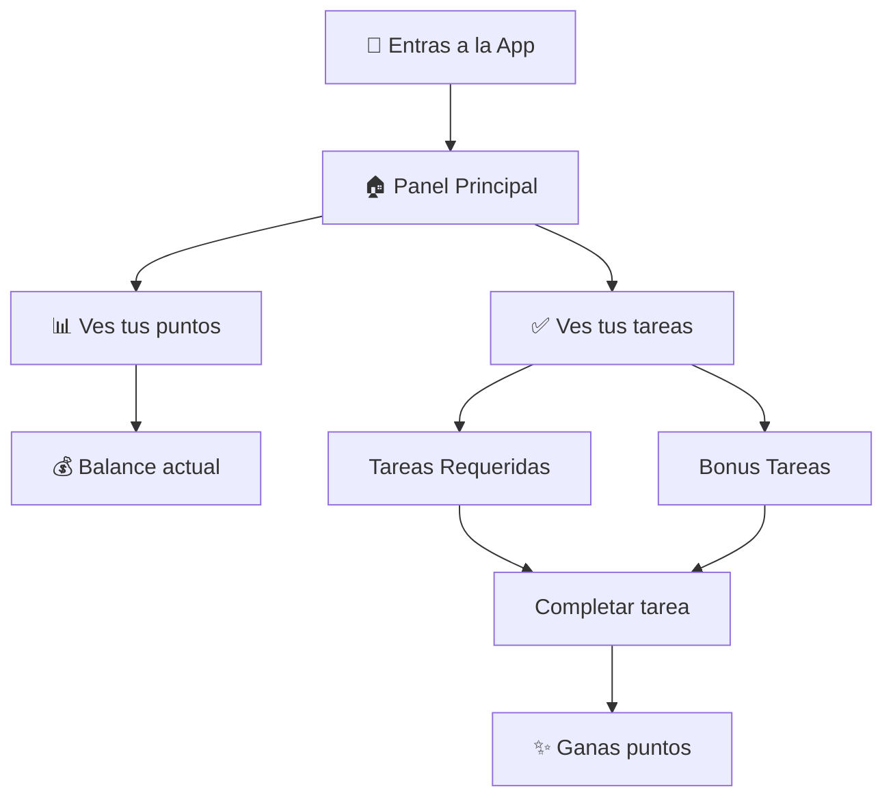
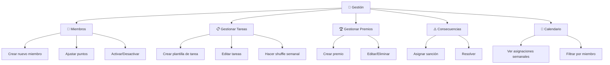
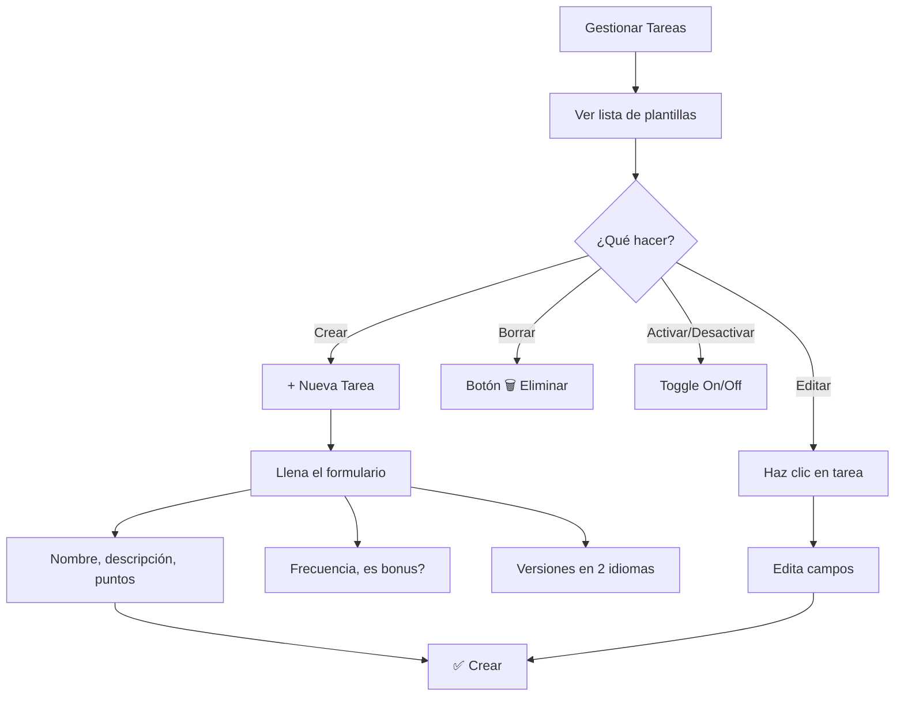
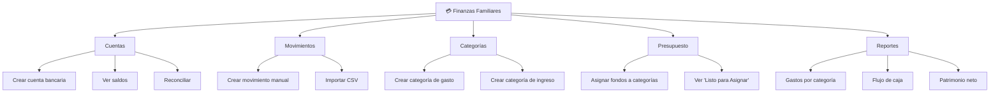
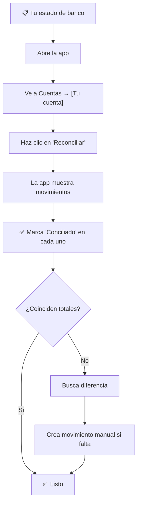
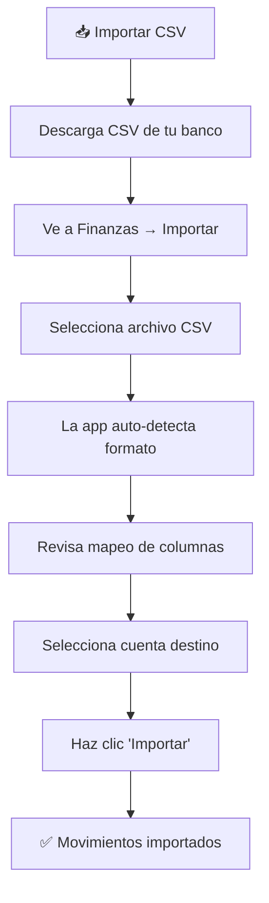
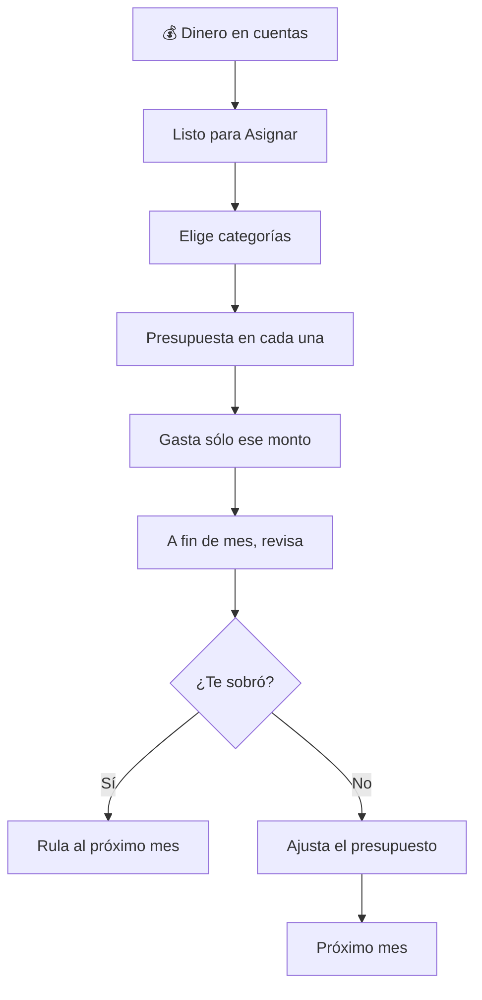
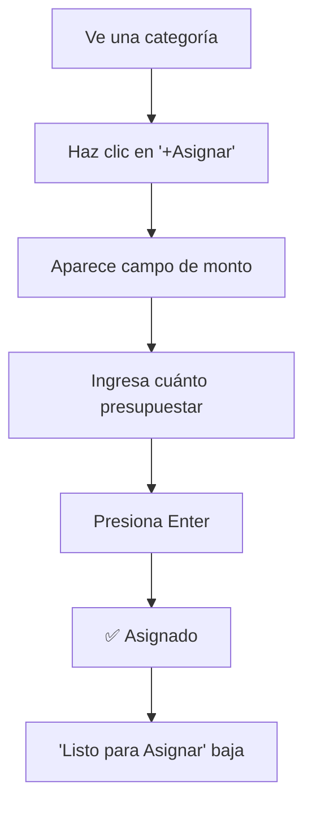
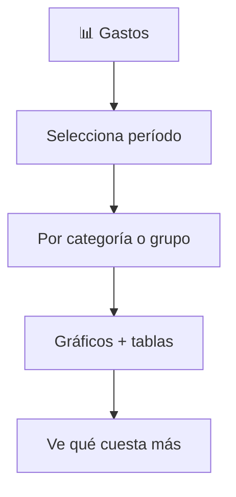
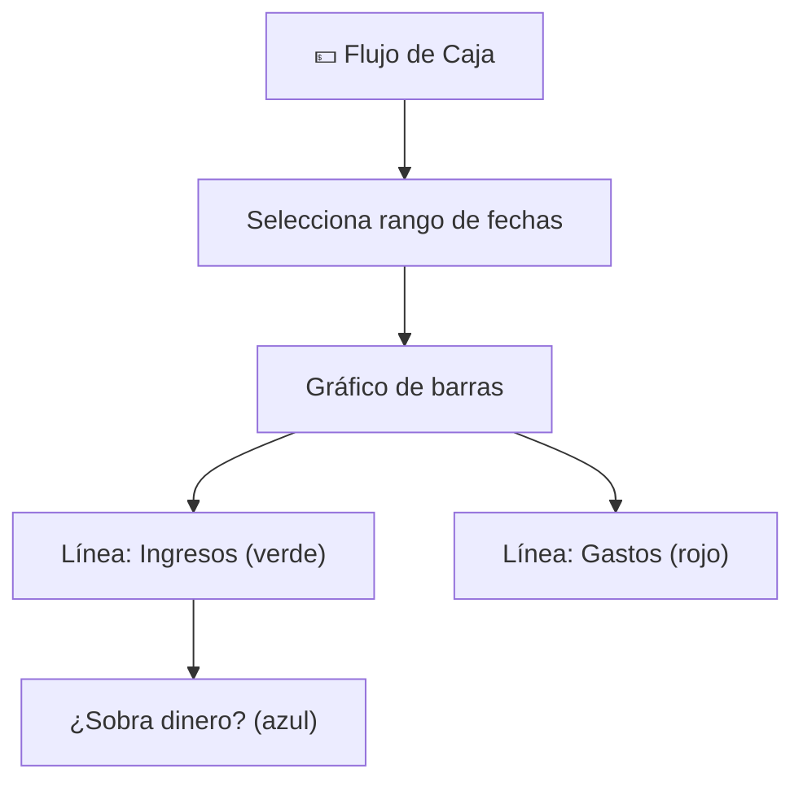

# Family Task Manager — Manual de Usuario

Bienvenido a **Family Task Manager**, la app para gestionar tareas, puntos y finanzas de la familia de forma divertida y ordenada.

---

## 📋 Tabla de Contenidos

1. [Parte 1: Task Manager](#parte-1-task-manager)
   - [Inicio de sesión](#inicio-de-sesión)
   - [Panel Principal (Dashboard)](#panel-principal-dashboard)
   - [Completar Tareas](#completar-tareas)
   - [Tienda de Premios](#tienda-de-premios)
   - [Perfil y Puntos](#perfil-y-puntos)
   - [Para Padres: Gestión](#para-padres-gestión)

2. [Parte 2: Finanzas Familiares](#parte-2-finanzas-familiares)
   - [Cuentas Bancarias](#cuentas-bancarias)
   - [Movimientos Bancarios](#movimientos-bancarios)
   - [Categorías](#categorías)
   - [Presupuesto Mensual](#presupuesto-mensual)
   - [Reportes](#reportes)

---

# Parte 1: Task Manager

## Inicio de Sesión

1. Ve a la app y haz clic en **"Iniciar Sesión"**
2. Ingresa tu **email** y **contraseña**
3. ¡Listo! Verás tu panel personal

> **Nota:** Si olvidaste tu contraseña, contacta a un padre para restablecerla.

---

## Panel Principal (Dashboard)

El panel es tu punto de partida cada vez que abres la app.



### ¿Qué ves en el Panel?

- **Balance de Puntos:** Tus puntos totales disponibles (arriba, en grande)
- **Tareas Requeridas:** Tareas que debes hacer cada semana
- **Bonus Tareas:** Tareas opcionales con puntos extra
- **Progreso:** Barra de progreso que muestra cuántas tareas completaste

### Botones principales

- **📅 Tareas** — Tu lista de tareas (activo por defecto)
- **🏆 Premios** — Ve a la tienda para canjear puntos
- **👤 Perfil** — Tu información personal
- **🔧 Gestión** (solo padres) — Administra la familia

---

## Completar Tareas

Cada tarea se muestra con su información:

| Campo | Qué es |
|-------|---------|
| **Título** | Nombre de la tarea |
| **Descripción** | Detalles de qué hacer |
| **Puntos** | Cuántos puntos ganas al completarla |
| **🔄 Frecuencia** | Semanal, diaria, etc. |
| **⭐ Bonus** | Si vale puntos extra |

### Cómo completar una tarea

1. Haz clic en la tarea
2. El **checkbox** se marca automáticamente
3. ✅ **¡Ganas los puntos!** Se suman a tu balance
4. La tarea desaparece de la lista hasta la próxima semana

> **Tip:** Solo ves tareas que aún no completaste hoy.

---

## Tienda de Premios

Aquí canjeas tus puntos ganados por premios que la familia configuró.

```mermaid
graph LR
    A["💰 Tienes puntos"] --> B["🏪 Abre Tienda de Premios"]
    B --> C["Ve la lista de premios"]
    C --> D["Selecciona un premio"}]
    D --> E{"¿Tienes suficientes puntos?"}
    E -->|Sí| F["✅ Canjear"]
    E -->|No| G["⏳ Sigue ganando puntos"]
    F --> H["🎉 ¡Canjeado!"]
    H --> I["Tus puntos bajan"]
```

### En la Tienda

- Cada premio muestra: **nombre**, **costo en puntos**, **categoría**
- **Si tienes puntos suficientes:** Botón verde "Canjear"
- **Si no tienes suficientes:** Botón gris (sigue ganando tareas)
- Al canjear, tus puntos **bajan inmediatamente**

> **Nota:** Los padres crean y configuran los premios. Tú solo ves lo disponible.

---

## Perfil y Puntos

Tu página personal con resumen de puntos.

### Qué ves

- **Puntos ganados:** Total que has acumulado
- **Puntos gastados:** Lo que canjeaste
- **Balance:** Puntos disponibles ahora = Ganados − Gastados
- **Consecuencias activas:** Las consecuencias vigentes
- **Idioma:** Cambia entre Español e Inglés
- **Cambiar contraseña:** Formulario para actualizar tu clave

---

## Para Padres: Gestión

Si tu rol es **"Padre/Madre"** (parent), tienes acceso extra a:



### 1️⃣ Miembros de la Familia

**Ruta:** Gestión → Miembros

#### Crear un nuevo miembro
1. Haz clic en **"+ Nuevo Miembro"**
2. Ingresa:
   - **Nombre** — El nombre real
   - **Email** — Cuenta única para iniciar sesión
   - **Rol** — Hijo (child) o Padre (parent)
3. Haz clic en **"Crear"**
4. El miembro recibe un email para activar su cuenta

#### Gestionar miembros
- **Ajustar puntos:** Ingresa un número y un motivo (ej: "Premio ganado", "Ajuste")
- **Activar/Desactivar:** El miembro no puede iniciar sesión si está desactivado
- **Eliminar:** Borra al miembro y todo su historial (irreversible)

---

### 2️⃣ Gestionar Tareas (Plantillas)

**Ruta:** Gestión → Gestionar Tareas

Las **plantillas** son tareas reusables que se asignan cada semana.



#### Crear una nueva tarea

1. Haz clic en **"+ Nueva Tarea"**
2. Rellena:
   - **Título** — Nombre corto (ej: "Lavar platos")
   - **Descripción** — Detalles de qué hacer
   - **Puntos** — Cuántos puntos vale (ej: 10, 50, 100)
   - **Frecuencia** — Semanal, diaria, etc.
   - **¿Es bonus?** — Marca si suma puntos extra
   - **Traducciones** — Ingresa títulos/descripciones en inglés también
3. Haz clic en **"Crear"**

#### Weekly Shuffle (Barajado Semanal)

Cada semana, el sistema **asigna automáticamente** las tareas a los miembros según:
- Frecuencia (cada qué días)
- Tipo de asignación (ROTATE = rota entre miembros, FIXED = siempre el mismo, AUTO = inteligente)

**Para hacer el shuffle manualmente:**
1. En **Gestionar Tareas**, haz clic en **"🔄 Hacer Shuffle"**
2. El sistema **reasigna todas las tareas** a partir de mañana
3. Los miembros verán las nuevas tareas en su panel

---

### 3️⃣ Gestionar Premios

**Ruta:** Gestión → Gestionar Premios

Crea los premios que los hijos pueden canjear.

#### Crear un premio

1. Haz clic en **"+ Nuevo Premio"**
2. Ingresa:
   - **Nombre** — Ej: "Película en el cine"
   - **Costo** — Puntos que cuesta (ej: 500)
   - **Categoría** — Tipo de premio (ej: "Diversión", "Comida")
   - **Traducciones** — En inglés también
3. Haz clic en **"Crear"**

#### Editar o eliminar premios
- Haz clic en el premio → **"Editar"** o **"Eliminar"**
- Los cambios se ven **inmediatamente** para todos

---

### 4️⃣ Consecuencias

**Ruta:** Gestión → Consecuencias

Cuando un miembro no cumple, puedes asignarle una consecuencia.

#### Crear una consecuencia

1. Haz clic en **"+ Nueva Consecuencia"**
2. Selecciona:
    - **Miembro** — A quién aplicar la consecuencia
    - **Descripción** — Qué hizo (ej: "No hizo la tarea X")
    - **Válida desde/hasta** — Fechas de la consecuencia
3. Haz clic en **"Crear"**

#### Resolver una consecuencia

Cuando el miembro haya completado la consecuencia:
1. Ve a **Consecuencias**
2. Haz clic en **"Resolver"** en la consecuencia
3. La consecuencia desaparece

---

### 5️⃣ Calendario de Asignaciones

**Ruta:** Gestión → Calendario

Ve **todas las tareas asignadas** de todos los miembros en formato semanal.

#### Usando el calendario

- **Navega semanas:** Botones ◀️ ▶️ (semana anterior/siguiente)
- **Filtra por miembro:** Selector para ver solo tareas de 1 persona
- **Ve de un vistazo:** Qué tarea tiene cada quién esta semana
- **Descubre conflictos:** ¿Un miembro tiene demasiadas tareas? Ajusta en "Gestionar Tareas"

---

# Parte 2: Finanzas Familiares

El módulo de finanzas ayuda a la familia a:
- 💰 Registrar ingresos y gastos
- 📊 Crear un presupuesto mensual
- 📈 Ver reportes de gastos



---

## Cuentas Bancarias

**Ruta:** Finanzas → Cuentas

Aquí registras todas las cuentas de dinero: corriente, ahorros, tarjetas de crédito, inversiones.

### Crear una cuenta

1. Haz clic en **"+ Nueva Cuenta"**
2. Ingresa:
   - **Nombre** — Ej: "Cuenta Corriente Santander", "Mi Tarjeta de Crédito"
   - **Tipo** — Checking (corriente), Savings (ahorros), Credit (crédito), Investment (inversión)
   - **Saldo inicial** — Si la cuenta ya tiene dinero, ingresa cuánto (ej: $50,000)
3. Haz clic en **"Crear"**

La app **crea automáticamente** un movimiento llamado "Saldo Inicial" para que el saldo de la cuenta sea correcto desde el primer día.

### Ver saldos

En **Cuentas**, ves una lista con:
- **Nombre de la cuenta**
- **Saldo actual** — En verde/rojo según sea positivo/negativo
- **Total neto** — Suma de todas las cuentas (arriba, en grande)

Haz clic en una cuenta para ver su **historial de movimientos**.

### Reconciliar una cuenta

Reconciliar = **verificar que la app coincida con tu banco**.



**Cómo reconciliar:**

1. Ve a **Cuentas** → Tu cuenta → **"Reconciliar"**
2. La app muestra cada movimiento con 2 columnas: "Total" y "Conciliado"
3. Compara con tu **extracto bancario**
4. **Marca** ✅ cada movimiento que coincida
5. Si falta alguno, **crea el movimiento** manualmente (ver abajo)
6. Una vez que todo coincida, verás una ✅ verde

---

## Movimientos Bancarios

**Ruta:** Finanzas → Movimientos

Aquí ves **todos los ingresos y gastos** de todas las cuentas.

### Crear un movimiento manual

1. Ve a **Movimientos** → **"+ Nuevo Movimiento"**
2. Ingresa:
   - **Cuenta** — De cuál cuenta (ej: "Corriente")
   - **Fecha** — Cuándo (ej: 2026-03-02)
   - **Monto** — Cuánto (positivo = ingreso, negativo = gasto)
   - **Categoría** — Qué categoría (opcional, ej: "Comida")
   - **Beneficiario/Pagador** — Quién (ej: "Supermercado", "Mi empresa")
   - **Descripción** — Detalles opcionales
3. Haz clic en **"Crear"**

### Importar movimientos desde CSV

Si tu **banco exporta un CSV**, puedes importar cientos de movimientos de una vez.



**Pasos:**

1. **Descarga el CSV** desde tu banco (extracto de movimientos)
2. Ve a **Finanzas → Importar**
3. Sube el archivo
4. La app **detecta automáticamente** el formato bancario
5. **Revisa las columnas:** Fecha, Monto, Concepto, etc.
6. Selecciona la **cuenta destino** (a cuál cuenta agregarlos)
7. Haz clic en **"Importar"**
8. ¡Listo! Los movimientos aparecen en tu cuenta

> **Tip:** El primer import puede tardar más. Los siguientes son más rápidos.

---

## Categorías

**Ruta:** Finanzas → Categorías

Las categorías te ayudan a **clasificar gastos e ingresos** (Comida, Transporte, Salario, etc.).

### Estructura: Grupos → Categorías

```
📊 Grupos
├─ 📌 Gastos Fijos (grupo)
│  ├─ Renta (categoría)
│  ├─ Servicios (categoría)
│  └─ ...
├─ 📌 Alimentación (grupo)
│  ├─ Comida (categoría)
│  ├─ Restaurantes (categoría)
│  └─ ...
└─ 📌 Ingresos (grupo)
   ├─ Salario (categoría)
   ├─ Bonus (categoría)
   └─ ...
```

### Crear un grupo

1. Haz clic en **"+ Nuevo Grupo"**
2. Ingresa:
   - **Nombre** — Ej: "Gastos Fijos", "Diversión"
   - **¿Es ingreso?** — Marca si es un grupo de **ingresos** (Salario, Bonus, etc.)
3. Haz clic en **"Crear"**

### Crear una categoría dentro de un grupo

1. En el grupo, haz clic en **"+ Nueva Categoría"**
2. Ingresa:
   - **Nombre** — Ej: "Comida", "Gasolina"
   - **¿Es ingreso?** — Hereda del grupo (no tocar)
   - **Meta mensual** (opcional) — ¿Cuánto quieres gastar máximo?
3. Haz clic en **"Crear"**

---

## Presupuesto Mensual

**Ruta:** Finanzas → Presupuesto del Mes

Aquí es donde **asignas dinero a categorías** cada mes. El sistema usa **envelope budgeting** (sobres presupuestarios).

### Concepto: Envelope Budgeting (Presupuesto por Sobres)



**La idea:** Es como tener sobres físicos con dinero dentro. Si presupuestas $300 en "Comida", puedes gastar máximo $300. Si te sobra, rula al mes siguiente.

### El Presupuesto Mensual — Paso a paso

#### 1. Ve a Presupuesto

1. **Finanzas** → **Presupuesto del Mes**
2. Ves el mes actual (arriba: "Marzo 2026")
3. Ves 3 números principales:
   - **Ingresos** — Dinero que entró este mes
   - **Presupuestado** — Dinero asignado a categorías
   - **Listo para Asignar** — Dinero disponible para presupuestar

#### 2. Asignar fondos a una categoría



**Ejemplo:** Presupuestas $3,000 en "Comida"
1. Ves la categoría "Comida" en la lista
2. Haz clic en **"+Asignar"**
3. Ingresa **3000**
4. Presiona **Enter**
5. ¡Listo! Ahora puedes gastar hasta $3,000 en Comida

#### 3. Entiende "Listo para Asignar"

```
Listo para Asignar = Total en cuentas − Dinero presupuestado − Gastos previos no cubiertos
```

**Ejemplos:**

- **Caso 1:** Tienes $272,234 en cuentas, presupuestaste $3,000. 
  - Listo para Asignar = $272,234 − $3,000 = **$269,234** ✅
  - Puedes seguir asignando

- **Caso 2:** Tienes $100,000, presupuestaste $120,000.
  - Listo para Asignar = **−$20,000** ❌ Sobreasignado
  - Debes bajar algún presupuesto

#### 4. Gastos y disponible

Ves 3 columnas por categoría:

| Columna | Qué es |
|---------|---------|
| **Presupuestado** | Cuánto asignaste (ej: $3,000) |
| **Gastado** | Cuánto ya gastaste (ej: $0) |
| **Disponible** | Lo que queda (ej: $3,000) |

Si gastas $500 en Comida:
- Presupuestado: $3,000
- Gastado: $500
- Disponible: $2,500

#### 5. Si gastas más de lo presupuestado

Si presupuestaste $3,000 en Comida pero gastaste $3,500:
- **Disponible:** −$500 (rojo) ⚠️

Para cubrir el exceso, haz clic en **"Asignar"** en esa categoría y suma más dinero.

#### 6. Transferir dinero entre categorías

Si "Comida" te sobró pero "Transporte" no alcanza:

1. Haz clic en **"Transferir"** en cualquier categoría
2. Elige:
   - **De cuál categoría** (ej: "Comida")
   - **A cuál categoría** (ej: "Transporte")
   - **Cuánto** (ej: $500)
3. Haz clic en **"Transferir"**
4. ¡Listo! Los fondos se mueven

---

## Reportes

**Ruta:** Finanzas → Reportes

3 reportes para entender tus finanzas:

### 1. Gastos (Spending Report)

Analiza dónde va tu dinero.



**Qué ves:**
- Gráfico circular/barras de gastos
- Tabla con: Categoría, Monto, % del total
- Filtros: Rango de fechas, categoría específica

**Ejemplo:** "En Enero gasté $50,000 total: Comida $20k, Transporte $15k, Servicios $15k"

### 2. Flujo de Caja (Income vs. Expense)

Ingresos vs. gastos en el tiempo.



**Qué ves:**
- Por mes: cuánto entrö (ingresos) vs. salió (gastos)
- Si la diferencia es positiva: ¡Ahorraste!
- Si es negativa: gastaste más de lo que entrö

**Ejemplo:** "En Marzo entraron $300,000 y gastaron $100,000. Ahorro: $200,000"

### 3. Patrimonio Neto (Net Worth)

El total de lo que tienes.

```
Patrimonio Neto = Activos (dinero, inversiones, bienes)
                 − Pasivos (deudas, tarjetas de crédito)
```

**Qué ves:**
- Gráfico del patrimonio en el tiempo
- Crecimiento o caída mes a mes
- Desglose: cuánto en cada cuenta/inversión

**Ejemplo:** "Tu patrimonio neto es $500,000 y creció $50k este mes"

---

# 🎯 Tips & Trucos

## Task Manager

✅ **Completa tareas sin esperar:** No hay penalización por completar temprano  
✅ **Canjea premios cuando quieras:** Puedes esperar o canjear rápido, tú decides  
✅ **Vé al Perfil cada semana:** Verifica si hay nuevas tareas asignadas  
✅ **Padres: Haz shuffle cada lunes:** Así las tareas se renuevan cada semana

## Finanzas

✅ **Reconcilia **cada mes:** Verifica que todo cuadre con tu banco  
✅ **Presupuesta realista:** Basado en lo que realmente gastas  
✅ **Revisa reportes mensualmente:** Entiende dónde va tu dinero  
✅ **Rula fondos sobrantes:** Si "Comida" te sobró, transfiere a otra categoría  
✅ **Importa CSV automáticamente:** Ahorra tiempo en datos manuales  

---

# ❓ Preguntas Frecuentes

### ¿Puedo recuperar puntos después de canjearlos?
No, los canjes son permanentes. Pero puedes ganar más puntos completando tareas.

### ¿Qué pasa si completo una tarea a mitad de semana?
Se marca como completada y no vuelve a aparecer hasta la próxima semana (tras el shuffle).

### ¿Puedo editar movimientos importados?
Sí, después de importar puedes editar cada movimiento (categoría, monto, fecha, etc.).

### ¿Qué es "Listo para Asignar" negativo?
Que presupuestaste más de lo que tienes disponible. Debes bajar presupuestos o esperar nuevos ingresos.

### ¿Cómo cambio mi contraseña?
Ve a **Perfil** → **"Cambiar Contraseña"** e ingresa la nueva.

### ¿Qué idioma usa la app?
Español (ES) e Inglés (EN). Cambia en tu **Perfil** o en el bottom nav (botón con banderas).

---

# 📞 Soporte

Si tienes problemas:
1. **Haz logout** (botón rojo en Perfil) y vuelve a iniciar sesión
2. **Recarga la página** (⌘R o F5)
3. **Borra cache** del navegador y reinicia
4. **Contacta a un padre** para que restablezca tu contraseña o ajuste datos

---

**Versión:** 1.0  
**Última actualización:** Marzo 2026  
**Idioma:** Español + English (bilingual)

¡Que disfrutes usando Family Task Manager! 🎉
