# Family Task Manager — Complete User Guide

**Version 2.0** | Last updated: April 2026

Welcome to the official **Family Task Manager** guide, the app for organizing your family's chores, rewards, consequences, and finances in a fun and efficient way.

---

## Table of Contents

1. [Chapter 1: Getting Started](#chapter-1-getting-started)
   - [1.1 What is Family Task Manager](#11-what-is-family-task-manager)
   - [1.2 Registration](#12-registration)
   - [1.3 Family Setup](#13-family-setup)
   - [1.4 Logging In](#14-logging-in)
   - [1.5 Navigation](#15-navigation)
2. [Chapter 2: Task Management](#chapter-2-task-management)
   - [2.1 Main Dashboard](#21-main-dashboard)
   - [2.2 Completing Tasks](#22-completing-tasks)
   - [2.3 Task Templates (Parents)](#23-task-templates-parents)
   - [2.4 Weekly Assignment (Shuffle)](#24-weekly-assignment-shuffle)
   - [2.5 Assignment Calendar](#25-assignment-calendar)
3. [Chapter 3: Rewards and Consequences](#chapter-3-rewards-and-consequences)
   - [3.1 Rewards Store](#31-rewards-store)
   - [3.2 Managing Rewards (Parents)](#32-managing-rewards-parents)
   - [3.3 Consequence System](#33-consequence-system)
4. [Chapter 4: Budget — Overview](#chapter-4-budget--overview)
   - [4.1 What is Envelope Budgeting](#41-what-is-envelope-budgeting)
   - [4.2 Module Navigation](#42-module-navigation)
   - [4.3 Parents-Only Access](#43-parents-only-access)
5. [Chapter 5: Bank Accounts](#chapter-5-bank-accounts)
   - [5.1 Account Types](#51-account-types)
   - [5.2 Creating an Account](#52-creating-an-account)
   - [5.3 Account List and Balances](#53-account-list-and-balances)
   - [5.4 Account Details](#54-account-details)
   - [5.5 Closing and Reopening](#55-closing-and-reopening)
   - [5.6 Bank Reconciliation](#56-bank-reconciliation)
6. [Chapter 6: Transactions](#chapter-6-transactions)
   - [6.1 Anatomy of a Transaction](#61-anatomy-of-a-transaction)
   - [6.2 Creating a Transaction](#62-creating-a-transaction)
   - [6.3 Split Transactions](#63-split-transactions)
   - [6.4 Transfers Between Accounts](#64-transfers-between-accounts)
   - [6.5 Editing and Deleting](#65-editing-and-deleting)
   - [6.6 Filtering and Searching](#66-filtering-and-searching)
   - [6.7 CSV Import](#67-csv-import)
7. [Chapter 7: Categories and Groups](#chapter-7-categories-and-groups)
   - [7.1 Structure](#71-structure)
   - [7.2 Creating Groups and Categories](#72-creating-groups-and-categories)
   - [7.3 Income Categories](#73-income-categories)
   - [7.4 Archiving and Hiding](#74-archiving-and-hiding)
   - [7.5 Reordering](#75-reordering)
8. [Chapter 8: Monthly Budget View](#chapter-8-monthly-budget-view)
   - [8.1 Monthly View Layout](#81-monthly-view-layout)
   - [8.2 Ready to Assign](#82-ready-to-assign)
   - [8.3 Assigning Funds](#83-assigning-funds)
   - [8.4 The Three Columns](#84-the-three-columns)
   - [8.5 Handling Overspending](#85-handling-overspending)
   - [8.6 Transferring Between Categories](#86-transferring-between-categories)
   - [8.7 Rollover](#87-rollover)
   - [8.8 Navigating Between Months](#88-navigating-between-months)
   - [8.9 Closing and Reopening Months](#89-closing-and-reopening-months)
9. [Chapter 9: Payees](#chapter-9-payees)
   - [9.1 What Are Payees](#91-what-are-payees)
   - [9.2 Managing Payees](#92-managing-payees)
   - [9.3 Auto-creation from CSV](#93-auto-creation-from-csv)
10. [Chapter 10: Categorization Rules](#chapter-10-categorization-rules)
    - [10.1 How They Work](#101-how-they-work)
    - [10.2 Creating a Rule](#102-creating-a-rule)
    - [10.3 Priority](#103-priority)
    - [10.4 Common Rule Examples](#104-common-rule-examples)
11. [Chapter 11: Recurring Transactions](#chapter-11-recurring-transactions)
    - [11.1 What They Are](#111-what-they-are)
    - [11.2 Creating a Recurring Template](#112-creating-a-recurring-template)
    - [11.3 Auto-posting](#113-auto-posting)
    - [11.4 Managing Recurring Transactions](#114-managing-recurring-transactions)
12. [Chapter 12: Budget Goals](#chapter-12-budget-goals)
    - [12.1 Goal Types](#121-goal-types)
    - [12.2 Creating a Goal](#122-creating-a-goal)
    - [12.3 Tracking](#123-tracking)
13. [Chapter 13: Reports](#chapter-13-reports)
    - [13.1 Spending Report](#131-spending-report)
    - [13.2 Income vs Expense](#132-income-vs-expense)
    - [13.3 Net Worth](#133-net-worth)
    - [13.4 Budget Analysis](#134-budget-analysis)
14. [Chapter 14: Recycle Bin](#chapter-14-recycle-bin)
    - [14.1 Soft Deletion](#141-soft-deletion)
    - [14.2 Restoring Items](#142-restoring-items)
    - [14.3 Permanent Deletion](#143-permanent-deletion)
15. [Chapter 15: Settings](#chapter-15-settings)
    - [15.1 Budget Settings](#151-budget-settings)
    - [15.2 Backups](#152-backups)
    - [15.3 Language](#153-language)
16. [Chapter 16: Subscription and Profile](#chapter-16-subscription-and-profile)
    - [16.1 Available Plans](#161-available-plans)
    - [16.2 Subscription Page](#162-subscription-page)
- [Appendix A: Glossary](#appendix-a-glossary)
- [Appendix B: Frequently Asked Questions](#appendix-b-frequently-asked-questions)
- [Appendix C: Troubleshooting](#appendix-c-troubleshooting)

---

# Chapter 1: Getting Started

## 1.1 What is Family Task Manager

Family Task Manager is a web application designed for families with children who want to organize household chores in a fun, gamified way. Kids complete tasks, earn points, and redeem them for real rewards that parents set up. It also includes a full family budget module based on the envelope method.

**Who is this app for:**

- Families with children of any age (kids, teenagers)
- Parents who want to teach responsibility through play
- Families who want organized control over their finances

**What it can do:**

- Assign and rotate weekly tasks among family members
- Award points for completed tasks and redeem them for rewards
- Set consequences when responsibilities are not met
- Manage a complete family budget using the envelope method
- Import bank transactions from CSV files
- Generate spending, cash flow, and net worth reports

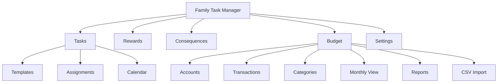

---

## 1.2 Registration

To start using Family Task Manager, the first parent in the family must create an account.

**Step by step:**

1. Open your browser and go to `/register`
2. Fill in the form:
   - **Full Name** — Your real name
   - **Email Address** — This will be your login username
   - **Password** — Minimum 8 characters
   - **Family Name** — The name that will identify your family group (e.g., "The Martinez Family")
3. Click **"Register"**
4. You will receive a verification email. Click the link to activate your account
5. Once verified, log in normally

> **Note:** The first registered user automatically becomes a Parent/Guardian (PARENT) and the family administrator.

---

## 1.3 Family Setup

Once registered, you can invite the rest of your family members.

### Invite by email

1. Go to **Management** (`/parent`) → **Members** (`/parent/members`)
2. In the **"Register New Member"** section, fill in:
   - **Full name** of the member
   - **Email address** — This will be their username
   - **Password** — Minimum 8 characters
   - **Role** — Select Child, Teen, or Parent/Guardian
3. Click **"Register Member"**

### Invitation code

You can also generate a unique code that other members can use to join your family:

1. Go to the family settings
2. Click **"Generate Code"**
3. Share the code with the new member
4. The new member goes to `/accept-invitation` and enters the code

### Family roles

| Role | In the app | Permissions |
|------|-----------|------------|
| **Parent/Guardian** | `Parent/Guardian` | Full access: create tasks, rewards, consequences, budget, manage members |
| **Teen** | `Teen` | Extended access: complete tasks, redeem rewards, view their profile |
| **Child** | `Child` | Basic access: complete tasks, redeem rewards, view their profile |

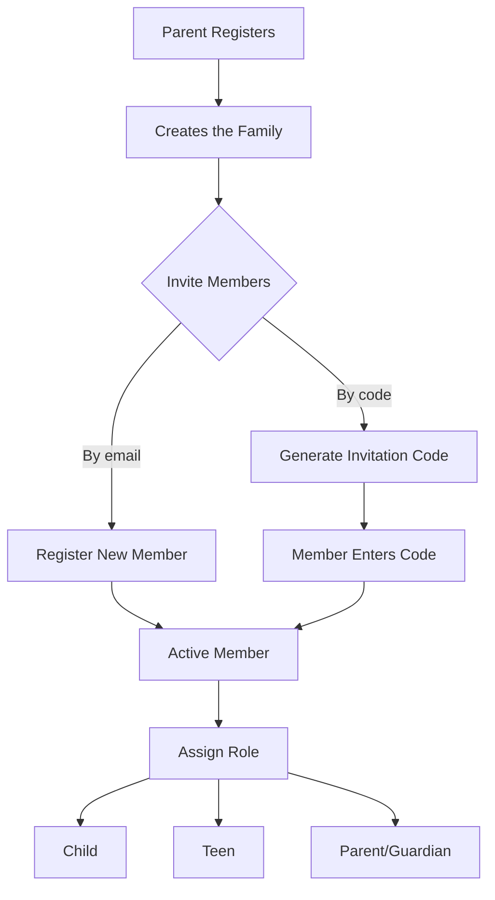

---

## 1.4 Logging In

1. Go to `/login`
2. Enter your **Email Address** and **Password**
3. Click **"Log In"**

### Demo accounts

If you want to try the app without creating a real account, you can use the demo accounts (available if seed data has been loaded):

| Email | Password | Role |
|-------|----------|------|
| `mom@demo.com` | `password123` | Parent/Guardian |
| `dad@demo.com` | `password123` | Parent/Guardian |
| `emma@demo.com` | `password123` | Child |
| `lucas@demo.com` | `password123` | Teen |

### Forgot my password

1. On the login screen, click **"Forgot my password"** (`/forgot-password`)
2. Enter your email address
3. You will receive a link to reset your password
4. Follow the link and choose a new password at `/reset-password`

> **Tip:** If you are a child and forgot your password, ask a parent to reset it from the Members section.

---

## 1.5 Navigation

The app has a bottom navigation bar (**Bottom Nav**) that appears on every screen. The visible buttons depend on your role:

| Button | Route | Visible to |
|--------|-------|-----------|
| **Tasks** | `/dashboard` | Everyone |
| **Rewards** | `/rewards` | Everyone |
| **Profile** | `/profile` | Everyone |
| **Budget** | `/budget` | Parents |
| **Management** | `/parent` | Parents |

### Changing the language

The app supports **Spanish** and **English**. To change the language:

1. Go to **Profile** (`/profile`)
2. In the **"Preferred Language"** section, select **Spanish** or **English**
3. The change takes effect immediately across the entire app

> **Note:** The bottom bar also shows a language button labeled "Switch to English" or "Cambiar a Espanol".

---

# Chapter 2: Task Management

## 2.1 Main Dashboard

**Route:** `/dashboard`

The Dashboard is the first screen you see when you log in. It shows a quick overview of your activity.

### What you see on the Dashboard

- **My Points** — Your current point balance (large number at the top)
- **Pending Tasks** — How many tasks are assigned to you for today
- **Required Tasks** — Tasks you must complete (main section)
- **Bonus Tasks** — Optional tasks that give extra points (unlocked after completing required tasks)
- **Progress bar** — Shows how many tasks you have completed out of the total

### Bonus mechanics

Bonus tasks are **locked** until you complete all of today's required tasks. Once the required tasks are done, you will see the message "Bonus tasks unlocked!" and you can complete them to earn extra points.

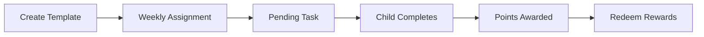

---

## 2.2 Completing Tasks

Each task card on the Dashboard shows the following information:

| Field | Description |
|-------|-------------|
| **Title** | Name of the task (e.g., "Wash the dishes") |
| **Description** | Details on what to do |
| **Points** | How many points you earn upon completion |
| **Frequency** | Daily, every 3 days, or weekly |
| **BONUS Badge** | Indicates if it is a bonus task (extra points) |

### Step by step to complete a task

1. On the Dashboard, find the task you want to complete
2. Click the **"Complete"** button
3. The task is marked as completed
4. The points are automatically added to your balance
5. The task disappears from the pending list

> **Tip:** You only see tasks you have not yet completed today. Completed tasks show "+N pts earned" in green.

### What happens when you complete everything

If you have no pending tasks, you will see the message **"All done! No pending tasks. Enjoy your day!"** on the Dashboard. New tasks will appear according to their frequency or after the next weekly shuffle.

---

## 2.3 Task Templates (Parents)

**Route:** `/parent/tasks`

Templates are reusable tasks that serve as blueprints for generating weekly assignments. Only parents can create and manage them.

### Creating a new template

1. Go to **Management** → **Tasks** (`/parent/tasks`)
2. In the **"Create New Template"** section, fill in:
   - **Task title** — Short, clear name (e.g., "Make the bed")
   - **Description (optional)** — Additional details on how to do it
   - **Points** — How many points the task is worth (e.g., 10, 25, 50)
   - **Frequency** — Select:
     - `Daily` — Assigned every day
     - `Every 3 days` — Assigned every 3 days
     - `Weekly` — Assigned once per week
   - **Bonus task** — Check if this is an extra task that only unlocks after completing required ones
3. Click **"Create Template"**

### Bilingual translations

Each template can have translations in Spanish and English:

- **Title (Spanish)** and **Title (English)**
- **Description (Spanish)** and **Description (English)**
- You can use the **"Auto-translate"** button to generate the translation automatically

### Assignment types

When creating a template, you can define how it is assigned to members:

| Type | Behavior |
|------|----------|
| **ROTATE** | Rotates among members each week |
| **FIXED** | Always assigned to the same member |
| **AUTO** | The system decides the best distribution |

### Editing and deleting templates

- Click on a template in the list → the edit page opens (`/parent/tasks/[id]/edit`)
- Modify the fields you want and click **"Save Changes"**
- To delete, confirm with the message "Delete this template and all its assignments?"
- You can activate/deactivate a template without deleting it (Active/Inactive toggle)

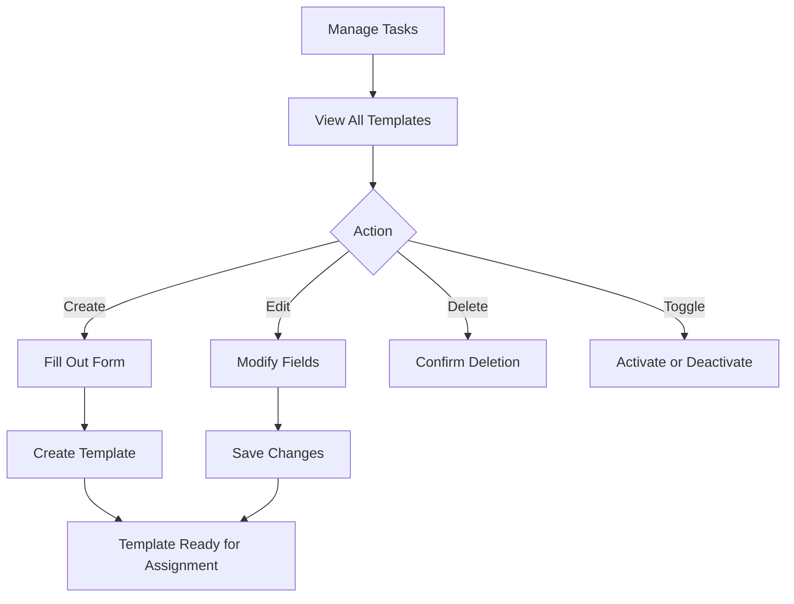

---

## 2.4 Weekly Assignment (Shuffle)

Each week, the system **automatically assigns** tasks to family members based on the frequency and assignment type configured in each template.

### Manual shuffle

If you want to redistribute tasks manually:

1. In **Manage Tasks** (`/parent/tasks`), find the **"Shuffle Tasks"** button (Weekly Shuffle)
2. A message will appear: "This will re-shuffle all pending assignments for this week. Continue?"
3. Confirm and the system will reassign the tasks
4. You will see a success message with the number of assignments created

### How rotation works

- **ROTATE** tasks change member each week. If Emma had "Sweep the floor" this week, Lucas will get it next week
- **FIXED** tasks are always assigned to the same member
- **AUTO** tasks are distributed intelligently to balance the workload among members

> **Tip:** Run the shuffle every Monday so tasks are refreshed for the week.

---

## 2.5 Assignment Calendar

**Route:** `/parent/assignments`

The calendar shows a weekly view of **all assignments** for all family members.

### Using the calendar

- **Week of** — Shows the start date of the current week
- **Navigation** — Use the previous week and next week buttons to move between weeks
- **Filter by member** — Use the "All Members" selector to see only one person's tasks
- **Days of the week** — Columns show Mon, Tue, Wed, Thu, Fri, Sat, Sun

### Task statuses

Each task on the calendar shows its status with a color indicator:

| Status | Meaning |
|--------|---------|
| **Pending** | The task has not been completed yet |
| **Done** | The task was completed |
| **Overdue** | It was not completed on time |
| **Cancelled** | It was cancelled by a parent |

> **Tip:** If a member has too many tasks in a week, adjust the templates or run a new shuffle.

---

# Chapter 3: Rewards and Consequences

## 3.1 Rewards Store

**Route:** `/rewards`

The Rewards Store is where family members redeem the points they earned by completing tasks.

### What you see in the store

- **Available Points** — Your current balance (at the top)
- **Rewards list** — Each reward shows its name, cost in points, and category
- **"Redeem Reward" button** — Green if you have enough points, disabled if not

### Redeeming a reward

1. Go to **Rewards** (`/rewards`)
2. Browse the list of available rewards
3. Find the reward you want and verify you have enough points
4. Click **"Redeem Reward"**
5. Your points are deducted immediately
6. You will see the message "Reward redeemed! Points deducted."

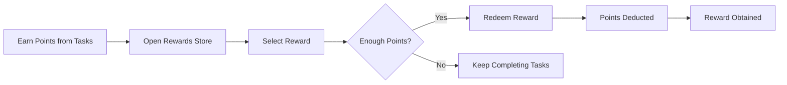

> **Note:** Redemptions are permanent. Once a reward is redeemed, the points are not refunded. But you can always earn more points by completing tasks.

### If there are no rewards available

If you see the message "No rewards yet", ask a parent to add rewards from the Management section.

---

## 3.2 Managing Rewards (Parents)

**Route:** `/parent/rewards`

Parents create and manage the rewards that children can redeem.

### Creating a reward

1. Go to **Management** → **Rewards** (`/parent/rewards`)
2. In the **"Create New Reward"** section, fill in:
   - **Reward name** — E.g., "Movie at the theater", "Double ice cream", "30 extra minutes of video games"
   - **Cost in Points** — How many points it costs to redeem (e.g., 100, 250, 500)
   - **Category** — Select one:
     - `Screen Time` — Video games, TV, tablet
     - `Food` — Candy, restaurants, desserts
     - `Activity` — Outings, trips, sports
     - `Privilege` — Special permissions
     - `Item` — Physical objects
     - `None` — No category
3. Click **"Create Reward"**

### Editing or deleting a reward

- Click on the reward in the list → the edit page opens (`/parent/rewards/[id]/edit`)
- Modify the name, cost, or category
- To delete, use the corresponding button

> **Tip:** Set up rewards with different point ranges: small rewards (50-100 pts), medium rewards (200-500 pts), and large rewards (1000+ pts). This gives children both short-term and long-term goals.

---

## 3.3 Consequence System

**Route:** `/parent/consequences`

Consequences are penalties that parents assign when a member fails to meet their responsibilities.

### Creating a consequence (Parents)

1. Go to **Management** → **Consequences** (`/parent/consequences`)
2. In the **"Create Consequence"** section, fill in:
   - **Consequence title** — E.g., "No video games for 3 days"
   - **Assign to** — Select the member
3. Click **"Create Consequence"**

### Viewing active consequences (Children)

Children see their active consequences on their **Profile** page (`/profile`), in the "Active Consequences" section. Each consequence shows its title and the "Until" date when it ends.

### Resolving a consequence

When the member has fulfilled the consequence:

1. Go to **Consequences** (`/parent/consequences`)
2. Find the active consequence
3. Click **"Resolve"**
4. The consequence changes to "Resolved" status and disappears from the member's profile

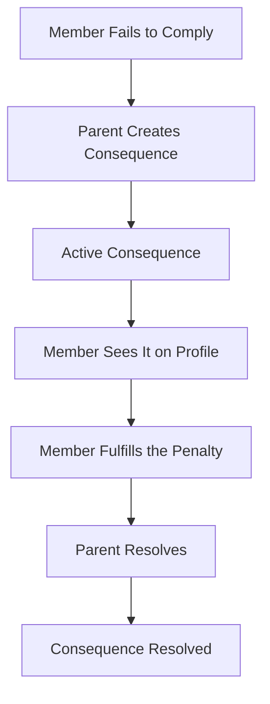

---

# Chapter 4: Budget — Overview

## 4.1 What is Envelope Budgeting

The Family Task Manager budget module uses the **envelope method** (envelope budgeting), a personal finance technique proven over decades.

### The physical envelope analogy

Imagine that each month you receive your paycheck in cash. You take paper envelopes, write the name of each expense on one (rent, groceries, transportation, utilities, savings, etc.) and distribute the money among the envelopes. When you go to the supermarket, you take money from the "Groceries" envelope. When you pay the electricity bill, you take from the "Utilities" envelope.

**The rule is simple:** you can only spend what is in each envelope. If the "Groceries" envelope runs out mid-month, you have three options:

1. **Wait** until the next month
2. **Transfer** money from another envelope (e.g., take $500 from the "Clothing" envelope and move it to "Groceries")
3. **Add more** money if you receive extra income

### How it works in the app

Instead of physical envelopes, the app uses **categories**. Each category is a "digital envelope" where you assign money at the beginning of the month and track your spending throughout the month.

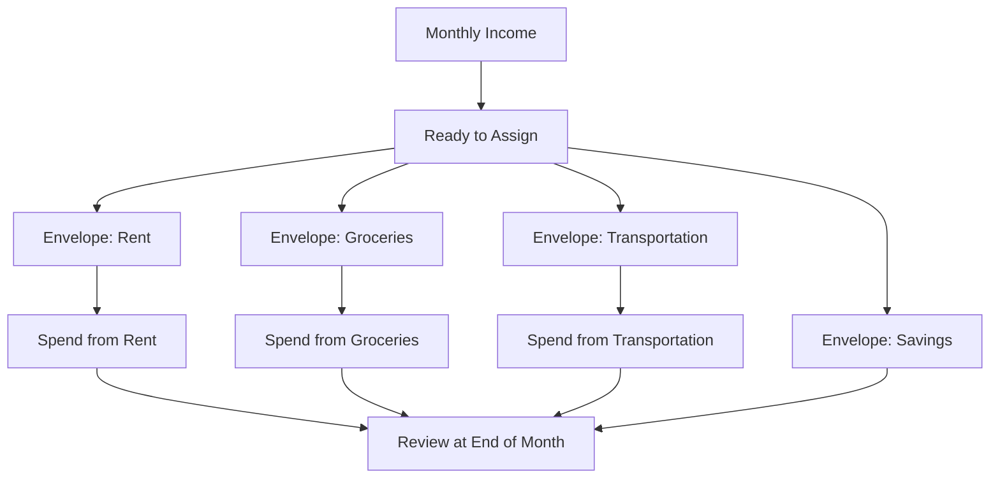

**Benefits of the envelope method:**

- You always know how much you have left to spend in each area
- It prevents overspending because every dollar has an assigned purpose
- It makes saving easier: if you assign money to the "Savings" envelope, that money is already set aside
- At the end of the month you can see exactly where your money went

---

## 4.2 Module Navigation

**Route:** `/budget`

When you enter the budget module, you see the **Budget Home** with cards that lead to each section:

| Section | Route | Description |
|---------|-------|-------------|
| **Monthly Budget** | `/budget/month/[year]/[month]` | Assign money, cover overspending, and track activity |
| **Accounts** | `/budget/accounts` | Balances, reconciliation, and transactions by account |
| **Transactions** | `/budget/transactions` | Create, review, and filter all transactions |
| **Categories** | `/budget/categories` | Organize groups, goals, and rollover rules |
| **Reports** | `/budget/reports/spending` | Spending, cash flow, and net worth |
| **Settings** | `/budget/settings` | Rules, recurring transactions, imports, and backups |

At the bottom of the page you see the **recommended workflow**:

1. Create accounts and categories
2. Assign income to categories for the month
3. Record and reconcile transactions
4. Cover overspending and close the month

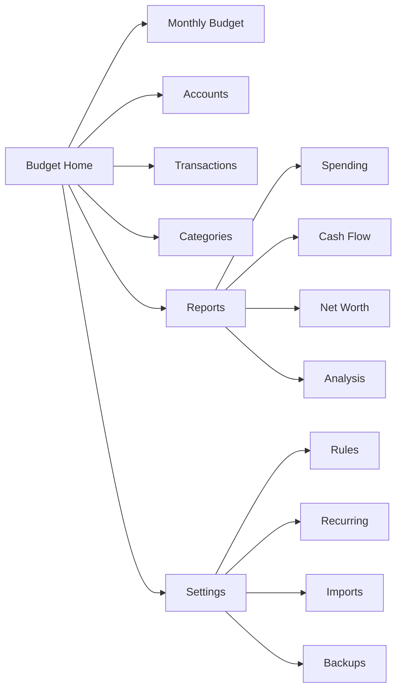

---

## 4.3 Parents-Only Access

The budget module is exclusively for users with the **Parent/Guardian** role. If a user with a Child or Teen role tries to access `/budget`, they will be automatically redirected to the Dashboard (`/dashboard`).

This ensures that the family's financial information is managed only by responsible adults.

---

# Chapter 5: Bank Accounts

**Route:** `/budget/accounts`

Bank accounts represent where your money is in the real world: checking accounts, savings accounts, credit cards, investments, etc.

## 5.1 Account Types

| Type | Description | Example |
|------|-------------|---------|
| **Checking** | Everyday checking account | Main Checking Account |
| **Savings** | Savings account | High-Yield Savings |
| **Credit** | Credit card (negative balance = debt) | Visa Credit Card |
| **Investment** | Mutual funds, bonds, etc. | Brokerage Account |
| **Loan** | Mortgage, auto loan | Home Mortgage |
| **Other** | Any other type | Cash, vouchers |

### On-budget vs Off-budget

| Type | What it means | Example |
|------|--------------|---------|
| **On-budget** | Affects envelope assignments. Money in this account can be assigned to categories | Checking account, credit card |
| **Off-budget** | Tracking only. Does not affect envelopes, only tracks the balance | Investments, mortgage |

> **Tip:** Use on-budget for accounts you spend from regularly (checking, credit). Use off-budget for long-term assets (investments) or large debts (mortgage).

---

## 5.2 Creating an Account

**Route:** `/budget/accounts/new`

1. Go to **Accounts** → **"+ New Account"**
2. Fill in the form:
   - **Name** — A descriptive name (e.g., "Main Checking", "Visa Card")
   - **Type** — Select from the list: Checking, Savings, Credit, Investment, Loan, Other
   - **On-budget / Off-budget** — Define whether it affects envelopes or is tracking only
   - **Starting balance** — How much money the account currently holds (e.g., $45,000.00)
   - **Notes** — Optional comments (e.g., "Primary payroll account")
3. Click **"Create"**

When you create the account, the system automatically generates a **"Starting Balance"** transaction with the amount you specified. This ensures the account balance is correct from day one.

**Practical example:**

If you have $45,000 in your checking account:
1. Create the account with the name "Main Checking", type "Checking", on-budget, starting balance $45,000
2. That $45,000 shows up as "Ready to Assign" in the monthly budget
3. Now you can assign that $45,000 to your categories (envelopes)

---

## 5.3 Account List and Balances

**Route:** `/budget/accounts`

On the accounts page you see a general overview:

- **Total On-budget** — The sum of all accounts that affect the budget
- **Total Off-budget** — The sum of tracking-only accounts
- **Net Worth** — Total assets minus debts (all accounts)

Each account shows:

- Account name
- Type (icon or label)
- Current balance — Green if positive, red if negative
- Status — Open or closed

> **Tip:** Click on any account to see its details and transactions.

---

## 5.4 Account Details

**Route:** `/budget/accounts/[id]`

When you click on an account, you see:

- **Header** with the account name, type, and balance
- **Transaction list** filtered to only that account
- Each transaction shows: date, payee, category, amount, and status (pending, cleared, reconciled)
- Button to **add a new transaction** directly to this account
- Link to **reconcile** the account

---

## 5.5 Closing and Reopening

When you close a bank account in real life (e.g., you cancelled a credit card), you can close it in the app:

- **Close** — The account no longer appears in active listings, but its history is preserved
- **Reopen** — If the account becomes active again, you can reopen it and continue using it

> **Note:** Closing an account in the app does not affect your actual bank. It is only for organizing the app.

---

## 5.6 Bank Reconciliation

**Route:** `/budget/accounts/[id]/reconcile`

Reconciliation is the process of verifying that the transactions in the app match your bank statement exactly. It is recommended to do this at least once a month.

### Detailed workflow

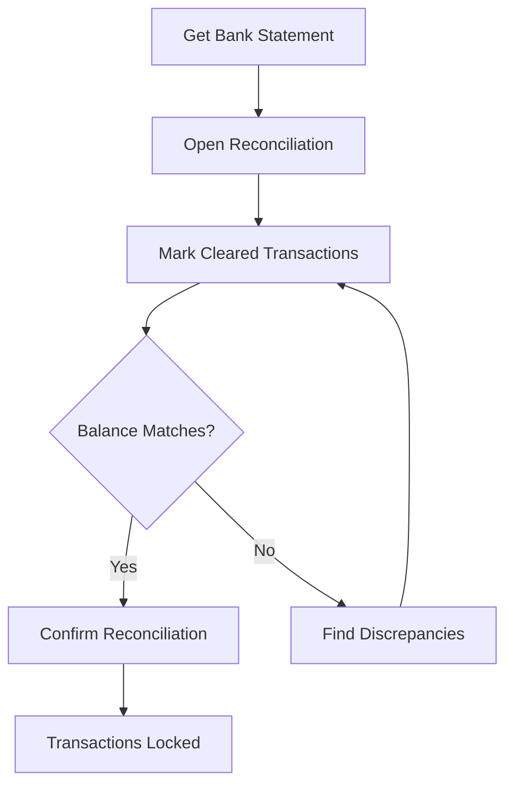

### Step by step

1. **Get your bank statement** (digital or paper)
2. Go to **Accounts** → select the account → **"Reconcile"**
3. The app shows all transactions pending reconciliation
4. **Compare each transaction** with your bank statement:
   - If it matches, mark it as **"Cleared"**
   - If it does not appear at the bank, leave it unmarked
5. The app shows the **calculated balance** vs the **bank balance**
6. If the balances match, click **"Confirm Reconciliation"**
7. Reconciled transactions are **locked** to prevent accidental edits

### Tips for finding discrepancies

| Issue | Solution |
|-------|----------|
| A transaction is missing in the app | Create it manually with the correct date |
| An amount is different | Edit the transaction and correct the amount |
| Duplicate transaction | Delete the duplicate (goes to the recycle bin) |
| Transaction in the app that is not at the bank | It probably has not processed yet; leave it unmarked |

> **Tip:** Reconcile in chronological order. Start with the oldest transactions.

---

# Chapter 6: Transactions

## 6.1 Anatomy of a Transaction

Each transaction has the following fields:

| Field | Description | Example |
|-------|-------------|---------|
| **Date** | When it occurred | 2026-04-01 |
| **Amount** | Quantity. Negative = expense, Positive = income | -$350.00 (expense) |
| **Account** | Which account the money comes from or goes into | Main Checking |
| **Payee** | Who you paid or who paid you | Walmart |
| **Category** | Which envelope the expense/income belongs to | Groceries |
| **Notes** | Optional details | "Weekly groceries" |
| **Status** | Pending, Cleared, or Reconciled | Cleared |

> **Important:** A **negative** amount means money went out (expense). A **positive** amount means money came in (income).

---

## 6.2 Creating a Transaction

**Route:** `/budget/transactions/new`

1. Go to **Transactions** → **"+ New Transaction"**
2. Fill in the form:
   - **Account** — Select which account (e.g., "Main Checking")
   - **Date** — Select the date (defaults to today)
   - **Amount** — Enter the amount. Use negative for expenses (e.g., `-1500`) and positive for income (e.g., `45000`)
   - **Payee** — Who received or sent the money (e.g., "Walmart", "My Company Inc.")
   - **Category** — Select the envelope category (e.g., "Groceries", "Salary")
   - **Notes (Optional)** — Additional comments (e.g., "Weekly groceries")
3. Click **"Save Transaction"**

**Example:** Recording a grocery purchase

| Field | Value |
|-------|-------|
| Account | Main Checking |
| Date | 2026-04-01 |
| Amount | -$1,500.00 |
| Payee | Walmart |
| Category | Groceries |
| Notes | Weekly groceries |

---

## 6.3 Split Transactions

Sometimes a single payment covers multiple categories. For example, at the supermarket you buy $1,200 worth of groceries and $300 worth of cleaning supplies. Instead of creating two separate transactions, you can split a single transaction.

### How it works

A parent transaction is split into multiple child transactions, each with its own category and amount. The sum of the children must equal the parent amount.

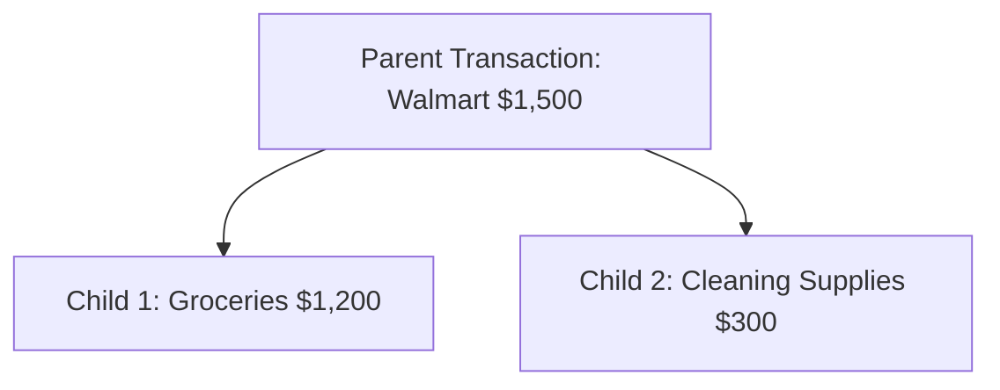

### Practical example

**Supermarket purchase for $1,500:**

| Part | Category | Amount |
|------|----------|--------|
| Parent transaction | (Split) | -$1,500.00 |
| Child 1 | Groceries | -$1,200.00 |
| Child 2 | Cleaning Supplies | -$300.00 |

When the transaction is split, each part deducts from the correct envelope: $1,200 from the "Groceries" envelope and $300 from the "Cleaning Supplies" envelope.

---

## 6.4 Transfers Between Accounts

When you move money from one account to another (e.g., from checking to savings), it is not an expense or income — it is a **transfer**.

### How it works

A transfer creates **two linked transactions**:

1. **Outgoing transaction** in the source account (negative amount)
2. **Incoming transaction** in the destination account (positive amount)

**Example:** Transferring $10,000 from Main Checking to Savings Account

| Account | Amount | Type |
|---------|--------|------|
| Main Checking | -$10,000.00 | Outgoing |
| Savings Account | +$10,000.00 | Incoming |

> **Note:** Transfers between on-budget accounts do not affect the budget — the money moves but stays assigned to the same envelopes. Transfers between on-budget and off-budget accounts do affect the "Ready to Assign" amount.

---

## 6.5 Editing and Deleting

### Editing a transaction

You can modify any field of a transaction: date, amount, account, payee, category, or notes. Changes are reflected immediately in balances and the budget.

> **Exception:** Reconciled transactions cannot be edited without first unlocking the reconciliation.

### Deleting a transaction

When you delete a transaction, it goes to the **recycle bin** (soft deletion). It is not permanently erased right away. You can restore it if it was a mistake.

---

## 6.6 Filtering and Searching

**Route:** `/budget/transactions`

The transaction list includes filters to find specific transactions:

| Filter | Description |
|--------|-------------|
| **Date range** | From/to a specific date |
| **Account** | Only transactions from a specific account |
| **Category** | Only transactions in a specific category |
| **Payee** | Filter by who paid/received |
| **Amount** | Search by amount range |
| **Status** | Pending, cleared, reconciled |

> **Tip:** Use filters to prepare for reconciliation — filter by account and date range matching your bank statement.

---

## 6.7 CSV Import

**Route:** `/budget/import`

If your bank lets you download your transactions in CSV format, you can import them in bulk instead of entering them one by one.

### Complete import flow

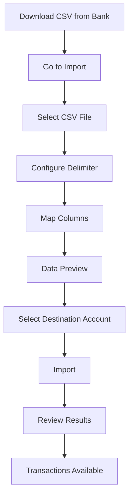

### Step by step

1. **Download the CSV** from your bank's portal
   - Look for options like "Download transactions", "Export", "Statement CSV"
   - Save the file to your computer

2. **Go to Import** (`/budget/import`)

3. **Select the CSV file** by clicking the upload button

4. **Configure the delimiter** — The app automatically detects whether it uses comma (`,`), semicolon (`;`), or tab. You can adjust it manually if needed

5. **Map the columns** — The app will try to automatically detect which column contains each piece of data:
   - **Date** — The column with transaction dates
   - **Amount** — The column with amounts
   - **Payee/Description** — The column with the description or who paid
   - **Category** — If the bank includes one (optional)
   - **Notes** — Additional detail column (optional)

6. **Review the preview** — Verify that the data is being interpreted correctly

7. **Select the destination account** — Which app account the transactions will be added to

8. **Click "Import"** — The system processes the data

9. **Review the results** — The app shows:
   - How many rows were imported
   - How many were skipped (duplicates)
   - Payees created automatically
   - Categories assigned (if rules are configured)

### Common bank CSV formats

| Bank | Typical format | Separator | Notes |
|------|---------------|-----------|-------|
| Chase | Date, Description, Amount, Balance | Comma | Negative = expense |
| Bank of America | Date, Description, Amount, Balance | Comma | Similar to Chase |
| Wells Fargo | Date, Amount, Description | Comma | Clean format |
| Capital One | Date, Description, Category, Debit, Credit | Comma | Debit = expense, Credit = income |

### Duplicate handling

If you import the same CSV twice, the system detects duplicate transactions and skips them automatically. No repeated records will be created.

### Auto-creation of payees

During import, if a payee does not exist in your list, it is created automatically. For example, if the CSV includes "AMAZON MARKETPLACE", a new payee with that name will be created.

> **Tip:** After your first CSV import, set up categorization rules (Chapter 10) so that future imports assign categories automatically.

---

# Chapter 7: Categories and Groups

**Route:** `/budget/categories`

Categories are the digital "envelopes" where you assign your money. They are organized into groups for easier management.

## 7.1 Structure

Categories are organized hierarchically: **Groups** contain **Categories**.

```
Fixed Expenses (group)
├── Rent
├── Utilities (electricity, water, gas)
├── Internet and phone
└── Insurance

Food (group)
├── Groceries
├── Restaurants
└── Fast food

Transportation (group)
├── Gas
├── Parking
├── Uber/Taxi
└── Public transit

Income (income group)
├── Salary
├── Freelance
└── Other income
```

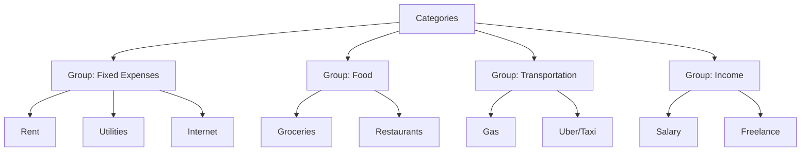

---

## 7.2 Creating Groups and Categories

### Creating a group

1. On the **Categories** page (`/budget/categories`), click **"+ New Group"**
2. Enter the group name (e.g., "Fixed Expenses", "Entertainment")
3. Indicate whether it is an **income** group (by checking the corresponding option)
4. Click **"Create"**

### Creating a category within a group

1. In the desired group, click **"+ New Category"**
2. Enter the category name (e.g., "Rent", "Groceries")
3. The income option is inherited from the group automatically
4. Optionally configure a monthly goal
5. Click **"Create"**

> **Note:** Remember that the Categories page only manages the structure. To assign money to each category, go to the Monthly Budget.

---

## 7.3 Income Categories

**Income** groups work differently from expense groups:

- Transactions with an income category **add to** the "Ready to Assign" amount
- You do not need to budget money into income categories — simply record how much you received
- Examples: Salary, Freelance, Bonuses, Gifts, Garage sales

**Example:** If your salary is $30,000 and you record it with the "Salary" category, that $30,000 appears in "Ready to Assign" for you to distribute among your expense envelopes.

---

## 7.4 Archiving and Hiding

If you no longer use a category but it has history, you can **archive** it instead of deleting it:

- **Archive** — The category disappears from selection lists but its transaction history is preserved
- **Unarchive** — You can reactivate it at any time

**When to archive:**

- You cancelled a service (e.g., you no longer pay for cable TV)
- You paid off a loan
- You changed your category structure but want to keep the history

---

## 7.5 Reordering

You can rearrange the order of groups and categories within each group by dragging and dropping. This only affects the visual presentation — it does not change data or the budget.

> **Tip:** Place the most-used groups at the top (e.g., "Fixed Expenses", "Food") and less frequent ones at the bottom.

---

# Chapter 8: Monthly Budget View

**Route:** `/budget/month/[year]/[month]` (e.g., `/budget/month/2026/4`)

This is the most important screen in the budget module. This is where you distribute your money among envelopes and track your spending throughout the month.

## 8.1 Monthly View Layout

### Header

- **Month navigation** — Arrows to move to the previous/next month
- **Month name** — E.g., "April 2026"

### Summary cards

At the top of the page you see three key numbers:

| Card | What it shows |
|------|---------------|
| **Income** | Total income recorded this month |
| **Budgeted** | Total assigned to all categories |
| **Ready to Assign** | Money available to distribute |

### Category table

Below the cards, a table with all your groups and categories. Each row shows three columns:

- **Budgeted** — How much you assigned to that category
- **Spent** (Activity) — How much you have actually spent
- **Available** — What is left in the envelope

---

## 8.2 Ready to Assign

The **"Ready to Assign"** number is the heart of the envelope method. It represents how much money you have available to distribute among categories.

### Formula

```
Ready to Assign = Month's Income
                - Total Budgeted in Categories
                - Uncovered Overspending from Previous Months
```

### Interpretation

| Value | Meaning | What to do |
|-------|---------|------------|
| **Positive** (e.g., $5,000) | You have unassigned money | Distribute it among categories |
| **Zero** ($0) | All your money is assigned | Perfect. Every dollar has a purpose |
| **Negative** (e.g., -$3,000) | You assigned more than you have | Reduce budgets or wait for more income |

### Practical example

Your salary is $30,000 and you recorded it as income:

1. **Ready to Assign: $30,000** — You have $30,000 to distribute
2. Assign $8,000 to Rent → Ready to Assign: $22,000
3. Assign $6,000 to Groceries → Ready to Assign: $16,000
4. Assign $3,000 to Transportation → Ready to Assign: $13,000
5. Assign $2,000 to Utilities → Ready to Assign: $11,000
6. Assign $5,000 to Savings → Ready to Assign: $6,000
7. Assign $6,000 to other envelopes → **Ready to Assign: $0**

When you reach zero, every dollar of your paycheck has a purpose. That is the goal.

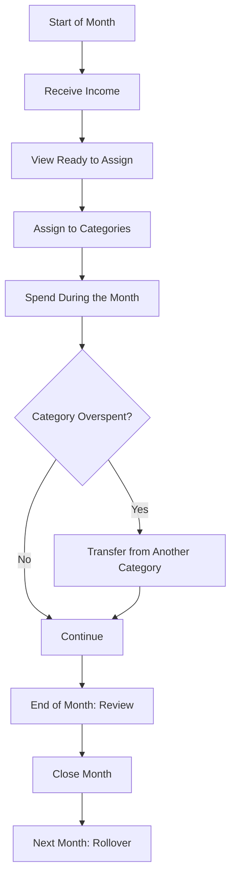

---

## 8.3 Assigning Funds

To assign money to a category:

1. In the monthly view, find the desired category
2. Click on the **"Budgeted"** field (or the "+ Assign" button)
3. Enter the amount you want to assign (e.g., `6000`)
4. Press Enter or click outside the field
5. The amount is saved and "Ready to Assign" decreases automatically

**Example:**

You want to assign $6,000 for groceries in April:

1. Find the "Groceries" category in the "Food" group
2. Click on the "Budgeted" column
3. Type `6000`
4. Press Enter
5. Now you see: Budgeted $6,000 | Spent $0 | Available $6,000

> **Tip:** Use the quick-assign suggestion button. The app can suggest an amount based on your spending from the previous month.

---

## 8.4 The Three Columns

Each category shows three essential columns:

### Budgeted

What you **planned** to spend this month in that category. It is the amount you assigned to the envelope.

### Spent (Activity)

What you **actually spent** so far. It is calculated automatically by summing all transactions in that category for the month.

### Available

What **remains** in the envelope. Available = Budgeted - Spent + Previous Balance.

### Color codes

| Color | Meaning |
|-------|---------|
| **Green** | Positive available — You have money left in the envelope |
| **Yellow** | Low available — Little money remains in the envelope |
| **Red** | Negative available — You went over budget (overspending) |

**Visual example:**

| Category | Budgeted | Spent | Available |
|----------|:--------:|:-----:|:---------:|
| Rent | $8,000 | $8,000 | $0 (gray) |
| Groceries | $6,000 | $4,200 | $1,800 (green) |
| Transportation | $3,000 | $3,500 | -$500 (red) |
| Utilities | $2,000 | $800 | $1,200 (green) |

---

## 8.5 Handling Overspending

When a category has a **red** (negative) Available amount, it means you spent more than you budgeted. This is overspending.

### What happens with overspending

- The category turns red as a visual alert
- If you do not cover it, the overspending carries over to the next month as a budget debt
- It affects the "Ready to Assign" amount for the following month

### How to cover overspending

**Option 1: Assign more money**

1. If you still have a positive "Ready to Assign"
2. Click on the overspent category
3. Increase the budgeted amount to cover the excess

**Option 2: Transfer from another category**

1. Identify a category with positive Available (e.g., "Clothing" has $2,000 available)
2. Use the transfer function to move money from "Clothing" to the overspent category
3. The destination category goes back to green

> **Tip:** It is normal for some categories to go slightly over. The important thing is to cover the overspending by moving funds from categories where you have a surplus.

---

## 8.6 Transferring Between Categories

When one envelope has a surplus and another is running short, you can move money between them.

### Step by step

1. In the monthly view, find the category you want to **take** money from
2. Click **"Transfer to another category"**
3. Fill in the form:
   - **From** — The source category (already selected)
   - **Transfer to** — Select the destination category
   - **Amount to transfer** — How much to move (e.g., $500)
4. Click **"Transfer"**
5. You will see the message "Transfer completed"

**Example:** You have $1,000 left over in "Clothing" and need $1,000 more in "Groceries"

- From: Clothing (Available $3,000 → $2,000)
- To: Groceries (Available -$500 → $500)
- Amount: $1,000

> **Note:** A transfer between categories only moves budgeted amounts. It does not create any bank transaction.

---

## 8.7 Rollover

Rollover is what happens to the money left in an envelope at the end of the month.

### With rollover enabled (default)

If you budgeted $5,000 for "Clothing" but only spent $2,000, the remaining $3,000 **carries over to the next month**. In the next month, the "Clothing" category starts with $3,000 from the previous balance, and any additional amount you budget gets added on top.

**Example:**

| Month | Budgeted | Spent | Available |
|-------|:--------:|:-----:|:---------:|
| March | $5,000 | $2,000 | $3,000 (rollover) |
| April | $5,000 | $4,000 | $4,000 ($3,000 previous + $5,000 new - $4,000 spent) |

### Benefit

Rollover lets you save up for large expenses. If you know you will spend $15,000 on holiday gifts in December, you can budget $2,500 each month for 6 months and the money accumulates.

---

## 8.8 Navigating Between Months

At the top of the monthly view, use the navigation controls:

- **Left arrow** — Go to the previous month
- **Right arrow** — Go to the next month
- **Month/year selector** — Jump directly to a specific month

The months available in the app go by short name: Jan, Feb, Mar, Apr, May, Jun, Jul, Aug, Sep, Oct, Nov, Dec.

> **Tip:** Review previous months to compare how much you budgeted vs how much you spent, and adjust your current month's assignments.

---

## 8.9 Closing and Reopening Months

### Why close a month

Closing a month locks the assignments to prevent accidental changes. It is like saying "I am done reviewing this month, I do not want to change anything."

### How to close a month

1. Make sure all transactions are recorded and reconciled
2. Verify that overspending is covered (or accept the negative rollover)
3. Use the close month option from the monthly view

### Reopening a month

If you need to make corrections after closing:

1. Go to the month you want to reopen
2. Use the reopen option
3. Make your changes
4. Close again when you are done

> **Note:** Reopening a closed month may affect rollover balances for subsequent months. Be careful with corrections.

---

# Chapter 9: Payees

**Route:** `/budget/settings/payees`

## 9.1 What Are Payees

A payee is any person, company, or business that you pay or receive money from. Examples:

- **Walmart** — Where you buy groceries
- **Electric Company** — Who you pay for electricity
- **My Company Inc.** — Who pays your salary
- **Uber** — Ride-hailing service
- **Amazon** — Online retailer

Payees help you track where your money goes and where it comes from.

---

## 9.2 Managing Payees

On the payees page you can:

- **View the list** of all registered payees
- **Create** a new payee manually
- **Edit** an existing payee's name
- **Delete** payees you no longer use

> **Tip:** Keep names consistent. Use "Amazon" instead of having "AMAZON", "amazon", "AMAZON.COM INC" as separate entries. You can rename to consolidate.

---

## 9.3 Auto-creation from CSV

When you import transactions from a bank CSV, the system automatically creates payees for each unique name it finds in the description/payee column.

**Example:** If your CSV includes "AMAZON MARKETPLACE", "WALMART STORE #1234", "NETFLIX.COM", three new payees will be created automatically.

After import, you can rename payees to make them more readable (e.g., "AMAZON MARKETPLACE" → "Amazon").

---

# Chapter 10: Categorization Rules

**Route:** `/budget/settings/rules`

Categorization rules automate the assignment of categories to your transactions. Instead of manually categorizing each transaction, rules detect patterns and assign the correct category.

## 10.1 How They Work

Every time a new transaction is recorded (manual or imported), the system checks the configured rules. If the payee or description of the transaction matches a defined pattern, the rule's category is automatically assigned.

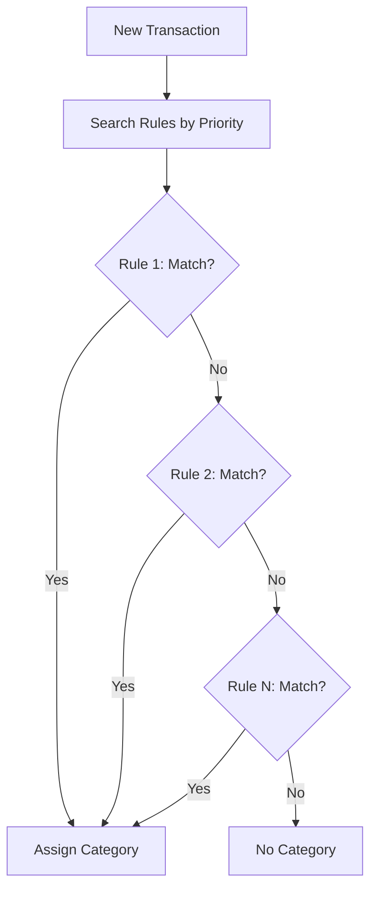

---

## 10.2 Creating a Rule

1. Go to **Settings** → **Rules** (`/budget/settings/rules`)
2. Click **"+ New Rule"**
3. Configure the fields:
   - **Field to match** — Payee, Description, or Both
   - **Match type**:
     - `Exact` — The text must match exactly
     - `Contains` — The text must contain the pattern
     - `Starts with` — The text must begin with the pattern
     - `Regex` — Regular expression for complex patterns
   - **Pattern** — The text to search for (e.g., "WALMART", "UBER", "NETFLIX")
   - **Target category** — Which category to assign (e.g., "Groceries", "Transportation", "Entertainment")
   - **Priority** — A number that defines the evaluation order (higher = checked first)
4. Click **"Create"**

---

## 10.3 Priority

Priority defines the order in which rules are evaluated. Rules with **higher numbers** are checked first.

**Recommended strategy:**

| Priority | Type of rule | Example |
|----------|-------------|---------|
| 100+ | Very specific rules | "UBER EATS" → Dining Out |
| 50-99 | Moderately specific rules | "UBER" → Transportation |
| 1-49 | General rules | Any transaction with "AMAZON" → Online Shopping |

**Why it matters:** If you have a general rule "UBER" → Transportation (priority 50) and a specific one "UBER EATS" → Dining Out (priority 100), the UBER EATS rule is evaluated first and wins. If it did not exist, the transaction would fall through to the general UBER rule.

---

## 10.4 Common Rule Examples

Here are useful rules based on common descriptions found in bank statements:

| Pattern | Type | Suggested Category |
|---------|------|-------------------|
| `WALMART` | Contains | Groceries |
| `TARGET` | Contains | Groceries / Household |
| `UBER EATS` | Contains | Dining Out |
| `UBER` | Contains | Transportation |
| `LYFT` | Contains | Transportation |
| `ELECTRIC CO` | Contains | Utilities (Electricity) |
| `COMCAST` | Contains | Utilities (Internet) |
| `AT&T` | Contains | Utilities (Phone) |
| `^AMZN` | Regex | Online Shopping |
| `NETFLIX` | Contains | Entertainment |
| `SPOTIFY` | Contains | Entertainment |
| `SHELL` | Contains | Gas |
| `CHEVRON` | Contains | Gas |
| `AMC THEATRES` | Contains | Entertainment |

> **Tip:** After your first CSV import, review the uncategorized payees and create rules for the most frequent ones. Future imports will be categorized automatically.

---

# Chapter 11: Recurring Transactions

**Route:** `/budget/settings/recurring`

Recurring transactions are templates that generate transactions automatically at regular intervals. They are ideal for expenses and income that repeat on a regular basis.

## 11.1 What They Are

Many of your financial transactions repeat: rent, utility payments, subscriptions, and salary. Instead of entering these manually every time, you can create recurring templates that generate them automatically.

**Common examples:**

| Transaction | Frequency | Amount |
|-------------|----------|--------|
| Apartment rent | Monthly (1st) | -$8,000 |
| Salary | Biweekly (15th and 30th) | +$15,000 |
| Netflix | Monthly (5th) | -$199 |
| Spotify | Monthly (10th) | -$115 |
| Electric bill | Bimonthly | -$600 |

---

## 11.2 Creating a Recurring Template

1. Go to **Settings** → **Recurring** (`/budget/settings/recurring`)
2. Click **"+ New Recurring"**
3. Fill in the form:
   - **Name** — Identifier (e.g., "April Rent")
   - **Amount** — Quantity. Negative for expenses, positive for income
   - **Account** — Which account the money comes from or goes into
   - **Category** — Which envelope it belongs to
   - **Payee** — Who you pay or who pays you
   - **Recurrence** — Select the pattern:
     - `Daily` — Every day
     - `Weekly` — Every week on a specific day
     - `Monthly by day of month` — E.g., every 15th
     - `Monthly by day of week` — E.g., every third Monday
   - **Interval** — How many periods between occurrences (e.g., every 1 month, every 2 weeks)
   - **Start date** — When it begins
   - **End date** — When it ends (optional; leave empty = indefinite)
4. Click **"Create"**

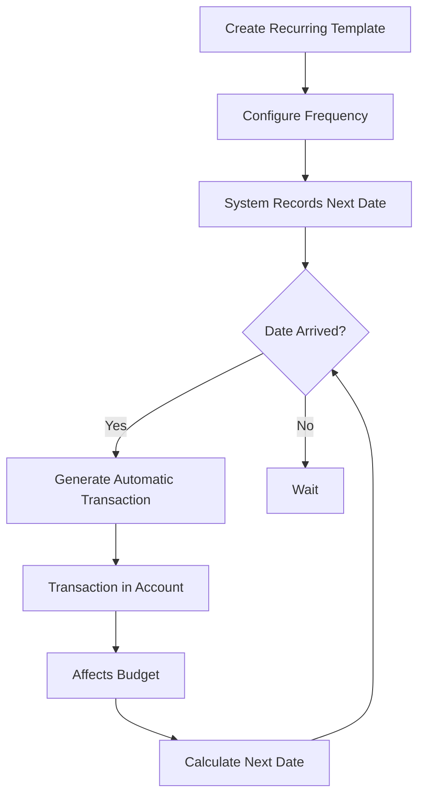

---

## 11.3 Auto-posting

When the scheduled date of a recurring transaction arrives, the system **automatically generates** the corresponding transaction in the configured account. You do not need to do anything manually.

The generated transaction:
- Appears in the transaction list like any other transaction
- Is assigned to the configured account and category
- Affects the month's budget (reduces the category's Available amount)

---

## 11.4 Managing Recurring Transactions

From the recurring transactions page you can:

- **View all** your active and inactive recurring templates
- **Activate/Deactivate** — Pause a recurring transaction without deleting it (e.g., during vacation)
- **Edit** — Change the amount, account, category, or frequency
- **Delete** — Remove the template permanently
- **View next occurrence** — See when the next transaction will be generated

> **Note:** This feature is available on Plus and Pro plans. The Free plan does not include recurring transactions.

---

# Chapter 12: Budget Goals

Goals help you define concrete objectives for your categories: how much you want to spend at most, or how much you want to save at minimum.

## 12.1 Goal Types

| Type | Description | Example |
|------|-------------|---------|
| **Spending limit** | "Do not spend more than X in this category" | Maximum $3,000 on restaurants |
| **Savings goal** | "Save at least X in this category" | At least $5,000 in emergency fund |

---

## 12.2 Creating a Goal

1. Go to the settings of the category where you want a goal
2. Select the goal type: spending limit or savings goal
3. Configure:
   - **Category** — Which category it applies to
   - **Target amount** — The goal amount (e.g., $3,000 maximum or $5,000 minimum)
   - **Period** — Monthly, quarterly, or annual
   - **Dates** — Start and end of the goal (optional)
4. Save the goal

---

## 12.3 Tracking

Goals show visual progress indicators:

- **Progress bar** — Shows what percentage of the goal has been reached
- **Percentage** — E.g., "75% complete"
- **Color** — Green if on track, yellow if near the limit, red if exceeded

**Spending limit example:**

Goal: Maximum $3,000 on restaurants this month
- Current spending: $2,100
- Progress: 70% ($900 remaining)
- Color: yellow (close to the limit)

**Savings goal example:**

Goal: Save $10,000 in emergency fund this quarter
- Saved: $6,500
- Progress: 65%
- Color: green (on track)

> **Note:** Goals are available on Plus and Pro plans.

---

# Chapter 13: Reports

Reports give you a broad view of your finances. You can analyze spending, compare income vs expenses, and track your net worth over time.

**Base route:** `/budget/reports/`

> **Note:** Reports are premium features available on Plus and Pro plans.

## 13.1 Spending Report

**Route:** `/budget/reports/spending`

Analyzes where your money goes, broken down by category.

### What it shows

- **Bar chart** with spending by category
- **Detailed table** with: Category, Total Amount, Percentage of total
- **Filters** by date range, specific category, or group

### How to read it

Identify the categories with the highest spending. If "Dining Out" represents 30% of your spending and you did not expect that, you can adjust your budget or your habits.

**Example:**

| Category | Amount | % |
|----------|-------:|---:|
| Rent | $8,000 | 27% |
| Groceries | $6,500 | 22% |
| Transportation | $3,200 | 11% |
| Restaurants | $2,800 | 9% |
| Utilities | $2,000 | 7% |
| Other | $7,500 | 24% |
| **Total** | **$30,000** | **100%** |

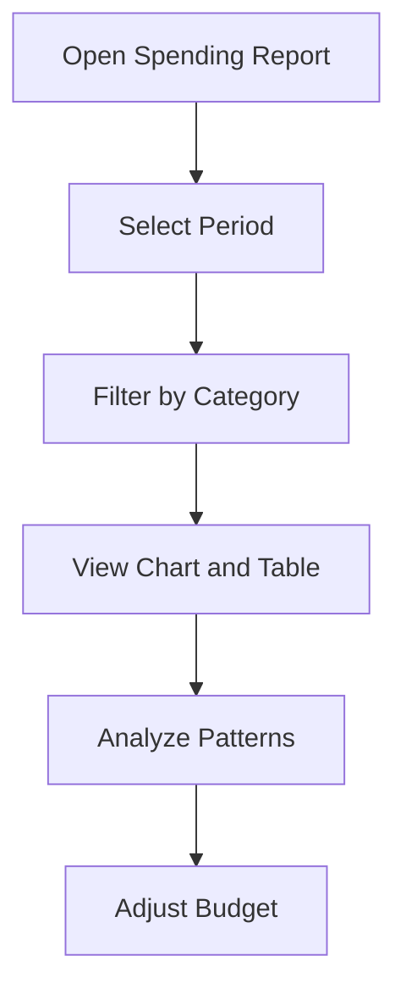

---

## 13.2 Income vs Expense

**Route:** `/budget/reports/income-vs-expense`

Compares how much money came in vs how much went out each month.

### What it shows

- **Line or bar chart** month by month
- **Income line** (in green)
- **Expense line** (in red)
- **Difference** (savings or deficit)
- **Savings rate** — What percentage of your income you are saving

**Example:**

| Month | Income | Expenses | Difference |
|-------|:------:|:--------:|:----------:|
| January | $30,000 | $25,000 | +$5,000 |
| February | $30,000 | $28,000 | +$2,000 |
| March | $35,000 | $27,000 | +$8,000 |

If the difference is positive, you are saving. If it is negative, you are spending more than you earn.

---

## 13.3 Net Worth

**Route:** `/budget/reports/net-worth`

Shows the total of what you own (assets) minus what you owe (liabilities) over time.

### Formula

```
Net Worth = Assets (accounts with positive balance, investments)
          - Liabilities (credit cards, loans)
```

### What it shows

- **Area chart** of net worth over time
- **Growth or decline** month by month
- **Breakdown** by account

**Example:**

| Account | Type | Balance |
|---------|------|--------:|
| Main Checking | Asset | $45,000 |
| Savings Account | Asset | $80,000 |
| Brokerage Account | Asset | $120,000 |
| Visa Credit Card | Liability | -$5,000 |
| **Net Worth** | | **$240,000** |

---

## 13.4 Budget Analysis

**Route:** `/budget/reports/budget-analysis`

Compares what you budgeted vs what you actually spent in each category.

### What it shows

- **By category:** Budgeted vs Actual
- **Variance:** How much you went over or under per category
- **Trends:** Whether you are improving month over month

**Example:**

| Category | Budgeted | Actual | Variance |
|----------|:--------:|:------:|:---------:|
| Groceries | $6,000 | $5,500 | -$500 (savings) |
| Transportation | $3,000 | $3,500 | +$500 (overspending) |
| Clothing | $2,000 | $800 | -$1,200 (savings) |

This report is key to improving the accuracy of your budget over time.

---

# Chapter 14: Recycle Bin

**Route:** `/parent/finances/recycle-bin`

The recycle bin is a safety net for accidentally deleted items.

## 14.1 Soft Deletion

When you delete an item in the budget module, it is not erased immediately. Instead, it goes to the **recycle bin** where it is kept for **30 days**.

Items that go to the recycle bin:

- Deleted transactions
- Deleted accounts
- Deleted categories
- Deleted category groups

---

## 14.2 Restoring Items

If you deleted something by mistake:

1. Go to the **Recycle Bin** (`/parent/finances/recycle-bin`)
2. Find the deleted item in the list
3. Click **"Restore"**
4. The item returns to its original location with all its data intact

> **Tip:** Check the recycle bin before emptying it. A mistakenly deleted transaction can affect your balances and budget.

---

## 14.3 Permanent Deletion

If you are sure you do not need an item:

- Click **"Delete Permanently"** on the individual item
- Or use **"Empty Recycle Bin"** to delete everything at once
- This action is **irreversible** — the data is gone forever

> **Note:** Items in the recycle bin are automatically deleted after 30 days. You do not need to empty it manually if you prefer not to.

---

# Chapter 15: Settings

## 15.1 Budget Settings

**Route:** `/budget/settings`

The budget settings page has the following sections:

| Section | Route | Status |
|---------|-------|--------|
| **Rules** | `/budget/settings/rules` | Available |
| **Recurring** | `/budget/settings/recurring` | Available |
| **Imports** | `/budget/import` | Available |
| **Payees** | `/budget/settings/payees` | Available |
| **Backups** | `/budget/settings/backups` | Coming soon |

From here you can access payee management, categorization rules, recurring transactions, import history, and (coming soon) backups.

---

## 15.2 Backups

The backup feature will allow you to export encrypted snapshots of your budget data. This feature is in development and will be available soon.

When it is ready, you will be able to:

- Download a file with all your budget data
- Restore from a backup in case of issues
- Save periodic backups

---

## 15.3 Language

The app supports two languages:

| Language | How to activate |
|----------|----------------|
| **Spanish** | Go to Profile → Preferred Language → select "Spanish" |
| **English** | Go to Profile → Preferred Language → select "English" |

The language change affects:

- All interface text
- Button and menu labels
- Confirmation and error messages
- Month names (Ene, Feb, Mar... vs Jan, Feb, Mar...)

> **Note:** Task and reward translations depend on the translations that parents entered when creating them. If a task does not have an English translation, it will be displayed in Spanish.

---

# Chapter 16: Subscription and Profile

## 16.1 Available Plans

Family Task Manager offers three plans:

| Feature | Free | Plus ($5 USD/mo) | Pro ($15 USD/mo) |
|---------|:----:|:-----------------:|:-----------------:|
| Tasks and Rewards | Full | Full | Full |
| Family Members | 4 | 8 | Unlimited |
| Budget Accounts | 2 | 5 | Unlimited |
| Transactions / month | 30 | 200 | Unlimited |
| Reports and Goals | No | Yes | Yes |
| Recurring Transactions | No | 5 | Unlimited |
| CSV Import | No | Yes | Yes |
| AI Receipt Scanning | No | 15/mo | Unlimited |
| Future AI Features | No | Limited | Full |

### Which plan to choose

- **Free** — Ideal for small families who only want to manage tasks and rewards. The basic budget (2 accounts, 30 transactions) is enough to get started.
- **Plus** — For families who actively use the budget, import bank CSVs, and want reports. Covers the needs of 90% of families.
- **Pro** — For large families or those with multiple bank accounts who need everything unlimited and access to advanced AI features.

---

## 16.2 Subscription Page

**Route:** `/parent/settings/subscription`

On the subscription page you can:

### View your current plan

- **Plan name** — Free, Plus, or Pro
- **Status** — Active or Cancelled
- **Renewal date** — When the next billing period occurs

### Usage meters

Progress bars showing how much of your limits you have used:

- **Family Members** — E.g., 3 of 4
- **Budget Accounts** — E.g., 2 of 2
- **Transactions this month** — E.g., 18 of 30
- **Recurring Transactions** — E.g., 0 of 0 (not available on Free)

### Plan comparison

A detailed table showing the differences between Free, Plus, and Pro, with checkmarks and crosses for each feature.

### Upgrade plan

Click **"Upgrade Plan"** to upgrade to Plus or Pro. Payment is processed through PayPal.

> **Note:** Only users with the Parent/Guardian role can manage the subscription.

---

# Appendix A: Glossary

| Term in the App | Spanish | Description |
|-----------------|---------|-------------|
| **Ready to Assign** | Listo para Asignar | Money available to distribute among categories |
| **Budgeted** | Presupuestado | Amount assigned to a category for the month |
| **Spent** | Gastado | Actual amount spent in a category |
| **Available** | Disponible | What remains in a category (budgeted - spent + previous balance) |
| **Envelope** | Sobre | Metaphor for a budget category where money is assigned |
| **Rollover** | Rollover | Unspent balance that carries over to the next month |
| **Overspending** | Sobregasto | When you spend more than budgeted in a category |
| **Reconcile** | Conciliar | Verifying that the app matches your bank statement |
| **Cleared** | Aclarada | Transaction that appears on your bank statement |
| **Reconciled** | Conciliada | Transaction verified and locked during reconciliation |
| **On-budget** | On-budget | Account that affects envelope assignments |
| **Off-budget** | Off-budget | Tracking-only account, does not affect envelopes |
| **Payee** | Beneficiario | Person or company you pay or receive money from |
| **Transaction** | Movimiento | Record of income or expense in an account |
| **Split** | Split | Transaction divided among multiple categories |
| **Template** | Plantilla | Reusable task that is assigned weekly |
| **Shuffle** | Shuffle | Weekly task assignment rotation |
| **Previous Balance** | Saldo Anterior | Rollover amount from the prior month |
| **Net Worth** | Patrimonio Neto | Total assets minus total liabilities |
| **Cash Flow** | Flujo de Caja | Comparison of income vs expenses over a period |

---

# Appendix B: Frequently Asked Questions

### 1. Can I recover points after redeeming a reward?

No. Reward redemptions are permanent. However, you can keep earning points by completing tasks. Parents can also adjust points manually from the Members section.

### 2. What happens if I complete a task mid-week?

The task is marked as completed and will not reappear until the next assignment (after the next weekly shuffle or according to the configured frequency).

### 3. What does a negative "Ready to Assign" mean?

It means you budgeted more money than you have available. You need to reduce the assignments in some categories or wait to receive more income.

### 4. Can I edit transactions imported from CSV?

Yes. After importing, each transaction becomes a normal transaction that you can edit freely (change category, amount, date, payee, etc.).

### 5. How do I change my child's password?

Go to **Management** → **Members**. From there you can manage the accounts of family members. You can also use the "Forgot my password" feature from the login screen.

### 6. Why do I not see the Budget button?

The budget module is only visible to users with the **Parent/Guardian** role. If you have a Child or Teen role, you will not have access to the family finances.

### 7. What happens if I delete a category that already has transactions?

The category goes to the recycle bin. The transactions are not deleted but are left without a category. You can restore the category from the recycle bin within 30 days.

### 8. Can I use the app on my phone?

Yes. Family Task Manager is a responsive web application that works in any modern browser, on both desktop and mobile devices. No installation required.

### 9. How many families can I create?

Each account belongs to a single family. If you need to manage another family, you must create a different account with a different email address.

### 10. Is the financial information secure?

Yes. All information is transmitted encrypted (HTTPS). Sessions are authenticated with JWT tokens stored in secure cookies (httpOnly). Each family's data is completely isolated — no member of another family can see your information.

### 11. Which browsers are supported?

Family Task Manager works on Chrome, Firefox, Safari, and Edge in their recent versions. Keeping your browser up to date is recommended.

### 12. What happens to leftover funds at the end of the month?

With rollover enabled (the default), unspent funds in a category carry over to the next month. This lets you save in categories where you do not spend everything each month.

---

# Appendix C: Troubleshooting

### Problem: I cannot log in

**Possible causes and solutions:**

1. **Incorrect email or password** — Verify that you are typing the exact email you registered with
2. **Unverified account** — Check your email inbox (including spam) and click the verification link
3. **Disabled account** — A parent may have disabled it. Contact your family administrator
4. **Server issue** — If you see "Error connecting to server", try reloading the page

### Problem: Tasks do not appear on my dashboard

**Possible causes:**

1. The weekly shuffle has not been run — Ask a parent to click "Shuffle Tasks"
2. All of today's tasks are already completed
3. Your account is disabled

### Problem: The budget does not add up

**Steps to diagnose:**

1. Verify that all transactions are recorded (none are missing)
2. Check for duplicate transactions
3. Reconcile with your bank statement
4. Verify that the starting balance of each account is correct
5. Check for uncovered overspending in previous months

### Problem: CSV import fails

**Possible causes:**

1. **Incompatible format** — Make sure the file is CSV (not Excel .xlsx)
2. **Incorrect delimiter** — Try switching between comma, semicolon, or tab
3. **Unmapped columns** — Verify that you correctly assigned the date and amount columns
4. **Encoding** — Some banks export with a different encoding. Open the CSV in a text editor and save it as UTF-8

### Problem: The page does not load or appears blank

**Solutions:**

1. Reload the page (Cmd+R on Mac, F5 on Windows)
2. Clear the browser cache
3. Log out and log back in
4. Try a different browser
5. Check your internet connection

### Problem: My child's points did not update

**Possible causes:**

1. The task was not correctly marked as completed — Try reloading the page
2. There is a server delay — Wait a few seconds and reload
3. Points were manually adjusted by a parent — Check the history in the Members section

---

**Version:** 2.0
**Last updated:** April 2026
**Available at:** https://family.agent-ia.mx
**Languages:** Spanish (Espanol) | English (this document)
