# Family Task Manager — Guia Completa de Usuario

**Version 3.0** | Ultima actualizacion: Junio 2026

Bienvenido a la guia oficial de **Family Task Manager**, la aplicacion para organizar tareas, premios, consecuencias y finanzas de su familia de forma divertida y eficiente.

---

## Tabla de Contenidos

1. [Capitulo 1: Primeros Pasos](#capitulo-1-primeros-pasos)
   - [1.1 Que es Family Task Manager](#11-que-es-family-task-manager)
   - [1.2 Registro](#12-registro)
   - [1.3 Configuracion Familiar](#13-configuracion-familiar)
   - [1.4 Iniciar Sesion](#14-iniciar-sesion)
   - [1.5 Navegacion](#15-navegacion)
2. [Capitulo 2: Gestion de Tareas](#capitulo-2-gestion-de-tareas)
   - [2.1 Tablero Principal (Dashboard)](#21-tablero-principal-dashboard)
   - [2.2 Completar Tareas](#22-completar-tareas)
   - [2.3 Plantillas de Tareas (Padres)](#23-plantillas-de-tareas-padres)
   - [2.4 Asignacion Semanal (Shuffle)](#24-asignacion-semanal-shuffle)
   - [2.5 Calendario de Asignaciones](#25-calendario-de-asignaciones)
3. [Capitulo 3: Premios y Consecuencias](#capitulo-3-premios-y-consecuencias)
   - [3.1 Tienda de Premios](#31-tienda-de-premios)
   - [3.2 Gestionar Premios (Padres)](#32-gestionar-premios-padres)
   - [3.3 Sistema de Consecuencias](#33-sistema-de-consecuencias)
4. [Capitulo 4: Presupuesto — Vision General](#capitulo-4-presupuesto--vision-general)
   - [4.1 Que es el Presupuesto por Sobres](#41-que-es-el-presupuesto-por-sobres)
   - [4.2 Navegacion del Modulo](#42-navegacion-del-modulo)
   - [4.3 Acceso Solo para Padres](#43-acceso-solo-para-padres)
5. [Capitulo 5: Cuentas Bancarias](#capitulo-5-cuentas-bancarias)
   - [5.1 Tipos de Cuenta](#51-tipos-de-cuenta)
   - [5.2 Crear Cuenta](#52-crear-cuenta)
   - [5.3 Lista de Cuentas y Saldos](#53-lista-de-cuentas-y-saldos)
   - [5.4 Detalle de Cuenta](#54-detalle-de-cuenta)
   - [5.5 Cerrar y Reabrir](#55-cerrar-y-reabrir)
   - [5.6 Conciliacion Bancaria](#56-conciliacion-bancaria)
6. [Capitulo 6: Transacciones](#capitulo-6-transacciones)
   - [6.1 Anatomia de una Transaccion](#61-anatomia-de-una-transaccion)
   - [6.2 Crear Transaccion](#62-crear-transaccion)
   - [6.3 Transacciones Divididas (Splits)](#63-transacciones-divididas-splits)
   - [6.4 Transferencias Entre Cuentas](#64-transferencias-entre-cuentas)
   - [6.5 Editar y Eliminar](#65-editar-y-eliminar)
   - [6.6 Filtrado y Busqueda](#66-filtrado-y-busqueda)
   - [6.7 Importar CSV](#67-importar-csv)
7. [Capitulo 7: Categorias y Grupos](#capitulo-7-categorias-y-grupos)
   - [7.1 Estructura](#71-estructura)
   - [7.2 Crear Grupos y Categorias](#72-crear-grupos-y-categorias)
   - [7.3 Categorias de Ingreso](#73-categorias-de-ingreso)
   - [7.4 Archivar y Ocultar](#74-archivar-y-ocultar)
   - [7.5 Reordenar](#75-reordenar)
8. [Capitulo 8: Vista Mensual del Presupuesto](#capitulo-8-vista-mensual-del-presupuesto)
   - [8.1 Layout de la Vista Mensual](#81-layout-de-la-vista-mensual)
   - [8.2 Listo para Asignar](#82-listo-para-asignar)
   - [8.3 Asignar Fondos](#83-asignar-fondos)
   - [8.4 Las Tres Columnas](#84-las-tres-columnas)
   - [8.5 Manejar Sobregasto](#85-manejar-sobregasto)
   - [8.6 Transferir Entre Categorias](#86-transferir-entre-categorias)
   - [8.7 Rollover](#87-rollover)
   - [8.8 Navegacion Entre Meses](#88-navegacion-entre-meses)
   - [8.9 Cerrar y Reabrir Meses](#89-cerrar-y-reabrir-meses)
9. [Capitulo 9: Beneficiarios (Payees)](#capitulo-9-beneficiarios-payees)
   - [9.1 Que son los Beneficiarios](#91-que-son-los-beneficiarios)
   - [9.2 Gestion de Beneficiarios](#92-gestion-de-beneficiarios)
   - [9.3 Auto-creacion desde CSV](#93-auto-creacion-desde-csv)
10. [Capitulo 9.5: Escaner de Recibos con IA y Cola de Revision](#capitulo-95-escaner-de-recibos-con-ia-y-cola-de-revision)
    - [9.5.1 Escanear un Recibo](#951-escanear-un-recibo)
    - [9.5.2 Cola de Revision (Revision Humana)](#952-cola-de-revision-revision-humana)
11. [Capitulo 10: Reglas de Categorizacion](#capitulo-10-reglas-de-categorizacion)
    - [10.1 Como Funcionan](#101-como-funcionan)
    - [10.2 Crear una Regla](#102-crear-una-regla)
    - [10.3 Prioridad](#103-prioridad)
    - [10.4 Ejemplos para Bancos Mexicanos](#104-ejemplos-para-bancos-mexicanos)
11. [Capitulo 11: Transacciones Recurrentes](#capitulo-11-transacciones-recurrentes)
    - [11.1 Que Son](#111-que-son)
    - [11.2 Crear Plantilla Recurrente](#112-crear-plantilla-recurrente)
    - [11.3 Auto-posting](#113-auto-posting)
    - [11.4 Gestionar Recurrentes](#114-gestionar-recurrentes)
12. [Capitulo 12: Metas de Presupuesto](#capitulo-12-metas-de-presupuesto)
    - [12.1 Tipos de Meta](#121-tipos-de-meta)
    - [12.2 Crear una Meta](#122-crear-una-meta)
    - [12.3 Seguimiento](#123-seguimiento)
13. [Capitulo 13: Reportes](#capitulo-13-reportes)
    - [13.1 Reporte de Gastos](#131-reporte-de-gastos)
    - [13.2 Ingreso vs Gasto](#132-ingreso-vs-gasto)
    - [13.3 Patrimonio Neto](#133-patrimonio-neto)
    - [13.4 Analisis de Presupuesto](#134-analisis-de-presupuesto)
14. [Capitulo 14: Papelera de Reciclaje](#capitulo-14-papelera-de-reciclaje)
    - [14.1 Eliminacion Suave](#141-eliminacion-suave)
    - [14.2 Restaurar Elementos](#142-restaurar-elementos)
    - [14.3 Eliminacion Permanente](#143-eliminacion-permanente)
15. [Capitulo 15: Configuracion](#capitulo-15-configuracion)
    - [15.1 Ajustes del Presupuesto](#151-ajustes-del-presupuesto)
    - [15.2 Respaldos](#152-respaldos)
    - [15.3 Idioma](#153-idioma)
16. [Capitulo 16: Suscripcion y Perfil](#capitulo-16-suscripcion-y-perfil)
    - [16.1 Planes Disponibles](#161-planes-disponibles)
    - [16.2 Pagina de Suscripcion](#162-pagina-de-suscripcion)
17. [Capitulo 17: Gigs (Ganancias Extra)](#capitulo-17-gigs-ganancias-extra)
18. [Capitulo 18: Mascota Virtual](#capitulo-18-mascota-virtual)
19. [Capitulo 19: Plan de Comidas](#capitulo-19-plan-de-comidas)
20. [Capitulo 20: Listas de Compras](#capitulo-20-listas-de-compras)
21. [Capitulo 21: Calendario Familiar](#capitulo-21-calendario-familiar)
22. [Capitulo 22: Chat Familiar y Mensajes](#capitulo-22-chat-familiar-y-mensajes)
23. [Capitulo 23: Modo Kiosco (Pantalla Compartida)](#capitulo-23-modo-kiosco-pantalla-compartida)
24. [Capitulo 24: Analitica Familiar](#capitulo-24-analitica-familiar)
25. [Capitulo 25: Jarvis (Copiloto IA)](#capitulo-25-jarvis-copiloto-ia)
26. [Capitulo 26: Planes de Suscripcion — Referencia Rapida](#capitulo-26-planes-de-suscripcion--referencia-rapida)
- [Apendice A: Glosario](#apendice-a-glosario)
- [Apendice B: Preguntas Frecuentes](#apendice-b-preguntas-frecuentes)
- [Apendice C: Solucion de Problemas](#apendice-c-solucion-de-problemas)

---

# Capitulo 1: Primeros Pasos

## 1.1 Que es Family Task Manager

Family Task Manager es una aplicacion web disenada para familias con hijos que desean organizar las tareas del hogar de manera divertida y gamificada. Los ninos completan tareas, ganan puntos y los canjean por premios reales que los padres configuran. Ademas, incluye un modulo completo de presupuesto familiar basado en el metodo de sobres.

**Como funciona la economia:** Dos monedas, dos propositos. Terminar tus tareas obligatorias gana **puntos** — cambialos en la Tienda de Premios, y terminar todas las tareas obligatorias tambien desbloquea el **domingo semanal** de la familia. Los gigs son trabajos opcionales pagados del tablero de gigs que ganan **dinero extra ($MXN)**, que un padre libera cada vez que aprueba tu evidencia enviada — un saldo separado de los puntos.

**Para quien es esta aplicacion:**

- Familias con hijos de cualquier edad (ninos, adolescentes)
- Padres que quieren ensenar responsabilidad a traves del juego
- Familias que desean llevar un control organizado de sus finanzas

**Que puede hacer:**

- Asignar y rotar tareas semanales entre los miembros de la familia
- Otorgar puntos por tareas completadas y canjearlos por premios
- Establecer consecuencias cuando no se cumplen las responsabilidades
- Llevar un presupuesto familiar completo con el metodo de sobres
- Importar movimientos bancarios desde CSV
- Generar reportes de gastos, flujo de caja y patrimonio neto

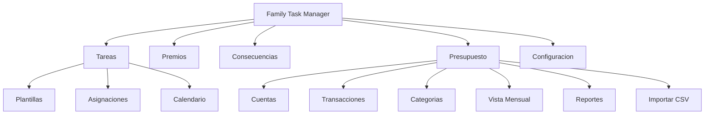

---

## 1.2 Registro

Para comenzar a usar Family Task Manager, el primer padre o madre de la familia debe crear una cuenta.

**Paso a paso:**

1. Abra su navegador y vaya a `/register`
2. Complete el formulario:
   - **Nombre completo** — Su nombre real
   - **Correo Electronico** — Sera su usuario para iniciar sesion
   - **Contrasena** — Minimo 8 caracteres
   - **Nombre de la familia** — El nombre que identificara a su grupo familiar (ej: "Familia Martinez")
3. Haga clic en **"Registrar"**
4. Recibira un correo de verificacion. Haga clic en el enlace para activar su cuenta
5. Una vez verificado, inicie sesion normalmente

> **Nota:** El primer usuario registrado automaticamente se convierte en Padre/Tutor (PARENT) y es el administrador de la familia.

---

## 1.3 Configuracion Familiar

Una vez registrado, puede invitar a los demas miembros de la familia.

### Invitar por correo electronico

1. Vaya a **Gestion** (`/parent`) → **Miembros** (`/parent/members`)
2. En la seccion **"Registrar Nuevo Miembro"**, complete:
   - **Nombre completo** del miembro
   - **Correo electronico** — Sera su usuario
   - **Contrasena** — Minimo 8 caracteres
   - **Rol** — Seleccione Hijo/a, Adolescente o Padre/Tutor
3. Haga clic en **"Registrar Miembro"**

### Codigo de invitacion

Tambien puede generar un codigo unico que otros miembros usen para unirse a su familia:

1. Vaya a la configuracion de la familia
2. Haga clic en **"Generar Codigo"**
3. Comparta el codigo con el nuevo miembro
4. El nuevo miembro va a `/accept-invitation` e ingresa el codigo

### Roles de la familia

| Rol | En la app | Permisos |
|-----|-----------|----------|
| **Padre/Tutor** | `Padre/Tutor` | Acceso completo: crear tareas, premios, consecuencias, presupuesto, gestionar miembros |
| **Adolescente** | `Adolescente` | Acceso extendido: completar tareas, canjear premios, ver su perfil |
| **Hijo/a** | `Hijo/a` | Acceso basico: completar tareas, canjear premios, ver su perfil |

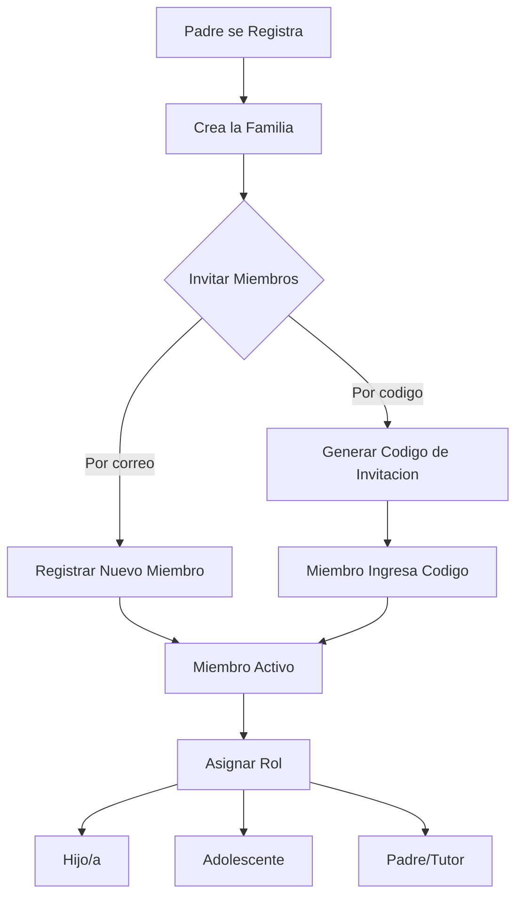

---

## 1.4 Iniciar Sesion

1. Vaya a `/login`
2. Ingrese su **Correo Electronico** y **Contrasena**
3. Haga clic en **"Iniciar Sesion"**

### Cuentas de demostracion

Si desea probar la aplicacion sin crear una cuenta real, puede usar las cuentas de demo (disponibles si se cargo la informacion de prueba):

| Correo | Contrasena | Rol |
|--------|------------|-----|
| `mom@demo.com` | `password123` | Padre/Tutor |
| `dad@demo.com` | `password123` | Padre/Tutor |
| `emma@demo.com` | `password123` | Hijo/a |
| `lucas@demo.com` | `password123` | Adolescente |

### Olvide mi contrasena

1. En la pantalla de inicio de sesion, haga clic en **"Olvide mi contrasena"** (`/forgot-password`)
2. Ingrese su correo electronico
3. Recibira un enlace para restablecer su contrasena
4. Siga el enlace y elija una nueva contrasena en `/reset-password`

> **Tip:** Si es un nino y olvido su contrasena, pida a un padre que la restablezca desde la seccion de Miembros.

---

## 1.5 Navegacion

La aplicacion tiene una barra de navegacion inferior (**Bottom Nav**) que aparece en todas las pantallas. Los botones visibles dependen de su rol:

| Boton | Ruta | Visible para |
|-------|------|-------------|
| **Tareas** | `/dashboard` | Todos |
| **Premios** | `/rewards` | Todos |
| **Perfil** | `/profile` | Todos |
| **Presupuesto** | `/budget` | Padres |
| **Gestion** | `/parent` | Padres |

### Cambio de idioma

La aplicacion soporta **Espanol** e **Ingles**. Para cambiar el idioma:

1. Vaya a **Perfil** (`/profile`)
2. En la seccion **"Idioma Preferido"**, seleccione **Espanol** o **Ingles**
3. El cambio se aplica inmediatamente en toda la aplicacion

> **Nota:** La barra inferior tambien muestra un boton de idioma con la leyenda "Switch to English" o "Cambiar a Espanol".

---

# Capitulo 2: Gestion de Tareas

## 2.1 Tablero Principal (Dashboard)

**Ruta:** `/dashboard`

El Tablero es la primera pantalla que ve al iniciar sesion. Muestra un resumen rapido de su actividad.

### Que ve en el Tablero

- **Mis Puntos** — Su saldo actual de puntos (numero grande en la parte superior)
- **Tareas Pendientes** — Cuantas tareas tiene asignadas para hoy
- **Tareas Obligatorias** — Tareas que debe completar (seccion principal)
- **Tareas Bonus** — Tareas opcionales que dan puntos extra (se desbloquean al completar las obligatorias)
- **Barra de progreso** — Muestra cuantas tareas lleva completadas del total

### Mecanica de bonus

Las tareas bonus estan **bloqueadas** hasta que complete todas las tareas obligatorias del dia. Una vez que las obligatorias estan listas, vera el mensaje "Tareas bonus desbloqueadas!" y podra completarlas para ganar puntos adicionales.

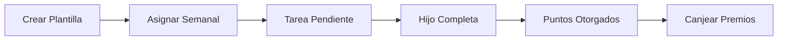

---

## 2.2 Completar Tareas

Cada tarjeta de tarea en el Tablero muestra la siguiente informacion:

| Campo | Descripcion |
|-------|-------------|
| **Titulo** | Nombre de la tarea (ej: "Lavar los platos") |
| **Descripcion** | Detalles de que hacer |
| **Puntos** | Cuantos puntos gana al completarla |
| **Frecuencia** | Diaria, cada 3 dias o semanal |
| **Badge BONUS** | Indica si es una tarea bonus (puntos extra) |

### Paso a paso para completar una tarea

1. En el Tablero, localice la tarea que desea completar
2. Haga clic en el boton **"Completar"**
3. La tarea se marca como completada
4. Los puntos se suman automaticamente a su saldo
5. La tarea desaparece de la lista de pendientes

> **Tip:** Solo ve tareas que aun no ha completado hoy. Las tareas completadas muestran "+N pts ganados" en verde.

### Que pasa cuando completa todo

Si no tiene tareas pendientes, vera el mensaje **"Todo listo! No hay tareas pendientes. Disfruta tu dia!"** en el Tablero. Las nuevas tareas apareceran segun su frecuencia o despues del siguiente shuffle semanal.

---

## 2.3 Plantillas de Tareas (Padres)

**Ruta:** `/parent/tasks`

Las plantillas son tareas reutilizables que sirven como moldes para generar asignaciones semanales. Solo los padres pueden crearlas y gestionarlas.

### Crear una nueva plantilla

1. Vaya a **Gestion** → **Tareas** (`/parent/tasks`)
2. En la seccion **"Crear Nueva Plantilla"**, complete:
   - **Titulo de la tarea** — Nombre corto y claro (ej: "Tender la cama")
   - **Descripcion (opcional)** — Detalles adicionales de como se hace
   - **Puntos** — Cuantos puntos vale la tarea (ej: 10, 25, 50)
   - **Frecuencia** — Seleccione:
     - `Diaria` — Se asigna cada dia
     - `Cada 3 dias` — Se asigna cada 3 dias
     - `Semanal` — Se asigna una vez por semana
   - **Tarea bonus** — Marque si es una tarea extra que solo se desbloquea al completar las obligatorias
3. Haga clic en **"Crear Plantilla"**

### Traducciones bilingues

Cada plantilla puede tener traducciones en espanol e ingles:

- **Titulo (Espanol)** y **Titulo (Ingles)**
- **Descripcion (Espanol)** y **Descripcion (Ingles)**
- Puede usar el boton **"Auto-traducir"** para generar la traduccion automaticamente

### Tipos de asignacion

Al crear una plantilla, puede definir como se asigna a los miembros:

| Tipo | Comportamiento |
|------|---------------|
| **ROTATE** | Rota entre los miembros cada semana |
| **FIXED** | Siempre se asigna al mismo miembro |
| **AUTO** | El sistema decide la mejor distribucion |

### Editar y eliminar plantillas

- Haga clic en una plantilla de la lista → se abre la pagina de edicion (`/parent/tasks/[id]/edit`)
- Modifique los campos que desee y haga clic en **"Guardar Cambios"**
- Para eliminar, confirme con el mensaje "Eliminar esta plantilla y todas sus asignaciones?"
- Puede activar/desactivar una plantilla sin eliminarla (toggle Activa/Inactiva)

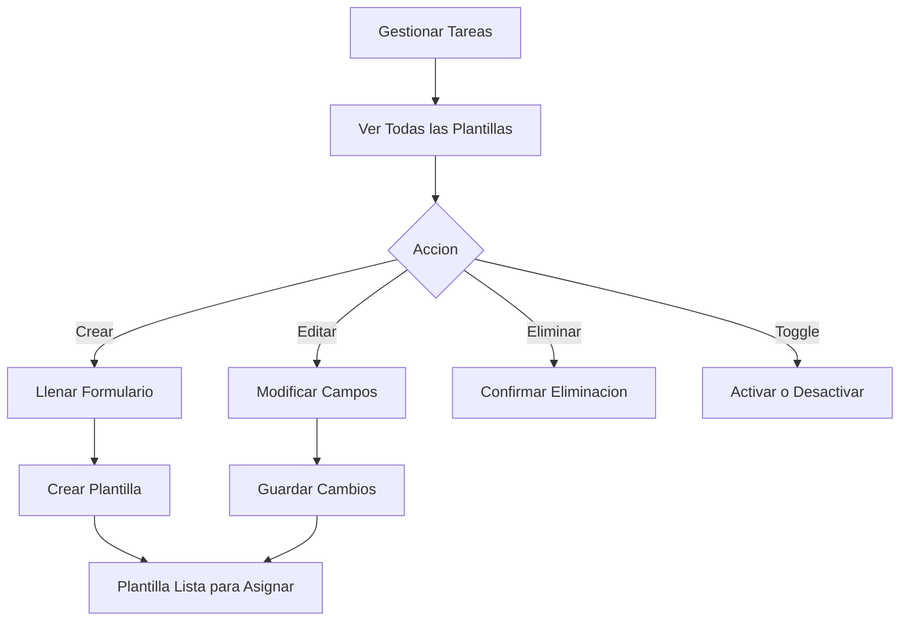

---

## 2.4 Asignacion Semanal (Shuffle)

Cada semana, el sistema **asigna automaticamente** las tareas a los miembros de la familia segun la frecuencia y el tipo de asignacion configurado en cada plantilla.

### Shuffle manual

Si desea redistribuir las tareas manualmente:

1. En **Gestionar Tareas** (`/parent/tasks`), busque el boton **"Mezclar Tareas"** (Shuffle Semanal)
2. Aparecera el mensaje: "Esto va a re-mezclar todas las asignaciones pendientes de esta semana. Continuar?"
3. Confirme y el sistema reasignara las tareas
4. Vera el mensaje de exito con la cantidad de asignaciones creadas

### Como funciona la rotacion

- Las tareas tipo **ROTATE** cambian de miembro cada semana. Si esta semana a Emma le toco "Barrer", la siguiente le tocara a Lucas
- Las tareas tipo **FIXED** siempre se asignan al mismo miembro
- Las tareas tipo **AUTO** se distribuyen inteligentemente para equilibrar la carga entre miembros

> **Tip:** Haga el shuffle cada lunes para que las tareas se renueven para la semana.

---

## 2.5 Calendario de Asignaciones

**Ruta:** `/parent/assignments`

El calendario muestra una vista semanal de **todas las asignaciones** de todos los miembros de la familia.

### Usando el calendario

- **Semana del** — Muestra la fecha de inicio de la semana actual
- **Navegacion** — Use los botones de semana anterior y semana siguiente para moverse entre semanas
- **Filtrar por miembro** — Use el selector "Todos los Miembros" para ver solo las tareas de una persona
- **Dias de la semana** — Las columnas muestran Lun, Mar, Mie, Jue, Vie, Sab, Dom

### Estados de las tareas

Cada tarea en el calendario muestra su estado con un indicador de color:

| Estado | Significado |
|--------|-------------|
| **Pendiente** | La tarea aun no se completa |
| **Hecha** | La tarea fue completada |
| **Atrasada** | No se completo a tiempo |
| **Cancelada** | Fue cancelada por un padre |

> **Tip:** Si un miembro tiene demasiadas tareas en una semana, ajuste las plantillas o haga un nuevo shuffle.

---

# Capitulo 3: Premios y Consecuencias

## 3.1 Tienda de Premios

**Ruta:** `/rewards`

La Tienda de Premios es donde los miembros de la familia canjean los puntos que ganaron completando tareas.

### Que ve en la tienda

- **Puntos Disponibles** — Su saldo actual (parte superior)
- **Lista de premios** — Cada premio muestra su nombre, costo en puntos y categoria
- **Boton "Canjear Premio"** — En verde si tiene suficientes puntos, deshabilitado si no

### Canjear un premio

1. Vaya a **Premios** (`/rewards`)
2. Revise la lista de premios disponibles
3. Encuentre el premio que desea y verifique que tiene suficientes puntos
4. Haga clic en **"Canjear Premio"**
5. Sus puntos se descuentan inmediatamente
6. Vera el mensaje "Premio canjeado! Puntos descontados."

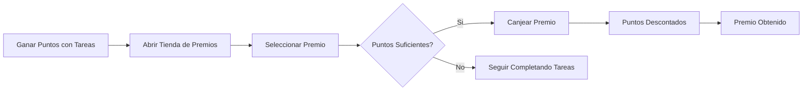

> **Nota:** Los canjes son permanentes. Una vez canjeado un premio, los puntos no se devuelven. Pero siempre puede ganar mas puntos completando tareas.

### Si no hay premios disponibles

Si ve el mensaje "Sin premios aun", pida a un padre que agregue premios desde la seccion de Gestion.

---

## 3.2 Gestionar Premios (Padres)

**Ruta:** `/parent/rewards`

Los padres crean y administran los premios que los hijos pueden canjear.

### Crear un premio

1. Vaya a **Gestion** → **Premios** (`/parent/rewards`)
2. En la seccion **"Crear Nuevo Premio"**, complete:
   - **Nombre del premio** — Ej: "Pelicula en el cine", "Helado doble", "30 min extra de videojuegos"
   - **Costo en Puntos** — Cuantos puntos cuesta canjearlo (ej: 100, 250, 500)
   - **Categoria** — Seleccione una:
     - `Tiempo de Pantalla` — Videojuegos, TV, tablet
     - `Comida` — Dulces, restaurantes, postres
     - `Actividad` — Salidas, paseos, deportes
     - `Privilegio` — Permisos especiales
     - `Articulo` — Objetos fisicos
     - `Ninguna` — Sin categoria
3. Haga clic en **"Crear Premio"**

### Editar o eliminar un premio

- Haga clic en el premio de la lista → se abre la pagina de edicion (`/parent/rewards/[id]/edit`)
- Modifique nombre, costo o categoria
- Para eliminar, use el boton correspondiente

> **Tip:** Configure premios con distintos rangos de puntos: premios chicos (50-100 pts), medianos (200-500 pts) y grandes (1000+ pts). Asi los hijos tienen metas a corto y largo plazo.

---

## 3.3 Sistema de Consecuencias

**Ruta:** `/parent/consequences`

Las consecuencias son sanciones que los padres asignan cuando un miembro no cumple con sus responsabilidades.

### Crear una consecuencia (Padres)

1. Vaya a **Gestion** → **Consecuencias** (`/parent/consequences`)
2. En la seccion **"Crear Consecuencia"**, complete:
   - **Titulo de la consecuencia** — Ej: "Sin videojuegos por 3 dias"
   - **Asignar a** — Seleccione el miembro
3. Haga clic en **"Crear Consecuencia"**

### Ver consecuencias activas (Hijos)

Los hijos ven sus consecuencias activas en su pagina de **Perfil** (`/profile`), en la seccion "Consecuencias Activas". Cada consecuencia muestra su titulo y la fecha "Hasta" cuando termina.

### Resolver una consecuencia

Cuando el miembro ha cumplido la consecuencia:

1. Vaya a **Consecuencias** (`/parent/consequences`)
2. Busque la consecuencia activa
3. Haga clic en **"Resolver"**
4. La consecuencia cambia a estado "Resuelta" y desaparece del perfil del miembro

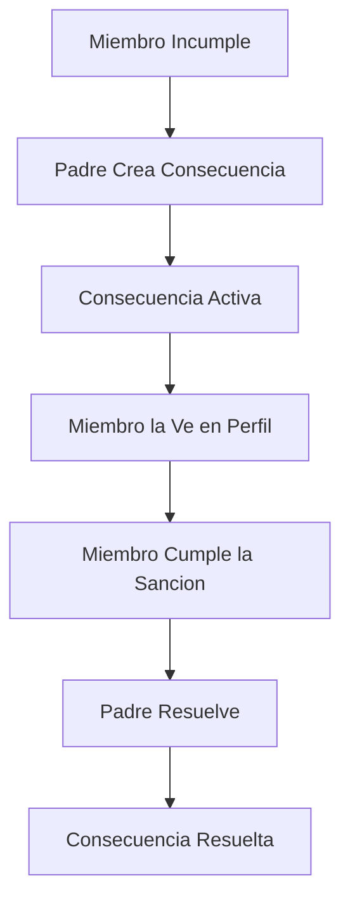

---

# Capitulo 4: Presupuesto — Vision General

## 4.1 Que es el Presupuesto por Sobres

El modulo de presupuesto de Family Task Manager utiliza el **metodo de sobres** (envelope budgeting), una tecnica de finanzas personales probada por decadas.

### La analogia del sobre fisico

Imagine que cada mes recibe su sueldo en efectivo. Toma sobres de papel, escribe el nombre de cada gasto en uno (renta, comida, transporte, servicios, ahorro, etc.) y distribuye el dinero entre los sobres. Cuando va al supermercado, toma dinero del sobre de "Comida". Cuando paga la luz, toma del sobre de "Servicios".

**La regla es simple:** solo puede gastar lo que hay en cada sobre. Si el sobre de "Comida" se queda vacio a mitad de mes, tiene tres opciones:

1. **Esperar** al siguiente mes
2. **Transferir** dinero de otro sobre (ej: tomar $500 del sobre de "Ropa" y pasarlo a "Comida")
3. **Agregar mas** dinero si recibe un ingreso extra

### Asi funciona en la app

En lugar de sobres fisicos, la app usa **categorias**. Cada categoria es un "sobre digital" donde usted asigna dinero al inicio del mes y registra sus gastos durante el mes.

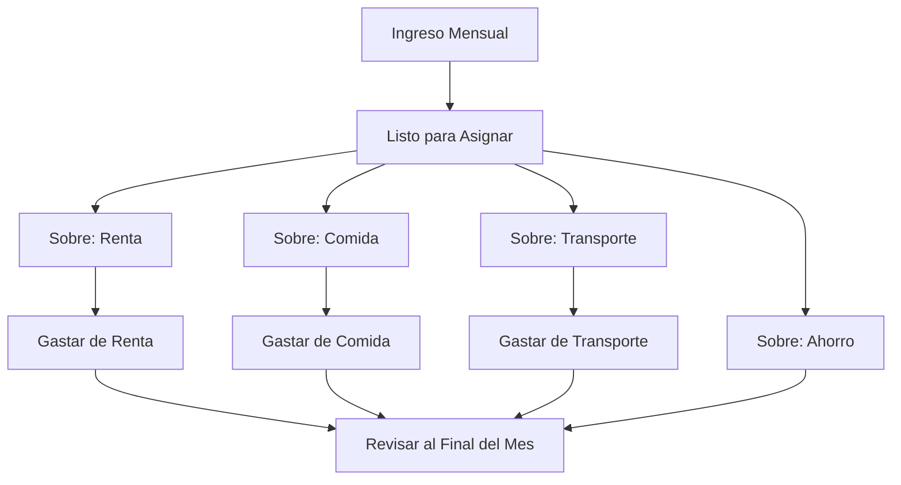

**Beneficios del metodo de sobres:**

- Siempre sabe cuanto le queda para gastar en cada rubro
- Evita gastar de mas porque cada peso tiene un destino asignado
- Facilita el ahorro: si asigna dinero al sobre de "Ahorro", ese dinero ya esta separado
- Al final del mes puede ver exactamente donde se fue su dinero

---

## 4.2 Navegacion del Modulo

**Ruta:** `/budget`

Al entrar al modulo de presupuesto, ve el **Inicio de Presupuesto** (Budget Home) con tarjetas que llevan a cada seccion:

| Seccion | Ruta | Descripcion |
|---------|------|-------------|
| **Presupuesto Mensual** | `/budget/month/[anio]/[mes]` | Asignar dinero, cubrir sobregiros y seguir la actividad |
| **Cuentas** | `/budget/accounts` | Saldos, conciliacion y movimientos por cuenta |
| **Movimientos** | `/budget/transactions` | Crear, revisar y filtrar todos los movimientos |
| **Categorias** | `/budget/categories` | Organizar grupos, metas y reglas de rollover |
| **Reportes** | `/budget/reports/spending` | Gastos, flujo de efectivo y valor neto |
| **Configuracion** | `/budget/settings` | Reglas, recurrentes, importaciones y respaldos |

Al final de la pagina ve el **flujo recomendado**:

1. Crea cuentas y categorias
2. Asigna ingresos a categorias en el mes
3. Registra y concilia movimientos
4. Cubre sobregiros y cierra el mes

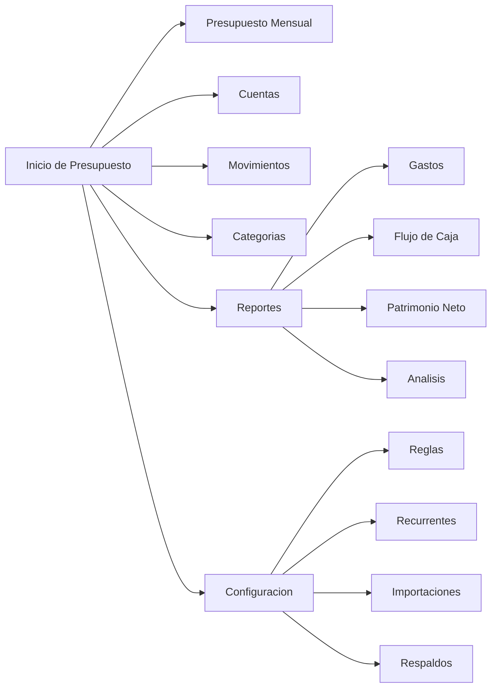

---

## 4.3 Acceso Solo para Padres

El modulo de presupuesto es exclusivo para usuarios con rol **Padre/Tutor**. Si un usuario con rol Hijo/a o Adolescente intenta acceder a `/budget`, sera redirigido automaticamente al Tablero (`/dashboard`).

Esto asegura que la informacion financiera de la familia solo la manejen los adultos responsables.

---

# Capitulo 5: Cuentas Bancarias

**Ruta:** `/budget/accounts`

Las cuentas bancarias representan donde esta su dinero en el mundo real: cuentas corrientes, de ahorro, tarjetas de credito, inversiones, etc.

## 5.1 Tipos de Cuenta

| Tipo | Descripcion | Ejemplo |
|------|-------------|---------|
| **Cuenta de Cheques** | Cuenta corriente del dia a dia | Cuenta BBVA Nomina |
| **Ahorro** | Cuenta de ahorro | Cuenta de ahorro Banorte |
| **Credito** | Tarjeta de credito (saldo negativo = deuda) | Tarjeta Banamex |
| **Inversion** | Fondos de inversion, CETES, etc. | GBM Inversiones |
| **Prestamo** | Hipoteca, credito automotriz | Credito hipotecario |
| **Otro** | Cualquier otro tipo | Efectivo, vales |

### On-budget vs Off-budget

| Tipo | Que significa | Ejemplo |
|------|--------------|---------|
| **On-budget** | Afecta las asignaciones de sobres. El dinero de esta cuenta se puede asignar a categorias | Cuenta corriente, tarjeta de credito |
| **Off-budget** | Solo seguimiento. No afecta los sobres, solo rastrea el saldo | Inversiones, CETES, hipoteca |

> **Tip:** Use on-budget para cuentas de las que gasta regularmente (corriente, credito). Use off-budget para activos de largo plazo (inversiones) o deudas grandes (hipoteca).

---

## 5.2 Crear Cuenta

**Ruta:** `/budget/accounts/new`

1. Vaya a **Cuentas** → **"+ Nueva Cuenta"**
2. Complete el formulario:
   - **Nombre** — Un nombre descriptivo (ej: "Cuenta BBVA Nomina", "Tarjeta Nu")
   - **Tipo** — Seleccione de la lista: Cheques, Ahorro, Credito, Inversion, Prestamo, Otro
   - **On-budget / Off-budget** — Defina si afecta los sobres o solo es seguimiento
   - **Saldo inicial** — Cuanto dinero tiene actualmente la cuenta (ej: $45,000.00)
   - **Notas** — Comentarios opcionales (ej: "Cuenta principal de nomina")
3. Haga clic en **"Crear"**

Al crear la cuenta, el sistema genera automaticamente una transaccion de **"Saldo Inicial"** con el monto que indico. Asi el saldo de la cuenta es correcto desde el primer dia.

**Ejemplo practico:**

Si tiene $45,000 en su cuenta BBVA:
1. Cree la cuenta con nombre "BBVA Nomina", tipo "Cheques", on-budget, saldo inicial $45,000
2. Esos $45,000 aparecen como "Listo para Asignar" en el presupuesto mensual
3. Ahora puede asignar esos $45,000 a sus categorias (sobres)

---

## 5.3 Lista de Cuentas y Saldos

**Ruta:** `/budget/accounts`

En la pagina de cuentas ve un resumen general:

- **Total On-budget** — La suma de todas las cuentas que afectan el presupuesto
- **Total Off-budget** — La suma de cuentas de solo seguimiento
- **Patrimonio Neto** — Total de activos menos deudas (todas las cuentas)

Cada cuenta muestra:

- Nombre de la cuenta
- Tipo (icono o etiqueta)
- Saldo actual — En verde si es positivo, en rojo si es negativo
- Estado — Abierta o cerrada

> **Tip:** Haga clic en cualquier cuenta para ver su detalle y movimientos.

---

## 5.4 Detalle de Cuenta

**Ruta:** `/budget/accounts/[id]`

Al hacer clic en una cuenta, ve:

- **Encabezado** con nombre, tipo y saldo de la cuenta
- **Lista de transacciones** filtradas solo para esa cuenta
- Cada transaccion muestra: fecha, beneficiario, categoria, monto y estado (pendiente, aclarada, conciliada)
- Boton para **agregar nueva transaccion** directamente a esta cuenta
- Enlace para **conciliar** la cuenta

---

## 5.5 Cerrar y Reabrir

Cuando cierra una cuenta bancaria en el mundo real (ej: cancelo una tarjeta de credito), puede cerrarla en la app:

- **Cerrar** — La cuenta deja de aparecer en listados activos, pero su historial se preserva
- **Reabrir** — Si la cuenta vuelve a estar activa, puede reabrirla y seguir usandola

> **Nota:** Cerrar una cuenta en la app no afecta su banco real. Es solo para organizar la app.

---

## 5.6 Conciliacion Bancaria

**Ruta:** `/budget/accounts/[id]/reconcile`

Conciliar es el proceso de verificar que los movimientos en la app coincidan exactamente con su estado de cuenta bancario. Se recomienda hacerlo al menos una vez al mes.

### Flujo de trabajo detallado

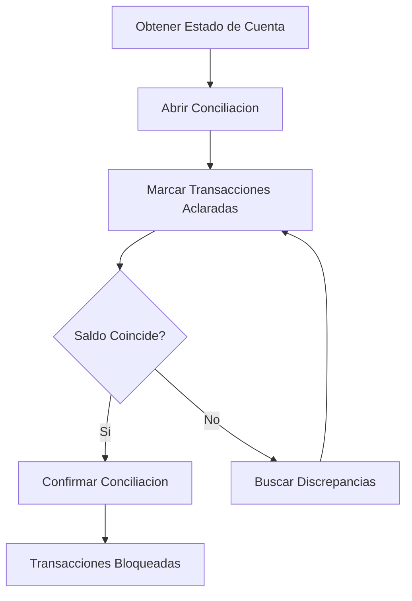

### Paso a paso

1. **Obtenga su estado de cuenta** bancario (digital o en papel)
2. Vaya a **Cuentas** → seleccione la cuenta → **"Reconciliar"**
3. La app muestra todas las transacciones pendientes de conciliar
4. **Compare cada transaccion** con su estado de cuenta:
   - Si coincide, marquela como **"Aclarada"** (cleared)
   - Si no aparece en el banco, dejela sin marcar
5. La app muestra el **saldo calculado** vs el **saldo del banco**
6. Si los saldos coinciden, haga clic en **"Confirmar Conciliacion"**
7. Las transacciones conciliadas se **bloquean** para evitar ediciones accidentales

### Tips para encontrar discrepancias

| Problema | Solucion |
|----------|----------|
| Falta una transaccion en la app | Creela manualmente con la fecha correcta |
| Hay un monto diferente | Edite la transaccion y corrija el monto |
| Transaccion duplicada | Elimine el duplicado (va a la papelera) |
| Transaccion en la app que no esta en el banco | Probablemente aun no se procesa; dejela sin marcar |

> **Tip:** Concilie en orden cronologico. Empiece por las transacciones mas antiguas.

---

# Capitulo 6: Transacciones

## 6.1 Anatomia de una Transaccion

Cada transaccion (movimiento) tiene los siguientes campos:

| Campo | Descripcion | Ejemplo |
|-------|-------------|---------|
| **Fecha** | Cuando ocurrio | 2026-04-01 |
| **Monto** | Cantidad. Negativo = gasto, Positivo = ingreso | -$350.00 (gasto) |
| **Cuenta** | De cual cuenta sale o entra el dinero | BBVA Nomina |
| **Beneficiario** | A quien se le pago o de quien se recibio | Supermercado Soriana |
| **Categoria** | A que sobre pertenece el gasto/ingreso | Comida |
| **Notas** | Detalles opcionales | "Despensa semanal" |
| **Estado** | Pendiente, Aclarada o Conciliada | Aclarada |

> **Importante:** Un monto **negativo** significa que salio dinero (gasto). Un monto **positivo** significa que entro dinero (ingreso).

---

## 6.2 Crear Transaccion

**Ruta:** `/budget/transactions/new`

1. Vaya a **Movimientos** → **"+ Nuevo Movimiento"**
2. Complete el formulario:
   - **Cuenta** — Seleccione de cual cuenta (ej: "BBVA Nomina")
   - **Fecha** — Seleccione la fecha (por defecto, hoy)
   - **Monto** — Ingrese la cantidad. Use negativo para gastos (ej: `-1500`) y positivo para ingresos (ej: `45000`)
   - **Lugar / Payee** — Quien recibio o envio el dinero (ej: "Oxxo", "Mi Empresa SA")
   - **Categoria** — Seleccione la categoria del sobre (ej: "Comida", "Salario")
   - **Notas (Opcional)** — Comentarios adicionales (ej: "Despensa semanal")
3. Haga clic en **"Guardar Gasto"**

**Ejemplo:** Registro de compra en el super

| Campo | Valor |
|-------|-------|
| Cuenta | BBVA Nomina |
| Fecha | 2026-04-01 |
| Monto | -$1,500.00 |
| Beneficiario | Supermercado Soriana |
| Categoria | Comida |
| Notas | Despensa semanal |

---

## 6.3 Transacciones Divididas (Splits)

A veces un solo pago cubre multiples categorias. Por ejemplo, en el supermercado compra $1,200 de comida y $300 de articulos de limpieza. En lugar de crear dos transacciones separadas, puede dividir una sola transaccion.

### Como funciona

Una transaccion padre se divide en multiples transacciones hijo, cada una con su propia categoria y monto. La suma de los hijos debe ser igual al monto del padre.

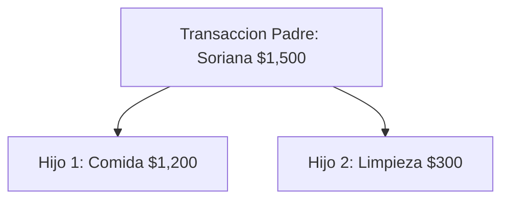

### Ejemplo practico

**Compra en supermercado por $1,500:**

| Parte | Categoria | Monto |
|-------|-----------|-------|
| Transaccion padre | (Split) | -$1,500.00 |
| Hijo 1 | Comida | -$1,200.00 |
| Hijo 2 | Articulos de Limpieza | -$300.00 |

Al dividir la transaccion, cada parte descuenta del sobre correcto: $1,200 del sobre "Comida" y $300 del sobre "Limpieza".

---

## 6.4 Transferencias Entre Cuentas

Cuando mueve dinero de una cuenta a otra (ej: de corriente a ahorro), no es un gasto ni un ingreso — es una **transferencia**.

### Como funciona

Una transferencia crea **dos transacciones vinculadas**:

1. **Transaccion de salida** en la cuenta origen (monto negativo)
2. **Transaccion de entrada** en la cuenta destino (monto positivo)

**Ejemplo:** Transfiere $10,000 de BBVA Nomina a Cuenta de Ahorro

| Cuenta | Monto | Tipo |
|--------|-------|------|
| BBVA Nomina | -$10,000.00 | Salida |
| Cuenta de Ahorro | +$10,000.00 | Entrada |

> **Nota:** Las transferencias entre cuentas on-budget no afectan el presupuesto — el dinero se mueve pero sigue asignado a los mismos sobres. Las transferencias entre on-budget y off-budget si afectan el monto "Listo para Asignar".

---

## 6.5 Editar y Eliminar

### Editar una transaccion

Puede modificar cualquier campo de una transaccion: fecha, monto, cuenta, beneficiario, categoria o notas. Los cambios se reflejan inmediatamente en los saldos y el presupuesto.

> **Excepcion:** Las transacciones ya conciliadas no se pueden editar sin antes desbloquear la conciliacion.

### Eliminar una transaccion

Al eliminar una transaccion, esta va a la **papelera de reciclaje** (eliminacion suave). No se borra permanentemente de inmediato. Puede restaurarla si fue un error.

---

## 6.6 Filtrado y Busqueda

**Ruta:** `/budget/transactions`

La lista de transacciones incluye filtros para encontrar movimientos especificos:

| Filtro | Descripcion |
|--------|-------------|
| **Rango de fechas** | Desde/hasta una fecha especifica |
| **Cuenta** | Solo movimientos de una cuenta |
| **Categoria** | Solo movimientos de una categoria |
| **Beneficiario** | Filtrar por quien pago/recibio |
| **Monto** | Buscar por rango de monto |
| **Estado** | Pendiente, aclarada, conciliada |

> **Tip:** Use los filtros para preparar la conciliacion — filtre por cuenta y rango de fechas que coincida con su estado de cuenta bancario.

---

## 6.7 Importar CSV

**Ruta:** `/budget/import`

Si su banco le permite descargar sus movimientos en formato CSV, puede importarlos masivamente en lugar de capturarlos uno por uno.

### Flujo completo de importacion

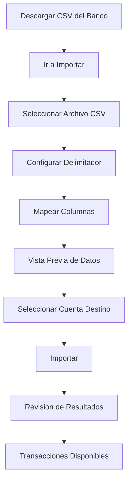

### Paso a paso

1. **Descargue el CSV** desde el portal de su banco
   - Busque opciones como "Descargar movimientos", "Exportar", "Estado de cuenta CSV"
   - Guarde el archivo en su computadora

2. **Vaya a Importar** (`/budget/import`)

3. **Seleccione el archivo CSV** haciendo clic en el boton de carga

4. **Configure el delimitador** — La app detecta automaticamente si usa coma (`,`), punto y coma (`;`) o tabulador. Puede ajustarlo manualmente si es necesario

5. **Mapee las columnas** — La app intentara detectar automaticamente que columna contiene cada dato:
   - **Fecha** — La columna con las fechas de transaccion
   - **Monto** — La columna con las cantidades
   - **Beneficiario/Concepto** — La columna con la descripcion o quien pago
   - **Categoria** — Si el banco incluye una (opcional)
   - **Notas** — Columna adicional de detalle (opcional)

6. **Revise la vista previa** — Verifique que los datos se interpretan correctamente

7. **Seleccione la cuenta destino** — A cual cuenta de la app se agregaran los movimientos

8. **Haga clic en "Importar"** — El sistema procesa los datos

9. **Revise los resultados** — La app muestra:
   - Cuantas filas se importaron
   - Cuantas se omitieron (duplicados)
   - Beneficiarios creados automaticamente
   - Categorias asignadas (si hay reglas configuradas)

### Formatos comunes de bancos mexicanos

| Banco | Formato tipico | Separador | Notas |
|-------|---------------|-----------|-------|
| BBVA | Fecha, Concepto, Cargo, Abono, Saldo | Coma | Cargo = gasto, Abono = ingreso |
| Banorte | Fecha, Referencia, Concepto, Monto | Coma | Monto negativo = gasto |
| Banamex | Fecha, Descripcion, Monto, Saldo | Coma | Similar a Banorte |
| Nu | Fecha, Descripcion, Monto | Coma | Formato limpio |

### Manejo de duplicados

Si importa el mismo CSV dos veces, el sistema detecta transacciones duplicadas y las omite automaticamente. No se crearan registros repetidos.

### Auto-creacion de beneficiarios

Durante la importacion, si un beneficiario no existe en su lista, se crea automaticamente. Por ejemplo, si el CSV incluye "OXXO SA DE CV", se creara un nuevo beneficiario con ese nombre.

> **Tip:** Despues de la primera importacion, configure reglas de categorizacion (Capitulo 10) para que las futuras importaciones asignen categorias automaticamente.

---

# Capitulo 7: Categorias y Grupos

**Ruta:** `/budget/categories`

Las categorias son los "sobres" digitales donde asigna su dinero. Se organizan en grupos para facilitar la gestion.

## 7.1 Estructura

Las categorias se organizan jerarquicamente: **Grupos** contienen **Categorias**.

```
Gastos Fijos (grupo)
├── Renta
├── Servicios (luz, agua, gas)
├── Internet y telefono
└── Seguros

Alimentacion (grupo)
├── Comida (despensa)
├── Restaurantes
└── Comida rapida

Transporte (grupo)
├── Gasolina
├── Estacionamiento
├── Uber/Taxi
└── Transporte publico

Ingresos (grupo de ingreso)
├── Salario
├── Freelance
└── Otros ingresos
```

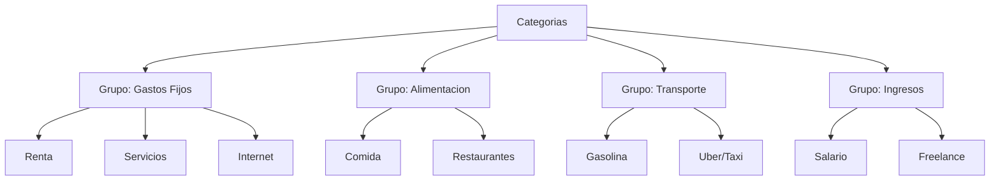

---

## 7.2 Crear Grupos y Categorias

### Crear un grupo

1. En la pagina de **Categorias** (`/budget/categories`), haga clic en **"+ Nuevo Grupo"**
2. Ingrese el nombre del grupo (ej: "Gastos Fijos", "Entretenimiento")
3. Indique si es un grupo de **ingresos** (marcando la opcion correspondiente)
4. Haga clic en **"Crear"**

### Crear una categoria dentro de un grupo

1. En el grupo deseado, haga clic en **"+ Nueva Categoria"**
2. Ingrese el nombre de la categoria (ej: "Renta", "Comida")
3. La opcion de ingreso se hereda del grupo automaticamente
4. Opcionalmente configure una meta mensual
5. Haga clic en **"Crear"**

> **Nota:** Recuerde que en la pagina de Categorias solo se gestiona la estructura. Para asignar dinero a cada categoria, vaya al Presupuesto Mensual.

---

## 7.3 Categorias de Ingreso

Los grupos de **ingreso** funcionan diferente a los de gasto:

- Las transacciones con categoria de ingreso **suman** al monto "Listo para Asignar"
- No necesita presupuestar dinero en categorias de ingreso — simplemente registra cuanto recibio
- Ejemplos: Salario, Freelance, Bonos, Regalos, Ventas de garage

**Ejemplo:** Si su salario es de $30,000 y lo registra con la categoria "Salario", esos $30,000 aparecen en "Listo para Asignar" para que los distribuya entre sus sobres de gasto.

---

## 7.4 Archivar y Ocultar

Si una categoria ya no la usa pero tiene historial, puede **archivarla** en lugar de eliminarla:

- **Archivar** — La categoria desaparece de los listados de seleccion pero su historial de transacciones se preserva
- **Desarchivar** — Puede volver a activarla en cualquier momento

**Cuando archivar:**

- Cancelo un servicio (ej: ya no paga TV por cable)
- Termino un prestamo
- Cambio la estructura de sus categorias pero quiere conservar el historial

---

## 7.5 Reordenar

Puede reorganizar el orden de los grupos y las categorias dentro de cada grupo arrastrando y soltando. Esto solo afecta la presentacion visual — no cambia los datos ni el presupuesto.

> **Tip:** Coloque los grupos mas usados al inicio (ej: "Gastos Fijos", "Alimentacion") y los menos frecuentes al final.

---

# Capitulo 8: Vista Mensual del Presupuesto

**Ruta:** `/budget/month/[anio]/[mes]` (ej: `/budget/month/2026/4`)

Esta es la pantalla mas importante del modulo de presupuesto. Aqui es donde distribuye su dinero entre los sobres y da seguimiento a sus gastos durante el mes.

## 8.1 Layout de la Vista Mensual

### Encabezado

- **Navegacion de mes** — Flechas para moverse al mes anterior/siguiente
- **Nombre del mes** — Ej: "Abril 2026"

### Tarjetas de resumen

Al inicio de la pagina ve tres numeros clave:

| Tarjeta | Que muestra |
|---------|-------------|
| **Ingresos** | Total de ingresos registrados este mes |
| **Presupuestado** | Total asignado a todas las categorias |
| **Listo para Asignar** | Dinero disponible para distribuir |

### Tabla de categorias

Debajo de las tarjetas, una tabla con todos sus grupos y categorias. Cada fila muestra tres columnas:

- **Presupuestado** — Cuanto asigno a esa categoria
- **Gastado** (Actividad) — Cuanto ha gastado efectivamente
- **Disponible** — Lo que queda en el sobre

---

## 8.2 Listo para Asignar

El numero **"Listo para Asignar"** es el corazon del metodo de sobres. Representa cuanto dinero tiene disponible para distribuir entre categorias.

### Formula

```
Listo para Asignar = Ingresos del Mes
                   - Total Presupuestado en Categorias
                   - Sobregasto de Meses Anteriores no Cubierto
```

### Interpretacion

| Valor | Significado | Que hacer |
|-------|-------------|-----------|
| **Positivo** (ej: $5,000) | Tiene dinero sin asignar | Distribuyalo entre categorias |
| **Cero** ($0) | Todo su dinero esta asignado | Perfecto. Cada peso tiene un destino |
| **Negativo** (ej: -$3,000) | Asigno mas de lo que tiene | Reduzca presupuestos o espere mas ingresos |

### Ejemplo practico

Su sueldo es de $30,000 y lo registro como ingreso:

1. **Listo para Asignar: $30,000** — Tiene $30,000 para distribuir
2. Asigna $8,000 a Renta → Listo para Asignar: $22,000
3. Asigna $6,000 a Comida → Listo para Asignar: $16,000
4. Asigna $3,000 a Transporte → Listo para Asignar: $13,000
5. Asigna $2,000 a Servicios → Listo para Asignar: $11,000
6. Asigna $5,000 a Ahorro → Listo para Asignar: $6,000
7. Asigna $6,000 a otros sobres → **Listo para Asignar: $0**

Cuando llega a cero, cada peso de su sueldo tiene un destino. Ese es el objetivo.

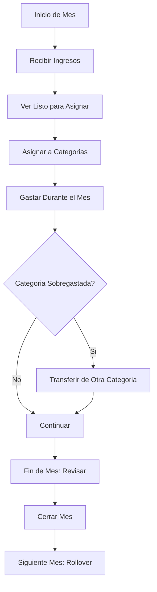

---

## 8.3 Asignar Fondos

Para asignar dinero a una categoria:

1. En la vista mensual, localice la categoria deseada
2. Haga clic en el campo de **"Presupuestado"** (o en el boton "+ Asignar")
3. Ingrese el monto que desea asignar (ej: `6000`)
4. Presione Enter o haga clic fuera del campo
5. El monto se guarda y "Listo para Asignar" se reduce automaticamente

**Ejemplo:**

Quiere asignar $6,000 para comida en abril:

1. Busque la categoria "Comida" en el grupo "Alimentacion"
2. Haga clic en la columna "Presupuestado"
3. Escriba `6000`
4. Presione Enter
5. Ahora ve: Presupuestado $6,000 | Gastado $0 | Disponible $6,000

> **Tip:** Use el boton de asignar rapidamente la sugerencia. La app puede sugerir un monto basado en sus gastos del mes anterior.

---

## 8.4 Las Tres Columnas

Cada categoria muestra tres columnas esenciales:

### Presupuestado

Lo que usted **planeo** gastar este mes en esa categoria. Es el monto que asigno al sobre.

### Gastado (Actividad)

Lo que **realmente gasto** hasta el momento. Se calcula automaticamente sumando todas las transacciones de esa categoria en el mes.

### Disponible

Lo que **queda** en el sobre. Disponible = Presupuestado - Gastado + Saldo Anterior.

### Codigos de color

| Color | Significado |
|-------|-------------|
| **Verde** | Disponible positivo — Le queda dinero en el sobre |
| **Amarillo** | Disponible bajo — Queda poco en el sobre |
| **Rojo** | Disponible negativo — Se paso del presupuesto (sobregasto) |

**Ejemplo visual:**

| Categoria | Presupuestado | Gastado | Disponible |
|-----------|:------------:|:-------:|:----------:|
| Renta | $8,000 | $8,000 | $0 (gris) |
| Comida | $6,000 | $4,200 | $1,800 (verde) |
| Transporte | $3,000 | $3,500 | -$500 (rojo) |
| Servicios | $2,000 | $800 | $1,200 (verde) |

---

## 8.5 Manejar Sobregasto

Cuando una categoria tiene el Disponible en **rojo** (negativo), significa que gasto mas de lo presupuestado. Esto es un sobregasto.

### Que pasa con el sobregasto

- La categoria queda en rojo como alerta visual
- Si no lo cubre, el sobregasto se traslada al siguiente mes como deuda del presupuesto
- Afecta el monto "Listo para Asignar" del mes siguiente

### Como cubrir un sobregasto

**Opcion 1: Asignar mas dinero**

1. Si aun tiene "Listo para Asignar" positivo
2. Haga clic en la categoria sobregastada
3. Aumente el monto presupuestado hasta cubrir el exceso

**Opcion 2: Transferir de otra categoria**

1. Identifique una categoria con Disponible positivo (ej: "Ropa" tiene $2,000 disponibles)
2. Use la funcion de transferencia para mover dinero de "Ropa" a la categoria sobregastada
3. La categoria destino vuelve a verde

> **Tip:** Es normal que algunas categorias se pasen un poco. Lo importante es cubrir el sobregasto moviendo fondos de categorias donde le sobre.

---

## 8.6 Transferir Entre Categorias

Cuando un sobre le sobra y otro le falta, puede mover dinero entre ellos.

### Paso a paso

1. En la vista mensual, localice la categoria de la que quiere **sacar** dinero
2. Haga clic en **"Transferir a otra categoria"**
3. Complete el formulario:
   - **De** — La categoria origen (ya seleccionada)
   - **Transferir a** — Seleccione la categoria destino
   - **Cantidad a transferir** — Cuanto mover (ej: $500)
4. Haga clic en **"Transferir"**
5. Vera el mensaje "Transferencia completada"

**Ejemplo:** Le sobro $1,000 en "Ropa" y necesita $1,000 mas en "Comida"

- De: Ropa (Disponible $3,000 → $2,000)
- A: Comida (Disponible -$500 → $500)
- Cantidad: $1,000

> **Nota:** Una transferencia entre categorias solo mueve el presupuesto asignado. No crea ninguna transaccion bancaria.

---

## 8.7 Rollover

El rollover es lo que sucede con el dinero que queda en un sobre al final del mes.

### Con rollover activado (por defecto)

Si presupuesto $5,000 para "Ropa" pero solo gasto $2,000, los $3,000 restantes **se pasan al siguiente mes**. En el proximo mes, la categoria "Ropa" ya inicia con $3,000 de saldo anterior, y cualquier monto adicional que presupueste se suma.

**Ejemplo:**

| Mes | Presupuestado | Gastado | Disponible |
|-----|:------------:|:-------:|:----------:|
| Marzo | $5,000 | $2,000 | $3,000 (rollover) |
| Abril | $5,000 | $4,000 | $4,000 ($3,000 anterior + $5,000 nuevo - $4,000 gasto) |

### Beneficio

El rollover permite ahorrar para gastos grandes. Si sabe que en diciembre gastara $15,000 en regalos, puede presupuestar $2,500 mensuales durante 6 meses y el dinero se acumula.

---

## 8.8 Navegacion Entre Meses

En la parte superior de la vista mensual, use los controles de navegacion:

- **Flecha izquierda** — Ir al mes anterior
- **Flecha derecha** — Ir al mes siguiente
- **Selector de mes/anio** — Saltar directamente a un mes especifico

Los meses disponibles en la app van por nombre corto: Ene, Feb, Mar, Abr, May, Jun, Jul, Ago, Sep, Oct, Nov, Dic.

> **Tip:** Revise los meses anteriores para comparar cuanto presupuesto vs cuanto gasto y ajustar sus asignaciones del mes actual.

---

## 8.9 Cerrar y Reabrir Meses

### Por que cerrar un mes

Al cerrar un mes, bloquea las asignaciones para evitar cambios accidentales. Es como decir "ya termine de revisar este mes, no quiero moverle nada".

### Como cerrar un mes

1. Asegurese de que todas las transacciones esten registradas y conciliadas
2. Verifique que el sobregasto este cubierto (o acepte el rollover negativo)
3. Use la opcion de cerrar mes desde la vista mensual

### Reabrir un mes

Si necesita hacer correcciones despues de cerrar:

1. Vaya al mes que desea reabrir
2. Use la opcion de reabrir
3. Haga sus cambios
4. Cierre nuevamente cuando termine

> **Nota:** Reabrir un mes cerrado puede afectar los saldos de rollover de los meses siguientes. Tenga cuidado con las correcciones.

---

# Capitulo 9: Beneficiarios (Payees)

**Ruta:** `/budget/settings/payees`

## 9.1 Que son los Beneficiarios

Un beneficiario (payee) es cualquier persona, empresa o comercio al que le paga o del que recibe dinero. Ejemplos:

- **Supermercado Soriana** — Donde compra la despensa
- **CFE** — A quien paga la luz
- **Mi Empresa SA** — Quien le paga el salario
- **Uber** — Servicio de transporte
- **OXXO** — Tienda de conveniencia

Los beneficiarios le ayudan a rastrear a quien va su dinero y de quien viene.

---

## 9.2 Gestion de Beneficiarios

En la pagina de beneficiarios puede:

- **Ver la lista** de todos los beneficiarios registrados
- **Crear** un nuevo beneficiario manualmente
- **Editar** el nombre de un beneficiario existente
- **Eliminar** beneficiarios que ya no usa

> **Tip:** Mantenga nombres consistentes. Use "Oxxo" en lugar de tener "OXXO", "oxxo", "OXXO SA DE CV" como entradas separadas. Puede renombrar para consolidar.

---

## 9.3 Auto-creacion desde CSV

Cuando importa transacciones desde un CSV bancario, el sistema crea automaticamente beneficiarios para cada nombre unico que encuentre en la columna de concepto/beneficiario.

**Ejemplo:** Si su CSV incluye "AMAZON MX", "OXXO JURIQUILLA", "TELMEX RECIBO", se crearan tres beneficiarios nuevos automaticamente.

Despues de la importacion, puede renombrar los beneficiarios para que sean mas legibles (ej: "AMAZON MX" → "Amazon Mexico").

---

# Capitulo 9.5: Escaner de Recibos con IA y Cola de Revision

**Rutas:** `/budget/scan-receipt` · `/budget/receipt-drafts`

> **Plan requerido:** Plus o Pro — el plan Gratuito no incluye escaneo de recibos.

## 9.5.1 Escanear un Recibo

En lugar de escribir una transaccion manualmente, puede fotografiar o subir un recibo y dejar que la IA extraiga los datos automaticamente.

1. Vaya a **Presupuesto → Escanear Recibo** (icono de camara en la barra inferior, o desde el menu del presupuesto).
2. **Seleccione la cuenta destino** — la transaccion se agregara aqui.
3. Proporcione una imagen:
   - **Tomar Foto** — use la camara de su telefono directamente (solo movil).
   - **Subir Archivo** — arrastre y suelte, o haga clic para buscar. Acepta JPEG, PNG, WebP y **PDF** (en PDFs de varias paginas solo se escanea la primera).
4. Haga clic en **Escanear Recibo**. La IA analiza la imagen en segundos.

### Que extrae la IA

| Campo | Ejemplo |
|-------|---------|
| Fecha | 2026-03-13 |
| Monto total | −$1,500.78 MXN |
| Nombre del comercio | HEB |
| Articulos | Lacteos · Verduras · Pan |

Si el comercio ya existe en la lista de beneficiarios de su familia, la transaccion se vincula automaticamente. De lo contrario, se crea un nuevo beneficiario.

### Puntuacion de confianza

Cada escaneo devuelve una **puntuacion de confianza** (0–100%). Los escaneos superiores al 30% con un total detectable se crean inmediatamente como transacciones. Los que quedan por debajo de ese umbral se guardan en la **Cola de Revision** para que usted los corrija antes de registrar la transaccion — ningun dato se pierde.

### Consejos para mejores escaneos

- Fotografíe con buena iluminacion; evite sombras sobre el total.
- Mantenga todo el recibo en el encuadre — la IA necesita ver el monto total.
- Para recibos largos y angostos (supermercados), el escaner funciona con PDFs generados por "Escanear Documento" en iOS o apps equivalentes en Android.
- Tamano maximo de archivo: 10 MB.

---

## 9.5.2 Cola de Revision (Revision Humana)

**Ruta:** `/budget/receipt-drafts`

Cuando un escaneo regresa con baja confianza, los datos se guardan como un **borrador pendiente** en lugar de descartarse. Un punto rojo en el icono del portapapeles en la barra del presupuesto le indica cuantos borradores estan esperando.

### Revisar un borrador

1. Haga clic en el **icono del portapapeles** (arriba a la derecha en la barra del presupuesto) o navegue a `/budget/receipt-drafts`.
2. Cada tarjeta muestra:
   - Lo que extrajo la IA (comercio, monto, fecha, articulos)
   - El porcentaje de confianza
   - La cuenta destino
3. Edite cualquier campo que parezca incorrecto — el formulario se pre-llena con los datos de la IA.
4. Haga clic en **Confirmar y Crear** → se registra una transaccion real y el borrador desaparece.
5. O haga clic en **Descartar** → el borrador se rechaza permanentemente; no se crea ninguna transaccion.

### Estados del borrador

| Estado | Significado |
|--------|-------------|
| **pendiente** | Esperando su revision |
| **aprobado** | Lo confirmo — existe la transaccion |
| **rechazado** | Lo descarto — sin transaccion |

> Los borradores aprobados y rechazados no se muestran en la cola. Solo los padres pueden acceder a la cola de revision.

---

# Capitulo 10: Reglas de Categorizacion

**Ruta:** `/budget/settings/rules`

Las reglas de categorizacion automatizan la asignacion de categorias a sus transacciones. En lugar de categorizar manualmente cada movimiento, las reglas detectan patrones y asignan la categoria correcta.

## 10.1 Como Funcionan

Cada vez que se registra una nueva transaccion (manual o importada), el sistema revisa las reglas configuradas. Si el beneficiario o la descripcion de la transaccion coincide con un patron definido, se asigna automaticamente la categoria de la regla.

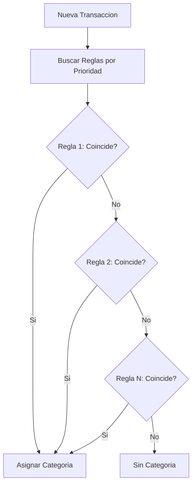

---

## 10.2 Crear una Regla

1. Vaya a **Configuracion** → **Reglas** (`/budget/settings/rules`)
2. Haga clic en **"+ Nueva Regla"**
3. Configure los campos:
   - **Campo a comparar** — Beneficiario (payee), Descripcion o Ambos
   - **Tipo de coincidencia**:
     - `Exacto` — El texto debe coincidir exactamente
     - `Contiene` — El texto debe contener el patron
     - `Empieza con` — El texto debe iniciar con el patron
     - `Regex` — Expresion regular para patrones complejos
   - **Patron** — El texto a buscar (ej: "OXXO", "UBER", "CFE")
   - **Categoria destino** — A cual categoria asignar (ej: "Compras", "Transporte", "Servicios")
   - **Prioridad** — Numero que define el orden de evaluacion (mayor = se revisa primero)
4. Haga clic en **"Crear"**

---

## 10.3 Prioridad

La prioridad define en que orden se evaluan las reglas. Las reglas con **numero mas alto** se revisan primero.

**Estrategia recomendada:**

| Prioridad | Tipo de regla | Ejemplo |
|-----------|---------------|---------|
| 100+ | Reglas muy especificas | "UBER EATS" → Comida Fuera |
| 50-99 | Reglas medianamente especificas | "UBER" → Transporte |
| 1-49 | Reglas generales | Cualquier transaccion con "AMAZON" → Compras en Linea |

**Por que importa:** Si tiene una regla general "UBER" → Transporte (prioridad 50) y una especifica "UBER EATS" → Comida Fuera (prioridad 100), la regla de UBER EATS se evalua primero y gana. Si no existiera, caeria en la regla general de UBER.

---

## 10.4 Ejemplos para Bancos Mexicanos

Estas son reglas utiles basadas en los conceptos comunes en estados de cuenta de bancos mexicanos:

| Patron | Tipo | Categoria Sugerida |
|--------|------|-------------------|
| `OXXO` | Contiene | Compras Conveniencia |
| `SORIANA` | Contiene | Comida (Despensa) |
| `WALMART` | Contiene | Comida (Despensa) |
| `UBER EATS` | Contiene | Comida Fuera |
| `UBER` | Contiene | Transporte |
| `DIDI` | Contiene | Transporte |
| `CFE SUMINISTRA` | Contiene | Servicios (Luz) |
| `TELMEX` | Contiene | Servicios (Internet) |
| `IZZI` | Contiene | Servicios (Internet) |
| `^AMZN` | Regex | Compras en Linea |
| `NETFLIX` | Contiene | Entretenimiento |
| `SPOTIFY` | Contiene | Entretenimiento |
| `GASOLINERA` | Contiene | Gasolina |
| `TOTAL PLAY` | Contiene | Servicios (TV/Internet) |
| `CINEPOLIS` | Contiene | Entretenimiento |

> **Tip:** Despues de su primera importacion CSV, revise los beneficiarios sin categoria y cree reglas para los mas frecuentes. Las futuras importaciones se categorizaran automaticamente.

---

# Capitulo 11: Transacciones Recurrentes

**Ruta:** `/budget/settings/recurring`

Las transacciones recurrentes son plantillas que generan movimientos automaticamente cada cierto tiempo. Son ideales para gastos e ingresos que se repiten con regularidad.

## 11.1 Que Son

Muchos de sus movimientos financieros se repiten: la renta, el pago de servicios, suscripciones, y el salario. En lugar de capturar estos movimientos manualmente cada vez, puede crear plantillas recurrentes que los generen automaticamente.

**Ejemplos comunes:**

| Transaccion | Frecuencia | Monto |
|-------------|-----------|-------|
| Renta departamento | Mensual (dia 1) | -$8,000 |
| Salario | Quincenal (dias 15 y 30) | +$15,000 |
| Netflix | Mensual (dia 5) | -$199 |
| Spotify | Mensual (dia 10) | -$115 |
| Pago de luz CFE | Bimestral | -$600 |

---

## 11.2 Crear Plantilla Recurrente

1. Vaya a **Configuracion** → **Recurrentes** (`/budget/settings/recurring`)
2. Haga clic en **"+ Nueva Recurrente"**
3. Complete el formulario:
   - **Nombre** — Identificador (ej: "Renta Abril")
   - **Monto** — Cantidad. Negativo para gastos, positivo para ingresos
   - **Cuenta** — De cual cuenta sale o entra
   - **Categoria** — A que sobre pertenece
   - **Beneficiario** — A quien se le paga o de quien se recibe
   - **Recurrencia** — Seleccione el patron:
     - `Diaria` — Cada dia
     - `Semanal` — Cada semana en un dia especifico
     - `Mensual por dia del mes` — Ej: cada dia 15
     - `Mensual por dia de la semana` — Ej: cada tercer lunes
   - **Intervalo** — Cada cuantos periodos (ej: cada 1 mes, cada 2 semanas)
   - **Fecha de inicio** — Cuando empieza
   - **Fecha de fin** — Cuando termina (opcional; dejar vacio = indefinido)
4. Haga clic en **"Crear"**

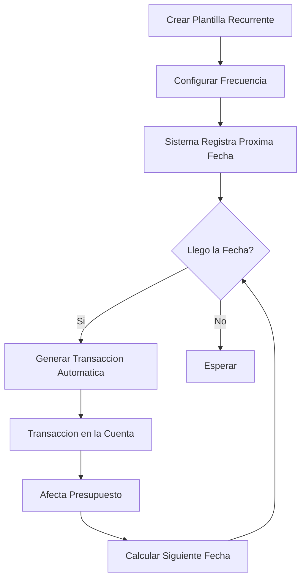

---

## 11.3 Auto-posting

Cuando llega la fecha programada de una transaccion recurrente, el sistema **genera automaticamente** la transaccion correspondiente en la cuenta configurada. No necesita hacer nada manualmente.

La transaccion generada:
- Aparece en la lista de movimientos como cualquier otra transaccion
- Se asigna a la cuenta y categoria configuradas
- Afecta el presupuesto del mes (reduce el Disponible de la categoria)

---

## 11.4 Gestionar Recurrentes

Desde la pagina de recurrentes puede:

- **Ver todas** sus plantillas recurrentes activas e inactivas
- **Activar/Desactivar** — Pause una recurrente sin eliminarla (ej: vacaciones)
- **Editar** — Cambie monto, cuenta, categoria o frecuencia
- **Eliminar** — Borre la plantilla definitivamente
- **Ver proxima ocurrencia** — Sepa cuando se generara la siguiente transaccion

> **Nota:** Esta funcion esta disponible en planes Plus y Pro. El plan Free no incluye transacciones recurrentes.

---

# Capitulo 12: Metas de Presupuesto

Las metas le ayudan a definir objetivos concretos para sus categorias: cuanto quiere gastar como maximo o cuanto quiere ahorrar como minimo.

## 12.1 Tipos de Meta

| Tipo | Descripcion | Ejemplo |
|------|-------------|---------|
| **Limite de gasto** | "No gastar mas de X en esta categoria" | Maximo $3,000 en restaurantes |
| **Meta de ahorro** | "Ahorrar al menos X en esta categoria" | Al menos $5,000 en fondo de emergencia |

---

## 12.2 Crear una Meta

1. Vaya a la configuracion de la categoria donde desea la meta
2. Seleccione el tipo de meta: limite de gasto o meta de ahorro
3. Configure:
   - **Categoria** — A cual categoria aplica
   - **Monto objetivo** — La cantidad meta (ej: $3,000 maximo o $5,000 minimo)
   - **Periodo** — Mensual, trimestral o anual
   - **Fechas** — Inicio y fin de la meta (opcional)
4. Guarde la meta

---

## 12.3 Seguimiento

Las metas muestran indicadores visuales de progreso:

- **Barra de progreso** — Muestra que porcentaje de la meta lleva
- **Porcentaje** — Ej: "75% completado"
- **Color** — Verde si va bien, amarillo si esta cerca del limite, rojo si se paso

**Ejemplo de limite de gasto:**

Meta: Maximo $3,000 en restaurantes este mes
- Gasto actual: $2,100
- Progreso: 70% (le quedan $900)
- Color: amarillo (cercano al limite)

**Ejemplo de meta de ahorro:**

Meta: Ahorrar $10,000 en fondo de emergencia este trimestre
- Ahorrado: $6,500
- Progreso: 65%
- Color: verde (va en camino)

> **Nota:** Las metas estan disponibles en planes Plus y Pro.

---

# Capitulo 13: Reportes

Los reportes le dan una vision amplia de sus finanzas. Puede analizar gastos, comparar ingresos vs egresos y rastrear su patrimonio a lo largo del tiempo.

**Ruta base:** `/budget/reports/`

> **Nota:** Los reportes son funciones premium disponibles en los planes Plus y Pro.

## 13.1 Reporte de Gastos

**Ruta:** `/budget/reports/spending`

Analiza donde se va su dinero, desglosado por categoria.

### Que muestra

- **Grafico de barras** con los gastos por categoria
- **Tabla detallada** con: Categoria, Monto total, Porcentaje del total
- **Filtros** por rango de fechas, categoria especifica o grupo

### Como leerlo

Identifique las categorias con mayor gasto. Si "Comida Fuera" representa el 30% de sus gastos y usted no lo esperaba, puede ajustar su presupuesto o sus habitos.

**Ejemplo:**

| Categoria | Monto | % |
|-----------|------:|---:|
| Renta | $8,000 | 27% |
| Comida | $6,500 | 22% |
| Transporte | $3,200 | 11% |
| Restaurantes | $2,800 | 9% |
| Servicios | $2,000 | 7% |
| Otros | $7,500 | 24% |
| **Total** | **$30,000** | **100%** |

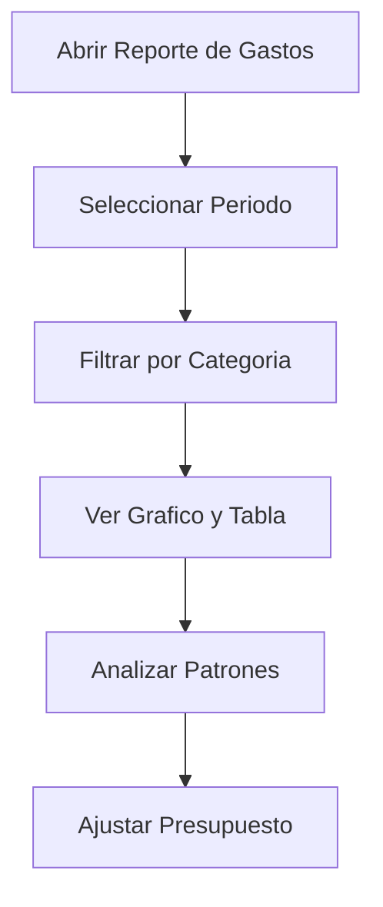

---

## 13.2 Ingreso vs Gasto

**Ruta:** `/budget/reports/income-vs-expense`

Compara cuanto dinero entro vs cuanto salio cada mes.

### Que muestra

- **Grafico de lineas o barras** mes a mes
- **Linea de ingresos** (en verde)
- **Linea de gastos** (en rojo)
- **Diferencia** (ahorro o deficit)
- **Tasa de ahorro** — Que porcentaje de sus ingresos ahorra

**Ejemplo:**

| Mes | Ingresos | Gastos | Diferencia |
|-----|:--------:|:------:|:----------:|
| Enero | $30,000 | $25,000 | +$5,000 |
| Febrero | $30,000 | $28,000 | +$2,000 |
| Marzo | $35,000 | $27,000 | +$8,000 |

Si la diferencia es positiva, esta ahorrando. Si es negativa, esta gastando mas de lo que gana.

---

## 13.3 Patrimonio Neto

**Ruta:** `/budget/reports/net-worth`

Muestra el total de lo que tiene (activos) menos lo que debe (pasivos) a lo largo del tiempo.

### Formula

```
Patrimonio Neto = Activos (cuentas con saldo positivo, inversiones)
                - Pasivos (tarjetas de credito, prestamos)
```

### Que muestra

- **Grafico de area** del patrimonio en el tiempo
- **Crecimiento o caida** mes a mes
- **Desglose** por cuenta

**Ejemplo:**

| Cuenta | Tipo | Saldo |
|--------|------|------:|
| BBVA Nomina | Activo | $45,000 |
| Ahorro Banorte | Activo | $80,000 |
| GBM Inversiones | Activo | $120,000 |
| Tarjeta Nu | Pasivo | -$5,000 |
| **Patrimonio Neto** | | **$240,000** |

---

## 13.4 Analisis de Presupuesto

**Ruta:** `/budget/reports/budget-analysis`

Compara lo que presupuesto vs lo que realmente gasto en cada categoria.

### Que muestra

- **Por categoria:** Presupuestado vs Actual
- **Variacion:** Cuanto se paso o le sobro por categoria
- **Tendencias:** Si esta mejorando mes a mes

**Ejemplo:**

| Categoria | Presupuestado | Actual | Variacion |
|-----------|:------------:|:------:|:---------:|
| Comida | $6,000 | $5,500 | -$500 (ahorro) |
| Transporte | $3,000 | $3,500 | +$500 (sobregasto) |
| Ropa | $2,000 | $800 | -$1,200 (ahorro) |

Este reporte es clave para mejorar la precision de su presupuesto con el tiempo.

---

# Capitulo 14: Papelera de Reciclaje

**Ruta:** `/parent/finances/recycle-bin`

La papelera de reciclaje es una red de seguridad para elementos eliminados accidentalmente.

## 14.1 Eliminacion Suave

Cuando elimina un elemento en el modulo de presupuesto, no se borra de inmediato. En su lugar, va a la **papelera de reciclaje** donde se conserva durante **30 dias**.

Elementos que van a la papelera:

- Transacciones eliminadas
- Cuentas eliminadas
- Categorias eliminadas
- Grupos de categorias eliminados

---

## 14.2 Restaurar Elementos

Si elimino algo por error:

1. Vaya a la **Papelera de Reciclaje** (`/parent/finances/recycle-bin`)
2. Busque el elemento eliminado en la lista
3. Haga clic en **"Restaurar"**
4. El elemento vuelve a su lugar original con todos sus datos intactos

> **Tip:** Revise la papelera antes de vaciarla. Un movimiento eliminado por error puede afectar sus saldos y presupuesto.

---

## 14.3 Eliminacion Permanente

Si esta seguro de que no necesita un elemento:

- Haga clic en **"Eliminar Permanentemente"** en el elemento individual
- O use **"Vaciar Papelera"** para borrar todo de una vez
- Esta accion es **irreversible** — los datos se eliminan para siempre

> **Nota:** Los elementos en la papelera se eliminan automaticamente despues de 30 dias. No necesita vaciarla manualmente si no lo desea.

---

# Capitulo 15: Configuracion

## 15.1 Ajustes del Presupuesto

**Ruta:** `/budget/settings`

La pagina de configuracion del presupuesto tiene las siguientes secciones:

| Seccion | Ruta | Estado |
|---------|------|--------|
| **Reglas** | `/budget/settings/rules` | Disponible |
| **Recurrentes** | `/budget/settings/recurring` | Disponible |
| **Importaciones** | `/budget/import` | Disponible |
| **Beneficiarios** | `/budget/settings/payees` | Disponible |
| **Respaldos** | `/budget/settings/backups` | Proximamente |

Desde aqui puede acceder a la gestion de beneficiarios, reglas de categorizacion, transacciones recurrentes, historial de importaciones y (proximamente) respaldos.

---

## 15.2 Respaldos

La funcion de respaldos permitira exportar snapshots cifrados de sus datos de presupuesto. Esta funcion esta en desarrollo y estara disponible proximamente.

Cuando este lista, podra:

- Descargar un archivo con todos sus datos de presupuesto
- Restaurar desde un respaldo en caso de problemas
- Guardar copias de seguridad periodicas

---

## 15.3 Idioma

La aplicacion soporta dos idiomas:

| Idioma | Como activarlo |
|--------|---------------|
| **Espanol** | Vaya a Perfil → Idioma Preferido → seleccione "Espanol" |
| **Ingles** | Vaya a Perfil → Idioma Preferido → seleccione "Ingles" |

El cambio de idioma afecta:

- Todos los textos de la interfaz
- Los nombres de botones y menus
- Los mensajes de confirmacion y error
- Los nombres de los meses (Ene, Feb, Mar... vs Jan, Feb, Mar...)

> **Nota:** Las traducciones de tareas y premios dependen de las traducciones que los padres hayan capturado al crearlos. Si una tarea no tiene traduccion al ingles, se mostrara en espanol.

---

# Capitulo 16: Suscripcion y Perfil

## 16.1 Planes Disponibles

Family Task Manager ofrece tres planes:

| Caracteristica | Gratis | Plus ($5 USD/mes) | Pro ($15 USD/mes) |
|---------------|:------:|:-----------------:|:-----------------:|
| Tareas y Premios | Completo | Completo | Completo |
| Miembros de Familia | 4 | 8 | Ilimitado |
| Cuentas de Presupuesto | 2 | 5 | Ilimitado |
| Transacciones / mes | 30 | 200 | Ilimitado |
| Reportes y Metas | No | Si | Si |
| Transacciones Recurrentes | No | 5 | Ilimitado |
| Importar CSV | No | Si | Si |
| Escaneo de Recibos con IA | No | 15/mes | Ilimitado |
| Futuras Funciones IA | No | Limitado | Completo |

### Que plan elegir

- **Gratis** — Ideal para familias pequenas que solo quieren gestionar tareas y premios. El presupuesto basico (2 cuentas, 30 transacciones) es suficiente para comenzar.
- **Plus** — Para familias que usan activamente el presupuesto, importan CSV bancarios y quieren reportes. Cubre las necesidades del 90% de las familias.
- **Pro** — Para familias grandes o con multiples cuentas bancarias que necesitan todo ilimitado y acceso a funciones de IA avanzadas.

---

## 16.2 Pagina de Suscripcion

**Ruta:** `/parent/settings/subscription`

En la pagina de suscripcion puede:

### Ver su plan actual

- **Nombre del plan** — Free, Plus o Pro
- **Estado** — Activo o Cancelado
- **Fecha de renovacion** — Cuando se cobra el siguiente periodo

### Medidores de uso

Barras de progreso que muestran cuanto ha usado de sus limites:

- **Miembros de Familia** — Ej: 3 de 4
- **Cuentas de Presupuesto** — Ej: 2 de 2
- **Transacciones este mes** — Ej: 18 de 30
- **Transacciones Recurrentes** — Ej: 0 de 0 (no disponible en Free)

### Comparacion de planes

Una tabla detallada que muestra las diferencias entre Free, Plus y Pro, con marcas de verificacion y cruces para cada funcion.

### Mejorar plan

Haga clic en **"Mejorar Plan"** para actualizar a Plus o Pro. El pago se procesa a traves de PayPal.

> **Nota:** Solo los usuarios con rol Padre/Tutor pueden gestionar la suscripcion.

---

# Capitulo 17: Gigs (Ganancias Extra)

**Quien lo usa:** Los padres publican y aprueban gigs. Los hijos y adolescentes los exploran, reclaman y completan. Los gigs son la capa de "ganancias extra" encima de las tareas regulares — trabajos opcionales que pagan dinero real.

Los gigs son trabajos pagados de una sola vez que un padre publica para la familia. A diferencia de las plantillas de tareas semanales (que se asignan y rotan), un gig queda en un tablero abierto que cualquier hijo elegible puede tomar por orden de llegada. El hijo hace el trabajo, envia evidencia y un padre lo aprueba para liberar el **dinero ($MXN)** — se paga cada vez que un padre aprueba un envio, ademas de tu saldo de puntos y por separado de este.

## 17.1 El Tablero de Gigs (Hijos)

**Ruta:** `/gigs`

El Tablero de Gigs es donde los hijos y adolescentes encuentran gigs disponibles. Se llega desde el boton **"Gigs"** en la barra de navegacion inferior.

### Que ve en el tablero

- Un encabezado que dice **"¡Gana puntos extra!"** con un enlace a **"Mis Gigs"** en la esquina superior derecha
- Una tarjeta por cada gig disponible que muestra: **Titulo** y descripcion corta, **Puntos** (el numero grande en violeta), un **chip de dificultad** (Facil, Medio o Dificil) y una **etiqueta de categoria** (Quehaceres, Mandados, Creativo, Aprendizaje, Al Aire Libre u Otro)
- Un boton **"Reclamar"** en cada gig que aun no haya reclamado

Si no hay gigs, vera **"Sin gigs disponibles — Tu papa/mama publicara gigs pronto."**

### Reclamar un gig

1. Vaya a **Gigs** (`/gigs`)
2. Explore las tarjetas y encuentre un trabajo que quiera hacer
3. Haga clic en **"Reclamar"** en ese gig
4. La tarjeta se actualiza y muestra un formulario de evidencia: **"Reclamada — envia tu evidencia abajo"**

> **Nota:** Solo puede tener un reclamo activo por gig a la vez. Si su rol no esta permitido en un gig en particular (un padre puede restringir un gig solo a Hijos o solo a Adolescentes), el reclamo sera rechazado.

### Enviar su evidencia

1. En la tarjeta del gig reclamado (en `/gigs` o dentro de **"Mis Gigs"**), complete **"¿Que hiciste? (opcional)"** y **"Foto de evidencia (opcional)"** (JPEG, PNG o WebP; en el telefono abre la camara directamente)
2. Haga clic en **"Enviar para aprobacion"**
3. La tarjeta ahora muestra **"⏳ Pendiente de aprobacion"**

> **Tip:** Ambos campos de evidencia son opcionales, pero agregar una foto hace mucho mas rapida la aprobacion — y ayuda a construir su racha de confianza (vea 17.4).

## 17.2 Mis Gigs (Hijos)

**Ruta:** `/gigs/my-gigs`

La pagina **"Mis Gigs"** lista cada gig que ha reclamado, con su estado actual:

| Estado | Significado |
|--------|-------------|
| **En progreso** | Reclamo el gig pero aun no ha enviado evidencia |
| **Esperando aprobacion** | Envio su evidencia; un padre necesita revisarla |
| **Aprobada** | Un padre la aprobo — los puntos se sumaron a su saldo (verde **+N pts**) |
| **Rechazada** | Un padre la regreso. La tarjeta muestra la nota bajo **"Motivo:"** |

Si un gig es rechazado, lea el motivo y luego reclamelo de nuevo desde el tablero para volver a intentarlo.

## 17.3 Publicar y Gestionar Gigs (Padres)

**Ruta:** `/parent/gigs`

Los padres gestionan el tablero desde **Gigs** en la barra de navegacion. (Si un padre abre `/gigs`, es redirigido aqui — los padres no pueden reclamar gigs.)

### Crear un gig

1. Vaya a **Gigs** (`/parent/gigs`)
2. Haga clic en **"+ Nueva Gig"** en la esquina superior derecha
3. Complete **"Titulo"** (obligatorio), **"Descripcion"** (opcional), **"Puntos"** (minimo 1; 1 punto = $1 MXN), **"Dificultad"** y **"Categoria"**
4. Haga clic en **"Guardar"**

### Editar y archivar

- **Editar** — Haga clic en **"Editar"**, cambie cualquier campo y guarde.
- **Archivar** — Haga clic en **"Archivar"** y confirme **"¿Archivar esta gig?"**. Archivar desactiva el gig (eliminacion suave, conserva el historial).

### Revisar el trabajo enviado

1. En `/parent/gigs`, haga clic en **"Revisar trabajo enviado"** (una insignia roja muestra cuantos esperan)
2. Llegara a la cola unificada de aprobaciones (`/parent/approvals`) con el nombre del hijo, el titulo, los puntos y la evidencia
3. Elija **Aprobar** (otorga puntos al instante, con nota opcional) o **Rechazar** (regresa con una nota; sin puntos)

> **Nota:** El hijo recibe una notificacion automatica (en la app y por push) al aprobar o rechazar.

## 17.4 La Racha de Confianza (Auto-aprobacion)

- Cada gig aprobado sube la racha del hijo en uno.
- Al alcanzar **3 gigs aprobados consecutivos** (umbral predeterminado), sus siguientes gigs se **auto-aprueban** al enviar la evidencia — los puntos llegan de inmediato.
- Un gig auto-aprobado se marca como **"⚡ Auto-aprobada"**.
- Un **rechazo reinicia la racha a cero**.

| Situacion | Puntos | Racha |
|-----------|--------|-------|
| El padre aprueba un gig | Se otorgan al aprobar | +1 |
| El hijo (racha ≥ 3) envia evidencia | Se otorgan al instante | +1 |
| El padre rechaza un gig | Ninguno | Se reinicia a 0 |

> **Tip para padres:** La racha de confianza los saca poco a poco de las aprobaciones de bajo riesgo. Si desea control mas estricto, rechace lo que no cumpla — eso reinicia la racha.

---

# Capitulo 18: Mascota Virtual

**Quien lo usa:** Hijos y adolescentes. Cada hijo tiene su propia mascota privada; los padres no la gestionan.

La Mascota Virtual le da a los hijos una razon divertida para seguir completando tareas y gigs. Cada hijo puede adoptar **una** mascota con tres estadisticas que cambian con el tiempo y un nivel que sube con la experiencia.

## 18.1 Adoptar Tu Mascota

**Ruta:** `/pet`

1. Vaya a **Mascota** (`/pet`)
2. Escriba un **Nombre** (hasta 40 caracteres)
3. Elija una **especie**:

| Especie | |
|---------|---|
| Gato 🐱 | Perro 🐶 |
| Dragon 🐲 | Zorro 🦊 |
| Buho 🦉 | Conejo 🐰 |

4. Haga clic en **"Adoptar"**

Solo tendra una mascota, asi que elija un nombre que le guste.

## 18.2 Las Estadisticas de Tu Mascota

| Estadistica | Que significa | Como se mueve |
|-------------|---------------|----------------|
| **Animo** 😊 | Que tan feliz esta (0–100) | **Baja** ~15 al dia si se le ignora. Sube al alimentar, jugar, dar premios y completar tareas |
| **Hambre** 🍖 | Que tan hambrienta esta (0–100, 100 = muerta de hambre) | **Sube** ~20 al dia. Baja al alimentar o dar premios de comida |
| **XP** ⭐ | Experiencia hacia el siguiente nivel | Solo sube — completando tareas y gigs, o con ciertos premios |

La cara refleja su estado: **🤩 Feliz**, **🐱 Bien**, **😞 Triste**, **😫 Muerta de hambre**.

> **Nota:** La mascota envejece en pasos de 24 horas. Si no abre la app por unos dias, regresara mas hambrienta y menos feliz.

## 18.3 Cuidar a Tu Mascota

### Alimentar (gratis)

Toque **"🍖 Alimentar"** — el hambre baja y el animo recibe un pequeno impulso. Solo puede alimentarla cuando tiene hambre.

### Jugar (gratis)

Toque **"🎾 Jugar"** — el animo sube, pero deja a la mascota un poco mas hambrienta.

### Premios (cuestan puntos)

La **"Tienda de premios"** le permite gastar sus puntos ganados. Un boton se desactiva si no le alcanza.

| Premio | Costo | Efecto |
|--------|-------|--------|
| **Snack** | 5 pts | Hambre −10, animo +2 |
| **Juguete** | 10 pts | Animo +20 |
| **Vitamina** | 20 pts | Hambre −5, animo +5, XP +30 |
| **Comida gourmet** | 30 pts | Hambre −50, animo +10, XP +15 |

## 18.4 Subir de Nivel

- Completar una tarea regular (obligatoria) alimenta un poco y da un pequeno impulso de XP.
- Completar una tarea de bono o un gig da un impulso de XP mucho mayor.

La pagina le recuerda: **"Completa tareas para subir el XP de tu mascota."** Las vitaminas y la comida gourmet tambien otorgan XP.

## 18.5 Recordatorios de la Mascota

Si la mascota cae en estado **triste** o **muerta de hambre**, la app envia un recordatorio (en la app y como push). Toquelo para ir directo a la pantalla de la mascota.

---

# Capitulo 19: Plan de Comidas

**Ruta:** `/meals` · **API:** `/api/meals/`

> **Quien puede usarlo:** Todos los miembros de la familia pueden ver y editar el plan de comidas y las recetas. No requiere un plan especifico.

El modulo de Comidas es un planificador de comidas semanal sencillo, con recetas opcionales que puede importar desde una pagina web con IA.

## 19.1 El Plan Semanal

**Ruta:** `/meals`

La pagina tiene el encabezado **🍽️ Plan de comidas** y muestra la **semana actual** (lunes a domingo). Es una cuadricula: columnas = los siete dias; filas = los cuatro momentos (Desayuno, Comida, Cena, Snack).

> **Nota:** El plan siempre muestra la semana actual — no hay botones de semana anterior/siguiente.

## 19.2 Agregar una Comida al Plan

1. Haga clic en **➕ Agregar comida**
2. Complete **Dia**, **Tipo de comida**, **Titulo o platillo** (obligatorio) y **Receta (opcional)**
3. Haga clic en **Guardar**

Para quitar una comida, haga clic en el boton **×** de su tarjeta.

## 19.3 Recetas

Cada receta guarda un **nombre**, una lista de **ingredientes** (uno por linea) y un **tiempo de preparacion** opcional. Las recetas guardadas aparecen debajo del formulario.

### Crear una receta manualmente

En **Nueva receta**, complete **Nombre receta** (obligatorio), **Ingredientes** (uno por linea) y **Minutos prep** (1–600), luego **Guardar**.

### Importar una receta desde una pagina web (IA)

1. En **🔗 Importar desde URL (IA)**, pegue la direccion (debe empezar con `http://` o `https://`)
2. Haga clic en **Importar** (vera **"Importar…"**)
3. Al terminar vera **"Loaded · confidence NN%"** y el formulario se llena con el **nombre**, los **ingredientes** y el **tiempo de preparacion**
4. Revise, ajuste lo necesario y haga clic en **Guardar**

> **Consejo:** El porcentaje de confianza indica que tan segura esta la IA. Siempre revise los ingredientes antes de guardar.

## 19.4 Comidas → Lista de Compras

Cuando una comida planeada esta vinculada a una receta con ingredientes, esos ingredientes pueden pasar a su lista de compras activa mas reciente automaticamente — creando una lista **"Meal prep"** si no tiene una. Las cantidades se conservan ("200g harina" → articulo "harina", cantidad "200g"). Vea el capitulo **Listas de Compras**.

---

# Capitulo 20: Listas de Compras

**Ruta:** `/shopping` · **API:** `/api/shopping/`

> **Quien puede usarlo:** Todos en la familia. Las listas son compartidas — cualquier miembro puede agregar, marcar o quitar articulos.

## 20.1 La Pagina de Compras

**Ruta:** `/shopping`

Encabezado **🛒 Shopping** ("Shared family lists"). Las listas aparecen como pestanas; cada encabezado muestra un conteo rapido (ej: "12 · 5 pending"). Sin listas, vera **"No lists yet. Create one above."**

## 20.2 Crear una Lista

1. En **"New list (e.g. Costco)"**, escriba un nombre
2. Haga clic en **"Add"** — la lista aparece como pestana y se abre

## 20.3 Agregar y Marcar Articulos

- **Agregar:** en **"Add item"** escriba el nombre, opcionalmente una cantidad en **"Qty"** (texto libre), y envie.
- **Marcar:** toque la casilla redonda para marcar como comprado (se tacha); toquela de nuevo para desmarcar. Para quitar, use el boton **×**.

Una lista vacia muestra **"Empty list. Add something."**

> **Nota:** Los articulos aparecen en el orden en que se agregaron. No hay agrupacion por pasillo ni reordenamiento manual.

## 20.4 Gestionar una Lista

- **Archivar** — **"Archive"** aparta la lista sin eliminarla.
- **Eliminar** — **"Delete"** (confirma **"Delete list?"**) elimina la lista y sus articulos.

## 20.5 Como se Llenan las Listas Automaticamente

- **Desde el plan de comidas:** los ingredientes de una receta vinculada se agregan a su lista activa mas reciente (crea **"Meal prep"** si no tiene una). Las cantidades se conservan.
- **Desde el escaneo de recibos:** al escanear un recibo en Presupuesto, la app **marca automaticamente** los articulos pendientes que coinciden (con coincidencia aproximada). El resultado del recibo indica que articulos se marcaron.

> **Consejo:** Planee comidas → deje fluir los ingredientes a una lista → compre → escanee el recibo y los articulos se marcan solos.

## 20.6 Compartido

Todas las listas se comparten en toda la familia — todos ven las mismas listas y articulos, y cualquiera puede agregar o marcar. Los cambios de otros miembros aparecen al recargar.

---

# Capitulo 21: Calendario Familiar

El Calendario Familiar mantiene a todos al tanto de practicas, citas, eventos escolares y cumpleanos. Los eventos viven en una sola lista compartida, y los padres pueden tomar una foto de un volante escolar para agregar eventos automaticamente.

## 21.1 Vision General

**Ruta:** `/calendar`

El calendario muestra los **eventos proximos de los siguientes 60 dias**, agrupados por dia. Cada evento muestra su hora (o "Todo el dia"), un lugar opcional y un icono de origen:

| Icono | Origen |
|-------|--------|
| 📅 | Manual |
| 📄 | Volante escaneado |
| 🏫 | Importacion escolar |
| 🔁 | Recurrente |

> **Nota:** El calendario es visible para **todos**. Cualquier miembro puede ver los eventos, pero solo los **padres** pueden crear eventos escaneados con IA, editarlos o eliminarlos.

### Dos formas de ver

- **Vista de lista** (`/calendar`) — La predeterminada.
- **Vista de mes** (`/calendar/month`) — Cuadricula mensual; use el boton **"Vista mes"**.

## 21.2 Agregar un Evento Manualmente

1. Vaya a **Calendario** (`/calendar`)
2. Toque **"➕ Nuevo evento"** para desplegar el formulario
3. Complete **Titulo**, **Fecha** (obligatorio), **Hora**, **Lugar (opcional)**, **Todo el dia** y **Repeticion**
4. Haga clic en **"Agregar"**

### Opciones de repeticion

Sin repeticion, Diario, Lun-Vie, Semanal, Mensual o **Personalizado (RRULE)**.

> **Tip:** Para control total, use **Personalizado (RRULE)**, por ejemplo `FREQ=WEEKLY;BYDAY=MO,WE,FR`.

## 21.3 Escanear un Volante Escolar (IA) — Padres

**Ruta:** `/calendar/scan`

> **Nota:** Solo disponible para usuarios con el rol de **Padre/Tutor**.

1. En el Calendario, toque la tarjeta morada **"📄 Escanear volante escolar"**, o vaya a `/calendar/scan`
2. Toque **"Elegir foto o PDF"** (JPG, PNG, WebP o PDF; en PDFs solo se lee la primera pagina)
3. Vera **"Escaneando…"** mientras la IA lee
4. Al terminar vera el **tipo de documento**, un porcentaje de **confianza** y una tarjeta editable por evento (todas marcadas)
5. Revise/edite **titulo**, **lugar** y **notas**; desmarque lo que no quiera
6. Haga clic en **"Importar eventos marcados"**

> **Tip:** Siempre revise fechas y horas antes de importar. Si reporta "No se detectaron eventos", use una foto mas clara.

## 21.4 Suscribirse desde Otra App de Calendario

El calendario publica un **feed iCal** en `/api/calendar/feed.ics` (proximos 6 meses) para Apple Calendar, Google Calendar u Outlook.

---

# Capitulo 22: Chat Familiar y Mensajes

Hay dos formas de conversar: un **Chat familiar** compartido y **Mensajes Directos** privados. Ambos para **todos los roles**.

## 22.1 Chat Familiar

**Ruta:** `/chat`

1. Vaya a **Chat** (`/chat`)
2. Escriba en la caja (**"Escribe un mensaje…"**)
3. Haga clic en **"Enviar"** — aparece al instante y los demas lo ven en vivo

> **Nota:** Hasta 2,000 caracteres. Sus mensajes a la derecha; los demas a la izquierda con el nombre arriba.

### Reacciones

Pase el cursor (o toque) un mensaje y elija: 👍 ❤️ 😂 🎉 🙏 ✅. Toque de nuevo para quitar.

### Estado de lectura

Al abrir `/chat`, todos los mensajes se marcan como leidos. Puede aparecer una insignia de no leidos en otras partes.

## 22.2 Mensajes Directos (DM)

**Ruta:** `/dm`

1. Vaya a **Mensajes directos** (`/dm`)
2. Toque **"➕ Nueva conversacion"** y marque a los miembros (usted se agrega automaticamente)
3. Haga clic en **"Iniciar"**
4. Para enviar, abra una conversacion, escriba en **"Mensaje privado…"** y **"Enviar"**

> **Tip:** Use el **Chat familiar** para todos y los **Mensajes Directos** cuando solo concierne a un par de personas.

---

# Capitulo 23: Modo Kiosco (Pantalla Compartida)

El Modo Kiosco convierte cualquier pantalla libre en un tablero familiar siempre encendido, **sin necesidad de iniciar sesion**.

## 23.1 Como Funciona

Un padre crea un **token de dispositivo** incrustado en una URL especial. Abra la URL en la pantalla compartida y mostrara la instantanea en vivo, actualizandose sola.

> **Nota:** Solo los **padres** pueden crear y revocar dispositivos. La pantalla es de solo lectura.

## 23.2 Que Muestra la Pantalla del Kiosco

**Ruta (en el dispositivo):** `/kiosk?token=...`

| Seccion | Contenido |
|---------|-----------|
| **Encabezado** | Nombre de la familia y un reloj en vivo |
| **📅 Hoy** | Eventos de hoy con horas/lugares y un adelanto de manana |
| **✅ Tareas** | Tareas de hoy de todos (⭐ = bonus), con el nombre asignado |
| **Miembros** | Progreso de cada miembro (ej: "2/3 tareas") |
| **🛒 Compras** | Listas activas con su conteo de pendientes |

La pagina **se actualiza cada 60 segundos**.

## 23.3 Configurar un Dispositivo — Padres

**Ruta:** `/parent/kiosk`

1. Vaya a **Gestion** → **Pantallas de pared** (`/parent/kiosk`)
2. Escriba una etiqueta (ej: "Cocina") y **"Crear"**
3. Copie la URL de una sola vez (**Importante:** el token se muestra **solo una vez**)
4. Abra la URL en la pantalla compartida

> **Tip:** Use el navegador en pantalla completa y desactive el suspender.

### Gestionar dispositivos

- **Visto** — Cuando cargo por ultima vez (ej: "ahora", "5m", "Nunca")
- **Revocar** — **"Revocar"** (confirma "¿Revocar este dispositivo?") deshabilita la URL de inmediato.

---

# Capitulo 24: Analitica Familiar

**Quien lo usa:** Solo padres. Resume como va toda la familia — cumplimiento, penalizaciones por tarde, gigs y un "PUP Score". Los hijos no la ven.

## 24.1 Abrir la Analitica

**Ruta:** `/parent/analytics`

1. Vaya a **Gestion** (`/parent`)
2. Abra **Configuracion**
3. Toque **"Analitica"**

## 24.2 El PUP Score

Un solo numero de **0 a 100** ("Parenting Under Pressure"; subtitulo **"Presion sobre los padres — bajo = todo en orden"**).

| Etiqueta | Rango | Color | Lectura |
|----------|-------|-------|---------|
| **Bajo** | 0–39 | Verde | Todo marcha sin problemas |
| **Moderado** | 40–69 | Ambar | Algo de friccion |
| **Alto** | 70–100 | Rojo | Vale la pena un reequilibrio |

### Que mueve el puntaje

Arranca en 50 y se ajusta segun las ultimas 4 semanas: cumplimiento despareja **sube** el puntaje; un hijo por debajo del 50% lo **sube** y lo senala por nombre; todos en 90%+ sin penalizaciones lo **baja**; mas de 5 auto-penalizaciones lo **suben**.

## 24.3 Tendencia de 30 Dias

Una grafica **"Tendencia 30 dias"** muestra como se ha movido su PUP Score el ultimo mes (se registra una instantanea diaria automatica).

## 24.4 Observaciones

Una lista corta de observaciones en lenguaje sencillo (ej: "Emma below 50% completion", "Everyone on track", "Zero late penalties this month").

## 24.5 Desglose por Miembro

**"Por miembro (ultimas 4 semanas)"** lista a cada miembro con: Nombre/rol, Hechas/total, % de cumplimiento (verde ≥ 80%, ambar ≥ 50%, rojo por debajo), Gigs hechos y Tareas tarde.

## 24.6 Exportar los Datos

Los numeros por miembro se exportan a **CSV** via `/api/analytics/export.csv` (archivo `family-analytics.csv`).

---

# Capitulo 25: Jarvis (Copiloto IA)

**Rutas:** `/parent/jarvis` · `/parent/jarvis-schedules`

> **Quien puede usarlo:** Solo Padres/Tutores. Los hijos y adolescentes son redirigidos a su tablero.
>
> **Plan requerido:** Jarvis forma parte de las **funciones de IA** del plan **Plus**. El plan Gratuito no incluye el copiloto de IA.

Jarvis es el copiloto de IA de su familia — un asistente de chat que responde preguntas y *realiza acciones por usted*. (Se llamaba antes "Frankie".)

## 25.1 Abrir Jarvis

1. Vaya a **Gestion** (`/parent`) y abra **Jarvis** (`/parent/jarvis`)
2. Vera la pantalla **🤖 Jarvis** ("Copiloto familiar — pregunta lo que sea")
3. La primera vez: **"Sin mensajes aun. Preguntale algo a Jarvis."**

## 25.2 Conversar con Jarvis

1. Escriba su pregunta (ej: *"¿Como balanceo la semana? ¿Que le digo a Emma?"*)
2. Haga clic en **"Enviar"** (hasta 2000 caracteres)
3. Mientras trabaja vera **"Pensando…"**; las respuestas se muestran en vivo

### Cuando Jarvis realiza acciones

Aparecen etiquetas mostrando lo que hace, y un resumen al terminar:

| Accion | Que hace |
|--------|----------|
| **Crear tarea o gig** | Agrega una plantilla de tarea recurrente |
| **Agregar evento al calendario** | Crea un evento puntual |
| **Enviar notificacion familiar** | Notificacion en la app para toda la familia |
| **Agregar articulo de compra** | A su lista activa mas reciente |
| **Guardar receta** / **Programar comida** | Recetario / plan de comidas |
| **Crear programacion de Jarvis** | Prompt recurrente (vea 25.4) |
| **Ver progreso de hoy** / **Aprobaciones pendientes** / **Tareas vencidas** | Reportes rapidos |

> **Nota:** Jarvis actua de forma **autonoma** — no pide confirmar cada accion. Usted revisa lo que hizo despues. Mantenga sus peticiones claras.

## 25.3 Historial de la Conversacion

El historial es **compartido entre los padres** y se guarda automaticamente. Para empezar de cero, **"Limpiar historial"**.

## 25.4 Prompts Programados (Programaciones de Jarvis)

**Ruta:** `/parent/jarvis-schedules`

Una **programacion** es un prompt recurrente que Jarvis ejecuta automaticamente (ej: un "resumen semanal" el domingo). El resultado llega como notificacion o se publica en el chat familiar.

### Crear una programacion

1. **Nombre** (ej: "Resumen semanal")
2. **Prompt** — lo que quiere que responda
3. **Cron** — `minuto hora dia mes dow` (dow: `0 = Domingo`). Botones rapidos:

   | Boton | Se ejecuta |
   |-------|------------|
   | **Diario 8am** | `0 8 * * *` |
   | **Lunes 9am** | `0 9 * * 1` |
   | **Domingo 6pm** | `0 18 * * 0` |
   | **Cada hora** | `0 * * * *` |

4. **Canal** — **Notificacion** (predeterminado) o **Chat**
5. Guarde

Use **▶** / **⏸** para activar/pausar y **🗑** para eliminar.

> **Consejo:** Una programacion de resumen semanal "Domingo 6pm" es ideal para recibir un repaso sin tener que preguntar.

---

# Capitulo 26: Planes de Suscripcion — Referencia Rapida

Family Task Manager ofrece tres planes. **Las tareas, premios, consecuencias, el calendario y el chat familiar siempre estan incluidos en todos los planes**; los niveles de pago aumentan los limites del presupuesto, las funciones de IA y el tamano de la familia. Este capitulo complementa el Capitulo 16 con los limites actuales por plan.

> **Nota:** Solo el rol de **Padre/Tutor** puede ver o gestionar la suscripcion, en `/parent/settings/subscription`.

## 26.1 Comparacion de Planes

| Funcion | Gratis | Plus | Pro |
|---------|:------:|:----:|:---:|
| Tareas, Premios y Consecuencias | Completo | Completo | Completo |
| Calendario y Chat Familiar | Completo | Completo | Completo |
| Miembros de la Familia | 4 | 6 | Ilimitado |
| Cuentas Bancarias | 2 | 10 | Ilimitado |
| Transacciones / mes | 30 | Ilimitado | Ilimitado |
| Transacciones Recurrentes | — | Ilimitado | Ilimitado |
| Gigs / mes | 3 | 30 | Ilimitado |
| Escaneos de Recibos con IA / mes | — | 50 | Ilimitado |
| Reportes | No | Si | Si |
| Metas de Presupuesto | No | Si | Si |
| Importar CSV | No | Si | Si |
| Funciones de IA (Escaner de recibos, Jarvis, Escaner de calendario) | No | Si | Si |

- **Ilimitado** — Sin tope.
- **—** (guion) — No disponible en este plan.

## 26.2 Que Plan Elegir

- **Gratis** — Para familias que principalmente quieren tareas, premios, calendario y chat.
- **Plus** — Para quienes usan activamente el presupuesto: transacciones y recurrentes ilimitadas, hasta 10 cuentas, CSV, reportes, metas y **50 escaneos de recibos al mes**.
- **Pro** — Para familias grandes que quieren todo ilimitado.

## 26.3 Medidores de Uso

En la pagina de suscripcion, las barras muestran cuanto de cada limite ha usado este periodo. Al alcanzar un limite, la app sugiere actualizar. Los pagos se procesan via **PayPal** (mensual o anual); los nuevos limites toman efecto de inmediato y una cancelacion mantiene el plan activo hasta el final del periodo.

---

# Apendice A: Glosario

| Termino en la App | Ingles | Descripcion |
|-------------------|--------|-------------|
| **Listo para Asignar** | Ready to Assign | Dinero disponible para distribuir entre categorias |
| **Presupuestado** | Budgeted | Monto asignado a una categoria para el mes |
| **Gastado** | Spent | Monto real gastado en una categoria |
| **Disponible** | Available | Lo que queda en una categoria (presupuestado - gastado + saldo anterior) |
| **Sobre** | Envelope | Metafora para una categoria de presupuesto donde se asigna dinero |
| **Rollover** | Rollover | Saldo no gastado que se traslada al mes siguiente |
| **Sobregasto** | Overspending | Cuando gasta mas de lo presupuestado en una categoria |
| **Conciliar** | Reconcile | Verificar que la app coincida con el estado de cuenta bancario |
| **Aclarada** | Cleared | Transaccion que aparece en el estado de cuenta bancario |
| **Conciliada** | Reconciled | Transaccion verificada y bloqueada durante conciliacion |
| **On-budget** | On-budget | Cuenta que afecta las asignaciones de sobres |
| **Off-budget** | Off-budget | Cuenta de solo seguimiento, no afecta sobres |
| **Beneficiario** | Payee | Persona o empresa a quien se paga o de quien se recibe |
| **Movimiento** | Transaction | Registro de ingreso o gasto en una cuenta |
| **Split** | Split | Transaccion dividida entre multiples categorias |
| **Plantilla** | Template | Tarea reutilizable que se asigna semanalmente |
| **Shuffle** | Shuffle | Mezcla semanal de asignacion de tareas |
| **Saldo Anterior** | Previous Balance | Monto de rollover del mes anterior |
| **Patrimonio Neto** | Net Worth | Activos totales menos pasivos totales |
| **Flujo de Caja** | Cash Flow | Comparacion de ingresos vs gastos en un periodo |

---

# Apendice B: Preguntas Frecuentes

### 1. Puedo recuperar puntos despues de canjear un premio?

No. Los canjes de premios son permanentes. Sin embargo, puede seguir ganando puntos completando tareas. Los padres tambien pueden ajustar puntos manualmente desde la seccion de Miembros.

### 2. Que pasa si completo una tarea a mitad de semana?

La tarea se marca como completada y no vuelve a aparecer hasta la proxima asignacion (despues del siguiente shuffle semanal o segun la frecuencia configurada).

### 3. Que es "Listo para Asignar" negativo?

Significa que presupuesto mas dinero del que tiene disponible. Debe reducir las asignaciones en algunas categorias o esperar a recibir mas ingresos.

### 4. Puedo editar movimientos importados desde CSV?

Si. Despues de importar, cada movimiento se convierte en una transaccion normal que puede editar libremente (cambiar categoria, monto, fecha, beneficiario, etc.).

### 5. Como cambio la contrasena de mi hijo?

Vaya a **Gestion** → **Miembros**. Desde ahi puede gestionar las cuentas de los miembros de la familia. Tambien puede usar la funcion de "Olvidé mi contrasena" desde la pantalla de login.

### 6. Por que no veo el boton de Presupuesto?

El modulo de presupuesto solo es visible para usuarios con rol **Padre/Tutor**. Si tiene rol Hijo/a o Adolescente, no tendra acceso a las finanzas familiares.

### 7. Que pasa si elimino una categoria que ya tiene transacciones?

La categoria va a la papelera de reciclaje. Las transacciones no se eliminan pero quedan sin categoria. Puede restaurar la categoria desde la papelera dentro de los 30 dias siguientes.

### 8. Puedo usar la app en mi celular?

Si. Family Task Manager es una aplicacion web responsiva que funciona en cualquier navegador moderno, tanto en computadora como en celular o tablet. No requiere instalacion.

### 9. Cuantas familias puedo crear?

Cada cuenta pertenece a una sola familia. Si necesita gestionar otra familia, debe crear una cuenta diferente con otro correo electronico.

### 10. La informacion financiera esta segura?

Si. Toda la informacion se transmite cifrada (HTTPS). Las sesiones se autentican con tokens JWT almacenados en cookies seguras (httpOnly). Cada familia tiene sus datos completamente aislados — ningun miembro de otra familia puede ver su informacion.

### 11. Que navegadores son compatibles?

Family Task Manager funciona en Chrome, Firefox, Safari y Edge en sus versiones recientes. Se recomienda mantener el navegador actualizado.

### 12. Que pasa con los fondos sobrantes al final del mes?

Con el rollover activado (por defecto), los fondos no gastados en una categoria se trasladan al siguiente mes. Esto le permite ahorrar en categorias donde no gasta todo cada mes.

---

# Apendice C: Solucion de Problemas

### Problema: No puedo iniciar sesion

**Posibles causas y soluciones:**

1. **Correo o contrasena incorrectos** — Verifique que escribe el correo exacto con el que se registro
2. **Cuenta no verificada** — Revise su bandeja de correo (incluyendo spam) y haga clic en el enlace de verificacion
3. **Cuenta desactivada** — Un padre puede haberla desactivado. Contacte al administrador de la familia
4. **Problema del servidor** — Si ve "Error al conectar con el servidor", intente recargar la pagina

### Problema: Las tareas no aparecen en mi tablero

**Posibles causas:**

1. No se ha hecho el shuffle semanal — Pida a un padre que haga clic en "Mezclar Tareas"
2. Todas las tareas del dia ya estan completadas
3. Su cuenta esta desactivada

### Problema: El presupuesto no cuadra

**Pasos para diagnosticar:**

1. Verifique que todas las transacciones esten registradas (no falte ninguna)
2. Revise si hay transacciones duplicadas
3. Concilie con su estado de cuenta bancario
4. Verifique que el saldo inicial de cada cuenta sea correcto
5. Revise si hay sobregasto en meses anteriores que no fue cubierto

### Problema: La importacion CSV falla

**Posibles causas:**

1. **Formato incompatible** — Asegurese de que el archivo sea CSV (no Excel .xlsx)
2. **Delimitador incorrecto** — Pruebe cambiando entre coma, punto y coma o tabulador
3. **Columnas no mapeadas** — Verifique que asigno correctamente las columnas de fecha y monto
4. **Codificacion** — Algunos bancos exportan con codificacion diferente. Abra el CSV en un editor de texto y guardelo como UTF-8

### Problema: La pagina no carga o se ve en blanco

**Soluciones:**

1. Recargue la pagina (Cmd+R en Mac, F5 en Windows)
2. Borre la cache del navegador
3. Cierre sesion y vuelva a iniciar sesion
4. Pruebe en otro navegador
5. Verifique su conexion a internet

### Problema: Los puntos de mi hijo no se actualizaron

**Posibles causas:**

1. La tarea no se marco correctamente como completada — Intente recargar la pagina
2. Hay un retraso en el servidor — Espere unos segundos y recargue
3. Los puntos se ajustaron manualmente por un padre — Revise el historial en la seccion de Miembros

---

**Version:** 3.0
**Ultima actualizacion:** Abril 2026
**Disponible en:** https://family.agent-ia.mx
**Idiomas:** Espanol (este documento) | English (en la app)
